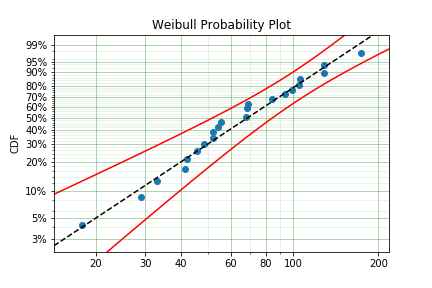

# SurPyval - Survival Analysis in Python

Yet another Python survival analysis tool. This is another pure python survival analysis tool so why was it needed? The intent of this package was to closely mimic the scipy API as close as possible, other survival analysis packages don't completely mimic that API. Further, there was a gap in the other tools, specifically, arbitrary combinations of observed, censored, and truncated data. The current capability is as follows:

| Method | Para/Non-Para | Observed | Censored | Truncated |
| ------ | ---- |-----|------|------|
| **MLE** | Parametric | Yes | Yes | Yes |
| **MPP** | Parametric | Yes | Yes | Limited |
| **MSE** | Parametric | Yes | Yes | Limited |
| **MOM** | Parametric | Yes | No | No |
| **MPS** | Parametric | Yes | Yes | No |
| **Kaplan-Meier** | Non-Parametric | Yes | Right only | Left only |
| **Nelson-Aalen** | Non-Parametric | Yes | Right only | Left only |
| **Fleming-Harrington** | Non-Parametric | Yes | Right only | Left only |
| **Turnbull** | Non-Parametric | Yes | Yes | Yes |

SurPyval also offers many different distributions for users, and because of the flexible implementation adding new distributions is easy. The available distributions are:

| Distribution |
| ---- |
| **Weibull** |
| **Normal** |
| **LogNormal** |
| **Gamma** |
| **Beta** |
| **Uniform** |
| **Exponential** |
| **Exponentiated Weibull** |
| **Gumbel** |
| **Logistic** |
| **LogLogistic** |

This project spawned from a Reliaility Engineering project, as such there is a focus on visualising distribution fits with probability plots. This is combined with extremely flexible non-parametric fitting estimates. So each parametric.

# Install and Quick Intro

SurPyval can be installed via pip using the PyPI [repository](https://pypi.org/project/surpyval/)

```bash
pip install surpyval
```

If you're familiar with survival analysis, and Weibull plotting, the following is a quick start.

```python
from surpyval import Weibull
from surpyval.datasets import BoforsSteel

# Fetch some data that comes with SurPyval
data = BoforsSteel.df

x = data['x']
n = data['n']

model = Weibull.fit(x=x, n=n, offset=True)
model.plot();
```



# Documentation

SurPyval is well documented, and improving, at the main [documentation](https://surpyval.readthedocs.io/en/latest/).

# Contact

Email [derryn](mailto:derryn.knife@gmail.com) if you want any features or to see how SurPyval can be used for you.

