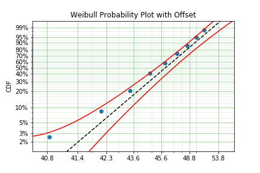

# SurPyval - Survival Analysis in Python

[](https://github.com/derrynknife/SurPyval/actions/workflows/actions.yml)
[](https://pypi.org/project/surpyval/)
[](https://pypi.org/project/surpyval/)
[](https://surpyval.readthedocs.io/en/latest/?badge=latest)
[](https://doi.org/10.21105/joss.03484)

Yet another Python survival analysis tool. 

This is another pure python survival analysis tool so why was it needed? The intent of this package was to closely mimic the scipy API as close as possible with a simple `.fit()` method for any type of distribution (parametric or non-parametric); other survival analysis packages don't completely mimic that API. Further, there is currently (at the time of writing) no pacakage that can take an arbitrary comination of observed, censored, and truncated data. Finally, surpyval is unique in that it can be used with multiple parametric estimation methods. This allows for an analyst to determine a distribution for the parameters if another method fails. The parametric methods available are Maximum Likelihood Estimation (MLE), Probability Plotting (MPP), Mean Square Error (MSE), Method of Moments (MOM), and Maximum Product of Spacing (MPS). Surpyval can, for each type of estimator, take the following types of input data:

| Method | Para/Non-Para | Observed | Censored | Truncated |
| ------ | ---- |-----|------|------|
| **MLE** | Parametric | Yes | Yes | Yes |
| **MPP** | Parametric | Yes | Yes | Limited |
| **MSE** | Parametric | Yes | Yes | Limited |
| **MOM** | Parametric | Yes | No | No |
| **MPS** | Parametric | Yes | Yes | No |
| **Kaplan-Meier** | Non-Parametric | Yes | Right only | Left only |
| **Nelson-Aalen** | Non-Parametric | Yes | Right only | Left only |
| **Fleming-Harrington** | Non-Parametric | Yes | Right only | Left only |
| **Turnbull** | Non-Parametric | Yes | Yes | Yes |

SurPyval also offers many different distributions for users, and because of the flexible implementation adding new distributions is easy. Further, the power of SurPyval lay in the robust parameter estimation, as such, some distributions, those that are supported on the half real line, can be offset to make a three- or four-parameter version. The currently available distributions are:

| Distribution  | Offsetable |
| ------------- | ---- |
| **Weibull**   | Yes |
| **Normal**    | No |
| **LogNormal** | Yes |
| **Gamma**     | Yes |
| **Beta**      | No |
| **Beta (4 parameter)** | No |
| **Uniform**   | No |
| **Exponential** | Yes |
| **Exponentiated Weibull** | Yes |
| **Gumbel**    | No |
| **Logistic**  | No |
| **LogLogistic** | Yes |

This project spawned from a Reliaility Engineering project; due to the history of reliability engineers estimating parameters from a probability plot. SurPyval has continued this tradition to ensure that any parametric distribution can have the estimate plotted on a probability plot. These visualisations enable an analyst to get a sense of the goodness of fit of the parametric distribution with the non-parametric distribution.

# The Model Landscape

SurPyval's models can be placed on a set of orthogonal axes. The table below
cross-tabulates four of those axes &mdash; the **outcome** (a time-to-event
duration vs a pass/fail result), **event recurrence**, **competing
events**, and **covariates** &mdash; against the **estimation** axis, and fills
each cell with what can be used to implement it. The recurrence axis spans both
outcomes: a single pass/fail trial is `Bernoulli`, while repeated trials
(the binomial case) are the recurrent counterpart. Every time-to-event model
listed is continuous-time.
A `&mdash;` marks a combination that is
either not applicable (e.g. semiparametric estimation requires covariates) or
not yet built (e.g. the recurrent pass/fail / binomial cell).

| Outcome | Recurrence | Events | Covariates | Parametric | Semiparametric | Nonparametric |
| --- | --- | --- | --- | --- | --- | --- |
| Time-to-event | Single event | Single | Without | `Weibull`, `Exponential`, `LogNormal`, `Gamma`, &hellip; | &mdash; | `KaplanMeier`, `NelsonAalen`, `FlemingHarrington`, `Turnbull` |
| Time-to-event | Single event | Single | With | `WeibullPH`/`WeibullAFT` (PH/AFT/PO families) | `CoxPH` | &mdash; |
| Time-to-event | Single event | Competing | Without | &mdash; | &mdash; | `CompetingRisks` (CIF) |
| Time-to-event | Single event | Competing | With | &mdash; | `FineGray`, `CRPH` | &mdash; |
| Time-to-event | Recurrent | Single | Without | `HPP`, `NHPP`, `CrowAMSAA`, `Duane`, `CoxLewis` | &mdash; | `NonParametricCounting` (MCF) |
| Time-to-event | Recurrent | Single | With | `ProportionalIntensityHPP`, `ProportionalIntensityNHPP` | &mdash; | &mdash; |
| Time-to-event | Recurrent | Competing | Without | &mdash; | &mdash; | `CauseSpecificMCF` |
| Time-to-event | Recurrent | Competing | With | &mdash; | &mdash; | &mdash; |
| Pass/fail | Single event | Single | Without | `Bernoulli` | &mdash; | &mdash; |
| Pass/fail | Recurrent | Single | Without | &mdash; | &mdash; | &mdash; |

# Install and Quick Intro

SurPyval can be installed via pip using the PyPI [repository](https://pypi.org/project/surpyval/)

```bash
pip install surpyval
```

If you're familiar with survival analysis, and Weibull plotting, the following is a quick start.

```python
from surpyval import Weibull
from surpyval.datasets import load_bofors_steel

# Fetch some data that comes with SurPyval
data = load_bofors_steel()

x = data['x']
n = data['n']

model = Weibull.fit(x=x, n=n, offset=True)
model.plot();
```



# Documentation

SurPyval is well documented, and improving, at the main [documentation](https://surpyval.readthedocs.io/en/latest/).

# Development
## Dependencies
```pip install -r requirements_dev.txt```

## Testing
Run the testing suite by simply executing:
```bash
pytest
```
or use coverage to get a coverage report:
```bash
coverage run -m pytest  # Run pytest under coverage's watch
coverage report         # Print coverage report
coverage html           # Make a html coverage report (really useful), open htmlcov/index.html
```

## Pre-commit
- Pip install `pre-commit` (it's in `requirements_dev.txt` anyways)
- Run `pre-commit install` which sets up the git hook scripts
- If you'd like, run `pre-commit run --all-files` to run the hooks on all files
- When you go to commit, it will only proceed after all the hooks succeed


# Contact

Email [derryn](mailto:derryn.knife@gmail.com) if you want any features or to see how SurPyval can be used for you.

