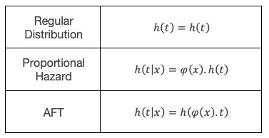

Handy References - Aide-mémoire
===============================

Relationship between functions of a probability distribution
------------------------------------------------------------

There exists a relationship between each of the functions of a distribution and the others. This can be very useful to keep in mind when understanding how surpyval works. For example, the Nelson-Aalen estimator is used to estimate the cumulative hazard function (Hf), the below relationships is how distribution for this can be used to estimate the survival function, or the cdf.

.. image:: images/relationships.png
  :align: center

The above table shows how the function on the right, can be described by the function along the top row (I leave out the function describing itself as it is simply itself...). So, an interesting one is that the reliability or survival function, R(t), is simply the exponentiated negative of the cumulative hazard function! This relationship holds for **every** distribution.

How an AFT and PH Model Relate to a regular distribution
--------------------------------------------------------

An AFT, or accelerated failure time, model does exactly that. It 'accelerates' the actual time by multiplying the time in the hazard function by a function of factors, :math:`\phi \left( x \right )`. This factor can be any function. A Proportional Hazard model also does exactly what it says, if changes the hazard rate by a particular proportion.

Given the relationship between variables and a distribution with either the PH or AFT models, you can see, using the above relationships that the survival, failure, and density functions can all be determined. This relationship is good to know to understand how AFT and PH models work.

