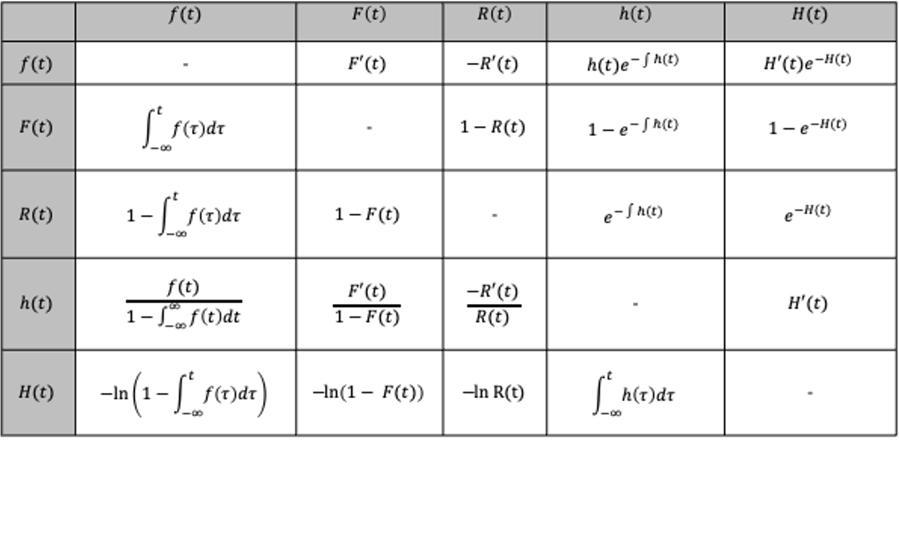
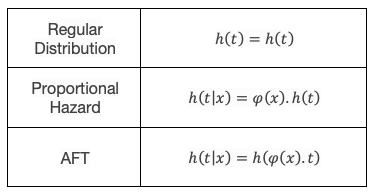

Handy References - Aide-mémoire
===============================

Relationship between functions of a probability distribution
------------------------------------------------------------

There exists a relationship between each of the functions of a distribution and the others. This can be very useful to keep in mind when understanding how surpyval works. For example, the Nelson-Aalen estimator is used to estimate the cumulative hazard function (Hf), the below relationships is how distribution for this can be used to estimate the survival function, or the cdf.

The above table shows how the function on the left, can be described by the function along the top row (I leave out the function describing itself as it is simply itself...). So, an interesting one is that the reliability or survival function, R(t), is simply the exponentiated negative of the cumulative hazard function! This relationship holds for **every** continuous distribution.

The five functions, their names in SurPyval, and their meanings:

.. list-table::
   :header-rows: 1
   :widths: 12 12 76

   * - Symbol
     - Method
     - Meaning
   * - :math:`f(t)`
     - ``df``
     - the density: the probability of failing in a small interval around :math:`t`, per unit time
   * - :math:`F(t)`
     - ``ff``
     - the CDF, or unreliability: the probability of having failed by :math:`t`
   * - :math:`R(t)`
     - ``sf``
     - the survival, or reliability, function: the probability of surviving past :math:`t`; :math:`R = 1 - F`
   * - :math:`h(t)`
     - ``hf``
     - the hazard: the rate of failure at :math:`t` *among the items that have survived to* :math:`t`
   * - :math:`H(t)`
     - ``Hf``
     - the cumulative hazard: the hazard accumulated up to :math:`t`

The identities in the table, written out:

.. math::

    F(t) = 1 - R(t), \qquad
    f(t) = \frac{dF(t)}{dt} = -\frac{dR(t)}{dt}, \qquad
    h(t) = \frac{f(t)}{R(t)}

.. math::

    H(t) = \int_0^t h(s)\, ds = -\ln R(t), \qquad
    R(t) = e^{-H(t)}, \qquad
    f(t) = h(t)\, e^{-H(t)}

The hazard is the one that most often causes confusion. It is not a probability: it is a *conditional rate*, and it can be greater than one. Its shape is what distinguishes infant mortality (decreasing hazard), random failures (constant hazard) and wear-out (increasing hazard); it is also the quantity that proportional hazards models act on.

Every SurPyval model computes all five, so the identities can be checked directly:

.. jupyter-execute::

    import numpy as np
    import surpyval as surv

    model = surv.Weibull.from_params([10, 2])
    t = np.array([2.0, 5.0, 10.0])

    print("R(t)             :", model.sf(t))
    print("exp(-H(t))       :", np.exp(-model.Hf(t)))
    print("h(t)             :", model.hf(t))
    print("f(t) / R(t)      :", model.df(t) / model.sf(t))

Two more quantities follow from these and come up constantly in reliability work:

- **B-lives, or quantiles.** The :math:`B_q` life is the time by which a fraction :math:`q` has failed, :math:`F^{-1}(q)`, given by ``qf(q)``. The B10 life is ``qf(0.1)``, the median is ``qf(0.5)``.
- **Conditional survival.** The probability that an item that has already survived to :math:`T` survives a further :math:`t` is :math:`R(t + T) / R(T)`, given by ``cs(t, T)``. This is the basis of remaining life calculations.

.. jupyter-execute::

    print("B10 life                        :", model.qf(0.1))
    print("P(survive 5 more | alive at 10) :", model.cs(5, 10))

AFT, AL, or PH?
---------------

What is the difference, if any, between an Accelerated Failure Time model, an Accelerated Life model, and a Proportional Hazard model? SurPyval uses the distinctions defined in [Bagdonavicius]_. The explanation of these are, for a baseline distribution (with subscript 0) and covariates :math:`x` acting through a positive function :math:`\phi(x)`:

- AL is an accelerated life model. That is, a model where the 'characteristic life' (or other life parameter) of the distribution is a function of the stress or stresses applied to the system. For example, a Weibull whose scale is :math:`\alpha = \phi(x)`, with :math:`\phi` a life-stress relationship such as the Arrhenius or inverse power law. This is the model traditionally used in accelerated life testing.
- AFT is an Accelerated Failure Time model. This is simply a distribution where the time is multiplied by a function of covariates. This has the effect of 'accelerating' the time. Concretely, for a survival function :math:`R_0(t)` it can be accelerated with a function to give :math:`R(t \mid x) = R_0 \left ( \phi \left ( x \right ) t \right )`. A :math:`\phi(x)` of 2 means the item ages twice as fast, so every quantile of its life is halved.
- PH is a proportional hazard model. In a proportional hazard model, the hazard function is multiplied by some function of covariates. Hence if a function has a hazard rate of :math:`h_0(t)` then the proportional hazard model will give simply :math:`h(t \mid x) = \phi \left ( x \right ) h_0(t)`.

Two more families are in SurPyval: the proportional odds (PO) model multiplies the odds of failure, :math:`F/R`, by :math:`\phi(x)`, and the additive hazards (AH) model adds a function of the covariates to the hazard. The full theory is in :doc:`regression analysis`.

When the life parameter is a scale parameter of time, as the :math:`\alpha` of the Weibull or LogLogistic is, an AL model with :math:`\alpha(x) = \alpha_0 / \phi(x)` is exactly the AFT model :math:`R_0(\phi(x) t)`, which is why the two terms are often used interchangeably. They differ when the life parameter enters the distribution differently, for example the mean of a Normal distribution, where changing the mean shifts the distribution rather than stretching it.

SurPyval has implementations, and even a general constructor, for AFT, AL, and PH models: ``surv.AFT(dist)``, ``surv.AcceleratedLife(dist, life_model)`` and ``surv.PH(dist)`` build a model from any suitable distribution, and common combinations are ready-made (``surv.WeibullAFT``, ``surv.WeibullPH``, ...). Each of which can handle arbitrary censoring, and the parametric regression fitters accept truncation through ``t``.

The Weibull is both AFT and PH
~~~~~~~~~~~~~~~~~~~~~~~~~~~~~~

The Weibull distribution is special: it is the only continuous distribution for which an AFT model is also a PH model. Accelerating the time of a Weibull with shape :math:`\beta` by a factor :math:`\phi`,

.. math::

    R_0(\phi t) = \exp\left(-\left(\frac{\phi t}{\alpha}\right)^{\beta}\right)
                = \exp\left(-\phi^{\beta}\left(\frac{t}{\alpha}\right)^{\beta}\right),

multiplies the cumulative hazard, and so the hazard, by :math:`\phi^{\beta}`. With :math:`\phi(x) = e^{b x}`, an AFT coefficient :math:`b_{AFT}` corresponds to a PH coefficient :math:`b_{PH} = \beta\, b_{AFT}`. Fitting both to the same data shows it:

.. jupyter-execute::

    rng = np.random.default_rng(1)
    Z = rng.integers(0, 2, (100, 1)).astype(float)
    x = 50 * rng.weibull(1.5, 100) * np.exp(0.7 * Z[:, 0])

    aft = surv.WeibullAFT.fit(x, Z)
    ph = surv.WeibullPH.fit(x, Z)

    shape = aft.dist_params[1]
    print("AFT coefficient            :", aft.phi_params)
    print("shape x AFT coefficient    :", shape * aft.phi_params)
    print("PH coefficient             :", ph.phi_params)

The two fits are the same model, parameterised differently. For any other distribution, AFT and PH are genuinely different assumptions, and choosing between them is a modelling decision.

How an AFT and PH Model Relate to a regular distribution
--------------------------------------------------------

An AFT, or accelerated failure time, model does exactly that. It 'accelerates' the actual time by multiplying the time in the hazard function by a function of factors, :math:`\phi \left( x \right )`. This factor can be any function. A Proportional Hazard model also does exactly what it says, if changes the hazard rate by a particular proportion.

Given the relationship between variables and a distribution with either the PH or AFT models, you can see, using the above relationships that the survival, failure, and density functions can all be determined. This relationship is good to know to understand how AFT and PH models work. Written out:

.. list-table::
   :header-rows: 1
   :widths: 16 42 42

   * - Function
     - AFT, :math:`R(t \mid x) = R_0(\phi(x) t)`
     - PH, :math:`h(t \mid x) = \phi(x) h_0(t)`
   * - :math:`H(t \mid x)`
     - :math:`H_0(\phi(x) t)`
     - :math:`\phi(x) H_0(t)`
   * - :math:`h(t \mid x)`
     - :math:`\phi(x)\, h_0(\phi(x) t)`
     - :math:`\phi(x)\, h_0(t)`
   * - :math:`R(t \mid x)`
     - :math:`R_0(\phi(x) t)`
     - :math:`R_0(t)^{\phi(x)}`
   * - :math:`F(t \mid x)`
     - :math:`F_0(\phi(x) t)`
     - :math:`1 - R_0(t)^{\phi(x)}`
   * - :math:`f(t \mid x)`
     - :math:`\phi(x)\, f_0(\phi(x) t)`
     - :math:`\phi(x)\, h_0(t)\, R_0(t)^{\phi(x)}`

Note the factor :math:`\phi(x)` in the AFT density and hazard: it is the Jacobian of the change of time scale, and forgetting it is a common mistake when writing these models out by hand.

References
----------

.. [Bagdonavicius] Bagdonavicius, V., & Nikulin, M. (2001). Accelerated life models: modeling and statistical analysis. CRC press.
