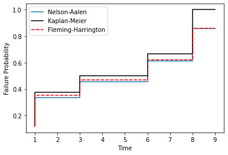
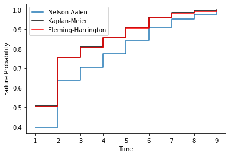

Non-Parametric Estimation
=========================

Non-parametric survival analysis is the attempt to capture the distribution of survival data without making any assumptions about the shape of the distribution. That is, non-parametric analysis, unlike parametric analysis, does not assume that the survival data was Weibull distributed or that it was Normally distributed etc. Concretely, non-parametric estimation does not attempt to estimate the parameters of a distribution, therefore "non-parametric." Parametric analysis is covered in more detail in the :doc:`Parametric Estimation` section but it is important to contrast non-parametric estimation against what it is not. So what exactly is non-parametric analysis?

Survival analysis is using statistics to answer the question 'what is the probability that the thing survived to a particular time?' Non-parametric analysis answers this by estimating the probability from the proportion failed up to a given time. This can be done by either estimating the probability of surviving a particular segment (the Kaplan-Meier approach) or by estimating the hazard rate and accumulating it (the Nelson-Aalen and Fleming-Harrington approach). When the data are too incomplete for either — left or interval censoring, or right truncation — the Turnbull estimator finds the most likely curve directly.

The price of making no assumption about shape is that a non-parametric estimate can only say something about times at which data were actually seen: it is a step function that changes only at observed values, it cannot extrapolate beyond the largest observation, and it cannot say anything below the earliest time at which items were being watched. Parametric models trade an assumption for the ability to interpolate and extrapolate; the non-parametric estimate is the yardstick against which that assumption is judged.

This page is the theory. For runnable examples of everything described here see :doc:`Non-Parametric SurPyval Modelling`.

**The xrd format.** Non-parametric estimation is well understood by appreciating the data format used to estimate the CDF. Specifically, the 'xrd' format and particularly understanding the r and d sets of that format.

The number of components at risk, :math:`r`, at a given time, :math:`x`, is the number of things at risk just prior to time :math:`x`. The number of deaths, :math:`d`, is the number of the at risk items that died (or failed) at time :math:`x`. So for completely observed data the number at risk counts down for every death. So r would count down, e.g. 6, 5, 4, 3... for each death, 1, 1, 1, 1, ... So in this example there were 6 items at risk and one death at the first time. Then, because there was 1 death at the first time the number of items at risk has decreased to 5, therefore for the next death there are only 5 at risk. This continues further until there are no more items at risk because they have all died, i.e. there is 1 at risk and 1 death.

This can be extended to more than one death. For example, the risk set could be 8, 6, 5, 3, 2, 1. with an accompanying death set of 2, 1, 2, 1, 1, 1. In this example there were times where there were 2 deaths and therefore the number at risk decreased by 2 after that number of deaths.

So a complete example of this format is:

.. code-block:: python

    x = [1, 2, 3, 4, 5, 6]
    r = [7, 5, 4, 3, 2, 1]
    d = [2, 1, 1, 1, 1, 1]

This format for data is not how survival data is usually provided in text books or papers. Survival data is usually displayed with the simple list of failure times such as "1, 3, 6, 7, 10, 16". The first step surpyval does for non-parametric analysis is to transform data into the xrd format. All the :code:`fit()` methods for surpyval take as input the xcnt format, see more at the :doc:`Types of Data` docs. So if you provide surpyval with the data "1, 2, 3, 4, 5, 6" it will assume that each of them are one death, and then create the risk set from the death counts resulting in the xrd format from above. (If you already have data in the xrd format you can skip the conversion: every estimator except Turnbull has a ``from_xrd(x, r, d)`` method.)

**Right censoring enters through the risk set.** A right censored item is one we stopped watching while it was still working. It contributes no death, but it *was* at risk up to the time it was censored, so it is counted in :math:`r` at every time up to and including its censoring time, and removed afterwards. In particular, an item censored at exactly the same time as a death is counted as at risk for that death: the convention is that failures at a given time happen just before censorings at that time. For example the data 1, 2, 2+, 3 (where + marks a censored value) becomes :math:`x = (1, 2, 3)`, :math:`r = (4, 3, 1)` and :math:`d = (1, 1, 1)`. The censored item is in the risk set at time 2, and gone by time 3. This is the only thing censoring changes, which is why the Kaplan-Meier, Nelson-Aalen and Fleming-Harrington estimators handle right censoring with no modification at all.

**Left truncation (delayed entry) also enters through the risk set.** A left truncated item is one that only came under observation at some entry time :math:`t_l`; had it failed before then we would never have known it existed. Such an item cannot be counted as at risk before it entered. SurPyval uses the standard :math:`(t_l, x]` convention (the same one as R's ``survival`` package and lifelines): an item is at risk at time :math:`t` if :math:`t_l < t \leq x`. An item entering at *exactly* the time of an event is therefore **not** at risk for that event, and an observed value equal to its own entry time is rejected as invalid (it would have a zero-length observation window). For example, with values 2, 3, 3, 4, 5, 6 and entry times 0, 0, 1, 1, 2, 2 the risk set is :math:`r = (4, 5, 3, 2, 1)` at :math:`x = (2, 3, 4, 5, 6)`: the two items entering at time 2 are not at risk for the failure at 2, but they are at risk by time 3, so the risk set *grows* from 4 to 5. With delayed entry the risk set need not decrease, which is the whole mechanism by which truncation is handled.

Two consequences are worth stating. First, the estimate is really of survival *conditional on surviving to the earliest entry time* — nothing can be learned about what happened before anyone was being watched. Second, if only a handful of items have entered at early times the risk set there is small, and a single early failure can move the estimate a long way (with one item at risk and one failure, the Kaplan-Meier estimate drops to zero and stays there). Always look at :math:`r` when working with delayed entry.

**What does not fit into the xrd format.** Left censoring (we only know the failure was *before* some time), interval censoring (it was *between* two times) and right truncation (items that fail *after* some time are never seen) cannot be expressed as a count of deaths at a time with a known risk set: the death times are not known, or the number at risk is not known. SurPyval raises an error if you pass such data to the Kaplan-Meier, Nelson-Aalen or Fleming-Harrington estimators. The Turnbull estimator, described below, handles them by estimating the :math:`r` and :math:`d` sets rather than counting them.

Given we now understand the format of the data we can estimate the probability of survival to some time with non-parametric methods. The first method we will visit is the Kaplan-Meier.

Kaplan-Meier Estimation
-----------------------

Kaplan-Meier [KM]_ is a very popular method for estimating survival curves for populations. The insight for this method is that for each time there is a death, we can estimate the probability of having survived since the previous deaths. Using the data from above as an example, at time 1, there are 7 items at risk and there are 2 deaths. We can therefore say that the probability of surviving this period was (7 - 2)/7, i.e. 5/7. Then the next time there is a death, the probability of having survived that extra time is (5 - 1)/5, i.e. 4/5.

To be clear, this is the chance of survival between each death. Therefore the chance of surviving up to a given time is the chance of surviving each segment. Therefore the probability of surviving up to any given time is the probability of surviving through all the previous segments. The probability of surviving multiple outcomes is the multiplication of each of the survival probabilities. Surviving through three sections is equal to the probability that I survive the first, then multiply this by the probability of surviving the second, then multiplying this result with the probability of surviving the third. So continuing our example from above, the probability of surviving the first two segments is (5/7) x (4/5) = 4/7.

Therefore using the at risk count, r, and the death count, d, can be used to estimate the segment survival probabilities and the survival probability to any point can be found by multiplying these probabilities. Formally, this has the following formula:

.. math::

   R(x) = \prod_{i:x_{i} \leq x}^{} \left ( 1 - \frac{d_{i} }{r_{i}}  \right )

where :math:`x_i` are the distinct observed times, :math:`r_i` the number at risk just before :math:`x_i` and :math:`d_i` the number of failures at :math:`x_i`. This is why it is also called the *product-limit* estimator. Because each factor is a ratio of counts the estimate is a step function that drops only at failure times; censored values change later factors (through :math:`r`) but never cause a drop themselves. For the example above the estimate is 5/7, 4/7, 3/7, 2/7, 1/7 and finally 0: with no censoring the Kaplan-Meier is exactly one minus the empirical CDF.

**Why this is the "right" answer.** The Kaplan-Meier is the non-parametric maximum likelihood estimator (NPMLE) for right censored and left truncated data: of all distributions, the one putting probability mass :math:`d_i / r_i \times R(x_{i-1})` at each failure time is the one that makes the observed data most likely. An equivalent and very intuitive construction is Efron's *redistribute-to-the-right* algorithm [Efron1967np]_: start with mass :math:`1/N` on every observation, then, working from left to right, take the mass of each censored observation and share it equally among all observations to its right. A censored item has, after all, failed at some later time, and with no other information it is equally likely to be any of the later ones. The mass left on the failures is exactly the Kaplan-Meier. Keep this picture in mind: it is the same idea the Turnbull estimator generalises.

Greenwood's variance
^^^^^^^^^^^^^^^^^^^^

The Kaplan-Meier is an estimate, so it has uncertainty. Each factor :math:`1 - d_i/r_i` is an estimated binomial proportion, and the uncertainty of the product is most easily found on the log scale, where the product becomes a sum. Working with the cumulative hazard :math:`H(x) = -\ln R(x)`, Greenwood's formula [Greenwood1926np]_ is

.. math::

   \widehat{Var}\left(\hat{H}(x)\right) = \sum_{i:x_{i} \leq x} \frac{d_{i}}{r_{i} \left ( r_{i} - d_{i} \right )}

and, by the delta method, :math:`\widehat{Var}(\hat{R}(x)) \approx \hat{R}(x)^2 \, \widehat{Var}(\hat{H}(x))`. Two things are visible in the formula. The terms grow as the risk set shrinks, so the estimate is least certain in the right-hand tail where few items remain. And when :math:`d_i = r_i` (everyone still at risk fails, which happens at the last value of a data set with no right censoring) the term is undefined: the estimate has reached 0 and Greenwood's formula has nothing to say there. SurPyval stores the cumulative variance of :math:`\hat{H}` for every fitted model in the attribute ``greenwood`` (the name is historical; for the Nelson-Aalen and Fleming-Harrington estimators it holds their own variance, given below).

From a variance to confidence bounds
^^^^^^^^^^^^^^^^^^^^^^^^^^^^^^^^^^^^

All the estimators on this page produce confidence bounds the same way, from :math:`\hat{\sigma}^2(x) = \widehat{Var}(\hat{H}(x))`. Write :math:`z` for the standard normal quantile: :math:`z = \Phi^{-1}(1 - \alpha/2)` for a two-sided interval and :math:`z = \Phi^{-1}(1 - \alpha)` for a one-sided bound, where :math:`\alpha` is ``alpha_ci`` (0.05 by default).

The naive ("normal", or plain Greenwood) interval is :math:`\hat{R} \pm z \hat{R} \hat{\sigma}`. It is symmetric, but a survival probability is not: near 0 or 1 this interval spills outside :math:`[0, 1]` and it tends to undercover in small samples.

The default ("exp") interval instead applies the normal approximation to :math:`\ln \hat{H}(x) = \ln(-\ln \hat{R}(x))`, which is unbounded in both directions and much closer to normally distributed. Its standard error is :math:`\hat{\sigma}/\hat{H}` (delta method again), and transforming back gives

.. math::

   \left[ \hat{R}(x)^{\exp\left(z\hat{\sigma}(x)/\hat{H}(x)\right)},\;
          \hat{R}(x)^{\exp\left(-z\hat{\sigma}(x)/\hat{H}(x)\right)} \right]

which always lies within :math:`[0, 1]`. This is the "log(-log)" or "exponential Greenwood" interval, and it is what ``cb()`` and ``plot()`` use unless told otherwise (``bound_type='normal'`` selects the plain interval). Bounds on :math:`F = 1 - R` and on :math:`H = -\ln R` are the corresponding transformations of the bounds on :math:`R`. A few practical details of the implementation:

- The bounds are asymptotic, so only the normal (``dist='z'``) statistic is offered; for small samples, or for the Turnbull estimator, use the bootstrap (below).
- Where the variance is undefined because the estimate has reached zero (Kaplan-Meier with no right censoring at the last value) the lower bound is set to 0 and the upper bound to the last finite upper bound, so bounds can still be drawn to the last observation.
- Bounds are only reported within the range of the data; below the first or above the last observed value ``cb()`` returns ``nan``.

Pointwise bounds, bands and the bootstrap
^^^^^^^^^^^^^^^^^^^^^^^^^^^^^^^^^^^^^^^^^

The interval above is *pointwise*: at any single time :math:`x` it covers the true :math:`R(x)` with probability :math:`1-\alpha`. It does **not** mean that the whole true curve lies between the two bound curves with that probability; a curve has many opportunities to escape somewhere. If the question is "is this whole curve (for example a fitted Weibull) consistent with the data?", you need a *simultaneous confidence band*, which is wider. SurPyval provides the two classical bands via ``band()``: the Hall-Wellner band [HallWellner1980np]_, whose width is proportional to :math:`(1 + N\hat{\sigma}^2(x))/\sqrt{N}`, and Nair's equal-precision band [Nair1984np]_, which is the pointwise interval with a larger critical value. The critical values come from the supremum of a (standardised) Brownian bridge over the range of the data, computed by Monte Carlo simulation with a fixed seed; the bands are defined only between the first and last points with a positive, finite variance. See [KleinMoeschberger2003np]_ (section 4.4) for the derivations.

The asymptotic formulas all rest on large-sample theory for counts that were actually observed. When that is doubtful (small samples, or Turnbull estimates built from expected counts) the non-parametric bootstrap is the robust alternative: ``bootstrap_cb()`` resamples the original observations with replacement, refits the same estimator to each resample and reports the percentile interval of the refitted curves at each requested time.

Quantiles, the median and the mean
^^^^^^^^^^^^^^^^^^^^^^^^^^^^^^^^^^

Because the estimate is a step function, its quantile is defined as the smallest observed value at which the estimated CDF reaches the requested probability, :math:`\hat{q}(p) = \min\{x_i : \hat{F}(x_i) \geq p\}`, and the median is :math:`\hat{q}(0.5)`. With right censoring the estimate may never reach :math:`p` (the curve stops above :math:`1-p`), in which case the quantile is undefined and SurPyval returns ``nan`` rather than guess. A confidence interval for a quantile is found by the Brookmeyer-Crowley method [BrookmeyerCrowley1982np]_: invert the pointwise bounds, i.e. take all times at which the confidence interval for :math:`R(x)` contains :math:`1 - p`.

The mean is the area under the survival curve. With right censoring the curve does not reach zero, so the area to infinity is unknown; what can be estimated is the area up to a horizon :math:`\tau`, the *restricted* mean (see `Restricted mean survival time`_ below). SurPyval's ``mean()`` integrates the step function from 0 to :math:`\tau`, defaulting :math:`\tau` to the largest observed value; if the estimate reaches zero this is the ordinary mean of the estimated distribution.

No failures at all: success-run testing
^^^^^^^^^^^^^^^^^^^^^^^^^^^^^^^^^^^^^^^

A common reliability test is to run :math:`n` items for a fixed duration (or demand) and hope that none fail. If none do, the Kaplan-Meier estimate is 1 with zero variance, which is true of the sample but useless as a statement about the population. The question is instead: what is the lowest reliability consistent with seeing :math:`n` successes in a row? If the true probability of success is :math:`R` and trials are independent, the chance of :math:`n` successes is :math:`R^n`. The smallest :math:`R` for which that chance is still at least :math:`\alpha` is the lower :math:`1-\alpha` confidence bound

.. math::

   R_L = \alpha^{1/n}.

For example, 59 successes demonstrate :math:`R \geq 0.95` at 95% confidence (:math:`0.05^{1/59} \approx 0.9505`), and 22 successes demonstrate :math:`R \geq 0.90` at 90% confidence. This is ``surpyval.success_run(n, confidence=...)`` (or ``alpha=...``).

Nelson-Aalen Estimation
-----------------------

The Nelson-Aalen estimator [NA]_ (also known as the Breslow estimator), instead of finding the probability, estimates the cumulative hazard function, and given that we know the relationship between the cumulative hazard function and the reliability function, the Nelson-Aalen cumulative hazard estimate can be converted to a survival curve.

The first step in computing the NA estimate is to convert your data to the x, r, d format. Once in this format the instantaneous hazard rate is found by:

.. math::

   h(x) = \frac{d_{x} }{r_{x}}

This estimate of the instantaneous hazard rate is the proportion of deaths/failures at a value, x, among those at risk there. Strictly, :math:`d_x/r_x` is the *increment* of the cumulative hazard at :math:`x` (a probability of failing at :math:`x` given survival to just before it), not a rate per unit time. Then to find the cumulative hazard rate for any x we simply take the sum of the instantaneous hazard rates for all the values below x. Mathematically:

.. math::
   H(x) = \sum_{i:x_{i} \leq x}^{} \frac{d_{i} }{r_{i}}

Then, since we know that the reliability, or survival function, is related to the cumulative hazard function, we can easily compute it.

.. math::
   R(x) = e^{-H(x)}

So we now have the survival/reliability function. One benefit of the Nelson-Aalen estimator is that it does not estimate a probability of 0 for the highest value (in a completely observed data set). This means that for a completely observed data set the whole estimation can be plotted on a transformed y-axis. For this reason SurPyval uses the Nelson-Aalen as the default plotting position.

**How it relates to the Kaplan-Meier.** Compare the factor each estimator applies at a failure time: Kaplan-Meier multiplies by :math:`1 - d_i/r_i`, Nelson-Aalen by :math:`e^{-d_i/r_i}`. Since :math:`e^{-u} \geq 1 - u` for all :math:`u`, the Nelson-Aalen survival estimate is always at least as large as the Kaplan-Meier. When :math:`d_i/r_i` is small (large risk set, few ties) the two factors are almost equal and so are the estimates; they separate when a large fraction of the risk set fails at once — with many ties, or in the tail where the risk set is small. In the worked example above, the survival at time 1 is 0.714 by Kaplan-Meier and 0.751 by Nelson-Aalen, and at the last value 0 versus 0.077.

**Variance.** The variance of :math:`\hat{H}` used by SurPyval for the Nelson-Aalen estimator is Aalen's (Poisson-type) estimator [Aalen1978np]_,

.. math::

   \widehat{Var}\left(\hat{H}(x)\right) = \sum_{i:x_{i} \leq x} \frac{d_{i}}{r_{i}^{2}},

which Klein [Klein1991np]_ recommends for its small-sample performance. Unlike Greenwood's formula it stays finite when :math:`d_i = r_i`, so Nelson-Aalen bounds are defined right up to the last observation. The bounds themselves are built exactly as described in `From a variance to confidence bounds`_.

Hazard rates and densities from a step function
^^^^^^^^^^^^^^^^^^^^^^^^^^^^^^^^^^^^^^^^^^^^^^^

A non-parametric estimate of :math:`H` is a step function, and the derivative of a step function is zero almost everywhere and infinite at the steps, so the hazard *rate* :math:`h(x) = dH/dx` cannot be read off it directly. SurPyval offers two approximations. ``hf()`` differences the cumulative hazard between the points you ask for (so the answer depends on the grid you choose), and ``df()`` combines it with the survival as :math:`f = h e^{-H}`. The better estimate is ``smoothed_hf()``, which spreads each jump :math:`\Delta \hat{H}(x_i)` over a neighbourhood with an Epanechnikov kernel of bandwidth :math:`b`,

.. math::

   \hat{h}(t) = \frac{1}{b} \sum_{i} K\left( \frac{t - x_i}{b} \right) \Delta \hat{H}(x_i),
   \qquad K(u) = \tfrac{3}{4}(1 - u^2) \text{ for } |u| \leq 1,

with a correction near the ends of the data where part of the kernel falls outside the observed range. The bandwidth trades bias (large :math:`b` flattens real features) against variance (small :math:`b` is noisy); the default of one eighth of the observed range is only a starting point.

Fleming-Harrington Estimation
-----------------------------

The Fleming-Harrington estimator [FH]_, uses the same principle as the Nelson-Aalen estimator. That is, it finds the cumulative hazard function and then converts that to the reliability/survival estimate. However, the NA estimate assumes, for any given step, that the number of items at risk is the same for each of the tied deaths; the FH estimate changes this. If :math:`d` items fail "at the same time" they did not really fail at the same instant — the ties are an artefact of recording to finite precision — so the FH estimator imagines them failing one after another, with the risk set shrinking by one after each. Mathematically, the hazard rate is calculated with:

.. math::

   h(x) = \frac{1}{r_{x}} + \frac{1}{r_{x} - 1} + \frac{1}{r_{x} - 2} + ... + \frac{1}{r_{x} - (d_{x} - 1)}

Which can be summarised as:

.. math::

   h(x) = \sum_{j=0}^{d_x-1} \frac{1}{r_x - j}

The cumulative hazard rate therefore becomes:

.. math::
   H(x) = \sum_{i:x_{i} \leq x} \sum_{j=0}^{d_i-1} \frac{1}{r_i - j}

and, as for the Nelson-Aalen, :math:`R(x) = e^{-H(x)}`. You can see that the cumulative hazard rate will be slightly higher than the NA estimate since:

.. math::

   \underbrace{\frac{1}{r_{x}} + ... + \frac{1}{r_{x}}}_{d_x \text{ terms}} \leq \frac{1}{r_{x}} + \frac{1}{r_{x} - 1} + ... + \frac{1}{r_{x} - (d_{x} - 1)}

with equality exactly when there is a single death/failure at that time (:math:`d_x = 1`). So the Fleming-Harrington estimate is *identical* to the Nelson-Aalen when there are no tied failures, and differs from it only at tied failure times. There is also an ordering between all three estimators: since each term :math:`e^{-1/(r-j)} \geq 1 - 1/(r-j)` and :math:`\prod_{j=0}^{d-1}(1 - \frac{1}{r-j}) = 1 - \frac{d}{r}`, at every step

.. math::

   R_{KM}(x) \leq R_{FH}(x) \leq R_{NA}(x).

In the worked example the survival at time 1 (two tied failures among seven) is 0.714, 0.734 and 0.751 respectively. The Fleming-Harrington and Nelson-Aalen estimates are particularly useful for small samples, see [FH]_.

The variance of :math:`\hat{H}` uses the same tie-splitting as the estimator,

.. math::

   \widehat{Var}\left(\hat{H}(x)\right) = \sum_{i:x_{i} \leq x} \sum_{j=0}^{d_i-1} \frac{1}{(r_i - j)^2},

which is the variance used by R's ``survfit`` with ``ctype=2``, and reduces to the Nelson-Aalen variance :math:`\sum d_i/r_i^2` when there are no ties.

The Turnbull estimator (below) produces *expected*, and therefore fractional, death counts. SurPyval extends the tie-splitting ladder to a fractional :math:`d` by taking the whole terms :math:`1/r, 1/(r-1), \ldots` for the first :math:`\lceil d \rceil - 1` failures and a pro-rata share of the next term for the remainder, so the Fleming-Harrington estimator can be applied to a Turnbull ladder.

Turnbull Estimation
-------------------

The Turnbull estimator is a remarkable non-parametric estimation method for data that can handle arbitrary censoring and truncation [TB]_. The Turnbull estimator can be found with a procedure of finding the most likely survival curve from the data, for that reason it is also known as the Non-Parametric Maximum Likelihood Estimator (NPMLE). The Kaplan-Meier is also a non-parametric maximum likelihood estimator, so is there a contradiction? No: for data that the Kaplan-Meier can handle (exact, right censored and left truncated observations), the Turnbull NPMLE *is* the Kaplan-Meier. Turnbull's contribution is the generalisation to data that the Kaplan-Meier cannot handle. (Whether SurPyval's ``Turnbull`` *output* equals the Kaplan-Meier depends on an option; see `Why a Turnbull fit need not equal the Kaplan-Meier`_.)

Every observation as an interval
^^^^^^^^^^^^^^^^^^^^^^^^^^^^^^^^

The Turnbull estimate is really an estimate of the observed failures given censoring, and then the 'ghost' failures (as Turnbull describes it) due to truncation. Turnbull's estimate converts all failures to interval failures regardless of the censoring. This is because a left censored point is equivalent to an intervally censored observation in the interval -Inf to x, and a right censored point is equivalent to an intervally censored observation in the interval x to Inf. An exactly observed failure at :math:`x` is the degenerate interval :math:`[x, x]`.

SurPyval uses the standard :math:`(l, r]` convention for censoring intervals: an observation censored in :math:`(l, r]` failed strictly after :math:`l` and at or before :math:`r`. So an interval whose right end coincides with an exactly observed failure time *can* have failed at that time, and a left censored observation at :math:`x`, i.e. :math:`(-\infty, x]`, can have failed at :math:`x` itself. This matches Turnbull's paper, and the :math:`(t_l, x]` convention used for truncation windows.

Next the time axis is cut into pieces at every distinct endpoint: every observed value, every interval end and every truncation time, with an extra zero-width piece :math:`[x, x]` at each exactly observed time to hold the mass of that failure. Let :math:`p_j` be the (unknown) probability that a failure falls in piece :math:`j`; the survival curve is determined by these masses, so estimating the :math:`p_j` *is* estimating the curve. Then for all the pieces between negative infinity and infinity we find how many failures happened in each. This value need not be a whole number since a single observation could have failed across several pieces.

The self-consistency (EM) algorithm
^^^^^^^^^^^^^^^^^^^^^^^^^^^^^^^^^^^

If we knew the curve we could say where each observation most likely failed; if we knew where each failed we could estimate the curve by counting. Turnbull's algorithm alternates between these two, which makes it an instance of the Expectation-Maximisation (EM) algorithm. Suppose observation :math:`i` (which may represent :math:`n_i` identical items) has censoring interval :math:`A_i` and truncation window :math:`B_i`, and write :math:`\alpha_{ij} = 1` if piece :math:`j` lies inside :math:`A_i` (the observation could have failed there) and 0 otherwise, and :math:`\beta_{ij} = 1` if piece :math:`j` lies inside :math:`B_i` (a failure there would have been observable) and 0 otherwise.

**E-step, observed failures.** Given the current masses :math:`p`, the expected number of observation :math:`i`'s failures that fell in piece :math:`j` is its count shared out over the pieces it could have failed in, in proportion to how likely each piece is:

.. math::
   \mu_{ij}(p) = n_i \frac{\alpha_{ij}p_j}{\sum_{k=1}^{m}\alpha_{ik}p_k}

where :math:`m` is the number of pieces. For a right censored observation this is exactly the redistribute-to-the-right idea from the Kaplan-Meier section; for an exact observation all the count lands on its own zero-width piece.

**E-step, ghosts.** If an observation is truncated, it was only a possible observation among others that would have been seen had the observation not been limited. If the probability of falling inside the window is :math:`P(B_i) = \sum_k \beta_{ik}p_k`, then for every item seen there were, on average, :math:`(1 - P(B_i))/P(B_i)` unseen 'ghost' items whose failures fell outside it. Spreading them over the pieces outside the window gives:

.. math::
   \nu_{ij}(p) = n_i \frac{(1 - \beta_{ij})p_j}{\sum_{k=1}^{m}\beta_{ik}p_k}

**M-step.** We can then estimate the probability of failure in each piece as the total expected failures in that piece divided by the total expected failures:

.. math::
   p_j = \frac{\sum_{i=1}^{N} \left( \mu_{ij} + \nu_{ij} \right)}{M(p)}
   \qquad\text{where}\qquad
   M(p) = \sum_{i=1}^{N} \sum_{j=1}^{m} \left( \mu_{ij} + \nu_{ij} \right)

Using this estimate of the masses, it can be input to the start of this procedure and it done again. This can then be repeated over and over until the values do not change; a solution that reproduces itself this way is called *self-consistent*. At this point we have reached the NPMLE estimate of the survival function!

It helps to see the M-step in xrd terms. Call :math:`d_j = \sum_i (\mu_{ij} + \nu_{ij})` the expected deaths in piece :math:`j` and :math:`r_j = \sum_{k \geq j} d_k` the expected number at risk just before it. The Kaplan-Meier on this *expected* ladder, :math:`\prod (1 - d_j/r_j)`, telescopes to a curve whose mass in piece :math:`j` is exactly :math:`d_j / M`. The M-step is therefore just a Kaplan-Meier applied to expected counts, which is why a fitted Turnbull model has ``r`` and ``d`` attributes like every other estimator, with fractional values.

In SurPyval the iteration stops when the largest change in any :math:`p_j` falls below ``tol`` (default :math:`10^{-10}`), or after ``max_iter`` iterations (default 1000), with a warning if the tolerance was not reached. EM is reliable but can be slow, especially when many observations are censored far to the right; raising ``max_iter`` is the first thing to try. Under truncation SurPyval also intersects each observation's support with its own truncation window (an observed failure cannot have happened where it would not have been observed) and confines the mass to pieces that at least one observation could have failed in, which keeps the iteration away from meaningless solutions.

Why a Turnbull fit need not equal the Kaplan-Meier
^^^^^^^^^^^^^^^^^^^^^^^^^^^^^^^^^^^^^^^^^^^^^^^^^^

Once the EM has produced the expected ladder :math:`(r_j, d_j)`, SurPyval lets you choose how to turn it into a survival curve with ``turnbull_estimator``: ``'Kaplan-Meier'``, ``'Nelson-Aalen'`` or ``'Fleming-Harrington'`` (the default). Under truncation the EM always iterates with the Kaplan-Meier (self-consistency) update above and the chosen estimator is applied to the converged ladder; without truncation the chosen estimator's curve is also used within the iteration. Either way:

- Only ``turnbull_estimator='Kaplan-Meier'`` gives the NPMLE. With it, on exact, right censored and left truncated data, ``Turnbull`` agrees with ``KaplanMeier`` to numerical precision, for both the curve and the confidence bounds.
- The Nelson-Aalen and Fleming-Harrington options are :math:`e^{-H}` constructions on the expected ladder. They are not trying to maximise the likelihood, and they give a (usually slightly) higher survival curve, by the ordering shown in the Fleming-Harrington section. They are offered for the same reasons those estimators are preferred elsewhere: they do not drop to zero at the last failure and they behave better in the far tail.
- Because the ladder is an *expected* one — right censored items appear as fractional failures spread over later pieces, and truncation adds ghost failures — a Turnbull fit with the Fleming-Harrington option is not in general equal to ``FlemingHarrington.fit`` on the same data either, even where the latter can be used.

For example, with values 2, 3, 3, 4, 5, 6 and entry times 0, 0, 1, 1, 2, 2 the Turnbull estimate of survival at 2 is 0.750 with the Kaplan-Meier option (identical to ``KaplanMeier``), 0.765 with Fleming-Harrington and 0.779 with Nelson-Aalen. None of these is a mistake; they are different estimators. When comparing a Turnbull fit with a Kaplan-Meier fit, compare like with like.

Uncertainty in a Turnbull estimate
^^^^^^^^^^^^^^^^^^^^^^^^^^^^^^^^^^

The confidence bounds from ``cb()`` for a Turnbull model use the variance formula of the chosen estimator, but the choice of *ladder* matters:

- With no truncation and only exact and right censored observations (where Turnbull reduces to the Kaplan-Meier) the variance is computed from the *observed* counts, i.e. the ordinary Greenwood ladder. The EM's expected ladder would treat redistributed censored mass as extra observed failures and give intervals that are too narrow.
- With truncation, the variance ladder also uses observed counts: exact failures count once at their time, censored items leave the risk set at their censoring time, and each item is only at risk inside its own truncation window. Ghost failures, which are needed to get the *estimate* right, are not data and are excluded. Only genuinely interval or left censored items, whose failure time is unknown, are spread over their possible pieces.
- With interval or left censoring and no truncation, the expected ladder is used as though it were observed. This ignores the uncertainty in where the censored failures were allocated, so the bounds are an approximation.

In the last case, and whenever you want calibrated intervals for a Turnbull estimate, use ``bootstrap_cb()``. The simultaneous bands of ``band()`` rest on theory for right censored data and should not be used with interval censored Turnbull estimates.

What the data cannot tell you: non-identifiability
^^^^^^^^^^^^^^^^^^^^^^^^^^^^^^^^^^^^^^^^^^^^^^^^^^

The NPMLE is a delicate object, and it is worth being clear about what it does *not* determine.

**Mass inside an interval.** The likelihood only depends on how much mass lies in each piece, not on where within the piece it lies. Within a piece where the estimate drops, every curve between the value at the left end and the value at the right end fits the data equally well. SurPyval's step function places each piece's drop at the piece's right end, which is a convention, not an estimate. Evaluate Turnbull curves and bounds at piece boundaries (``model.bounds``) when precision matters.

**Mass outside the observation windows.** With truncation the estimate is conditional: with left truncation it describes survival *given survival to the earliest entry time*; with right truncation it describes the distribution *given failure before the latest truncation time*. There is no information below the smallest left truncation time or above the largest right truncation time, and in effect the estimate assumes that the first value, if left truncated, had a 100% chance of observation, and likewise for the last value if right truncated. Only a parametric model, by assuming a shape, can extrapolate into those regions.

**A flat likelihood.** Left censored observations combined with two or more distinct entry times can create a direction in which the likelihood rises without limit. A piece that one observation could have failed in, but that lies before another observation's entry time, is worth mass to the first and costs the second nothing: the second's likelihood is conditional on its own entry, so mass it never had a chance to see cancels from both the numerator and denominator. The likelihood then has no interior maximum and the EM keeps pushing mass towards the boundary instead of settling; raising ``max_iter`` does not help. SurPyval reports the share of the fitted mass in such pieces as ``exploitable_mass`` and warns that the estimate is not identifiable when it exceeds 0.9. (Ordinary staggered-entry data has such pieces too and fits perfectly well, which is why a share is reported rather than a flag.) Entering every unit at a common time, or dropping the left censored observations, removes the problem.

**A collapsed estimate.** If the iteration produces a non-finite update, or (under truncation) the survival estimate collapses to essentially zero across the region the data can identify, SurPyval warns and sets ``degenerate = True`` on the model. The fitted model also records ``converged`` and ``iters``. Treat any Turnbull estimate for which a warning was raised with suspicion: it is telling you that the data do not pin down a unique curve.

When to use it
^^^^^^^^^^^^^^

The Turnbull estimator is the only non-parametric method that can handle left censoring, interval censoring, and right truncation (and arbitrary combinations of censoring and truncation). Left truncation / delayed entry on its own is handled by the Kaplan-Meier, Nelson-Aalen and Fleming-Harrington estimators too, via the ``tl`` keyword; it is only the left/interval censoring and right truncation that require Turnbull. Turnbull must therefore be used to supply the plotting positions in the parametric package whenever such data is present. For data the simpler estimators can handle, prefer them: they are exact rather than iterative, and their confidence bounds rest on firmer ground.

On Surpyval's recommended estimator
-----------------------------------

Two distinct "defaults" are worth separating. When a non-parametric estimate is
used *internally* as the plotting position for a parametric probability plot,
surpyval uses the Nelson-Aalen estimator (as noted above), because for a
completely observed data set it never assigns probability 1 to the largest
value and so plots cleanly on a transformed axis. When you want a *standalone*
non-parametric survival estimate, however, the Fleming-Harrington estimator is
the recommended choice (and is the default estimator applied to a Turnbull
ladder). The rationale is that it has near-optimal behaviour: it
performs well where the Kaplan-Meier and the Nelson-Aalen behave poorly.

The Kaplan-Meier, since its estimate of the probability of failure reaches 1 at the last failure of a completely observed sample, results in cases where it overstates the probability of failure in the tail: having seen every one of a finite sample fail says little about whether the population could last longer. (A related but distinct warning applies to competing risks: one minus a Kaplan-Meier that treats failures from other causes as censored overstates the probability of failing from the cause of interest, and the Nelson-Aalen construction has the same problem. Use the cumulative incidence methods described in :doc:`Competing Risks Analysis` there.) As an example, a comparison between a Nelson-Aalen and Kaplan-Meier estimate over time (I have plotted the Fleming-Harrington estimate for later discussion):

On the contrary, the Nelson-Aalen estimate performs poorly with lots of ties. With many failures tied at one time, the factor :math:`e^{-d/r}` is much larger than :math:`1 - d/r`, so the Nelson-Aalen estimator understates the probability of failure (overstates survival) at the lower failure times. This is in contrast to the Kaplan-Meier estimator which does well with lots of tied values. For example:

The Fleming-Harrington, plotted in red in the above two charts, optimises between these two estimators. The Fleming-Harrington estimate approaches the Nelson-Aalen under the conditions of where the Nelson-Aalen estimate performs well and the Kaplan-Meier does poorly. Fleming-Harrington also does well where the Nelson-Aalen estimate does poorly but the Kaplan-Meier does well. Both follow from its construction: without ties it *is* the Nelson-Aalen, and with ties its tie-splitting ladder brings it close to the Kaplan-Meier. Although the two examples provided are in the extreme, it is worth reaching for the Fleming-Harrington as a general-purpose non-parametric estimator since it is more flexible; it is for this reason that surpyval recommends it. This is not to say not to use KM or NA, but only when you are sure you are making the correct assumptions about what you are doing! In particular, reach for the Kaplan-Meier when you need the maximum likelihood estimate itself, or results that match other software's product-limit output, and remember that for large samples with few ties the three are practically indistinguishable.

Plotting positions
^^^^^^^^^^^^^^^^^^

Probability plotting, the traditional way to check and fit a distribution by eye (see :doc:`Parametric Estimation`), needs an estimate of :math:`F` at each observation. Any of the estimators above can supply one, but there is a long tradition of simpler rank-based formulas, called *plotting positions* or *heuristics*. For the :math:`i`-th smallest of :math:`N` values they have the form

.. math::

   \hat{F}_i = \frac{i - A}{N + B}

for constants :math:`A` and :math:`B`. The constants are chosen so that :math:`\hat{F}_i` approximates the mean, median or mode of the distribution of the :math:`i`-th order statistic on the probability scale. Most of them keep :math:`\hat{F}` strictly between 0 and 1, which a transformed probability axis needs; the plain ``ECDF``, ``None``, ``Modal`` and ``DPW`` choices do not. Those available in ``surpyval.univariate.nonparametric.plotting_positions`` are:

================  =======  =======
Heuristic         A        B
================  =======  =======
Blom              0.375    0.25
Median            0.3      0.4
ECDF              0        0
ECDF_Adj          0        1
Modal             1        -1
Midpoint          0.5      0
Mean / Weibull    0        1
Benard            0.3      0.2
Beard             0.31     0.38
Hazen             0.5      0
Gringorten        0.44     0.12
Larsen            0.567    -0.134
Tukey             1/3      1/3
DPW               1        0
None              0        0
================  =======  =======

The Filliben heuristic [Filliben1975np]_ uses :math:`A = 0.3175, B = 0.365` for the interior values and :math:`1 - 0.5^{1/N}` and :math:`0.5^{1/N}` for the smallest and largest. With right censored data the ranks :math:`i` of the failures are replaced by adjusted (mean order number) ranks: each failure's rank is the previous adjusted rank plus :math:`(N + 1 - \text{previous rank}) / (1 + \text{number of items at or beyond the current position})`, which shares the "missing" ranks of censored items among the later failures, much as the Kaplan-Meier redistributes their mass. The rank-based heuristics cannot handle truncation; the ``'Kaplan-Meier'``, ``'Nelson-Aalen'`` and ``'Fleming-Harrington'`` options handle left truncation; and left censoring, interval censoring or right truncation require ``'Turnbull'``.

Comparing two groups: the log-rank test
---------------------------------------

Having estimated a survival curve for each of several groups, the natural next question is whether the groups genuinely *differ*, or whether the separation between the curves is just sampling noise. The **log-rank test** answers this. At every distinct event time it compares the number of failures observed in each group with the number *expected* if all groups shared one common survival curve, where the expected count in a group is the total number of failures at that time apportioned by the group's share of the risk set. Summing the observed-minus-expected differences over all event times, and dividing by their variance, gives a statistic that is :math:`\chi^2` distributed with :math:`k - 1` degrees of freedom for :math:`k` groups. A small :math:`p`-value is evidence the groups differ.

Concretely, at event time :math:`t` let :math:`r_{gt}` and :math:`d_{gt}` be the number at risk and the number of failures in group :math:`g`, and :math:`r_t` and :math:`d_t` the pooled totals. Under the null hypothesis the failures at :math:`t` are shared out like a draw without replacement from the risk set, so the expected count in group :math:`g` is :math:`E_{gt} = d_t r_{gt}/r_t` with hypergeometric variance :math:`d_t \frac{r_t - d_t}{r_t - 1} \frac{r_{gt}}{r_t}\left(1 - \frac{r_{gt}}{r_t}\right)`. The test statistic is built from :math:`\sum_t w_t (d_{gt} - E_{gt})` and the corresponding (weighted) covariance, with one group dropped because the differences sum to zero. The test uses exact and right censored data.

The plain log-rank weights every event time equally (:math:`w_t = 1`), which makes it most sensitive to *proportional* differences in hazard. Weighted variants change that emphasis: the **Gehan-Breslow** (:math:`w_t = r_t`) and **Tarone-Ware** (:math:`w_t = \sqrt{r_t}`) weights, and the **Fleming-Harrington** family :math:`w_t = \hat{S}(t-)^{\rho}(1 - \hat{S}(t-))^{\gamma}` (with :math:`\hat{S}` the pooled Kaplan-Meier just before :math:`t`), up-weight early or late times so the test is more sensitive to differences concentrated there. (These Fleming-Harrington *weights* are a different thing from the Fleming-Harrington *estimator* above; the same two authors are behind both.)

When a *nuisance* factor (a site, a batch) also affects survival, comparing groups while ignoring it can be misleading if the groups are unevenly distributed across its levels. The **stratified log-rank** accumulates the observed-minus-expected numerators and their variances *within* each stratum before forming the statistic, so groups are only ever compared against others in the same stratum — the same logic as stratification in a Cox model, applied to the two-sample test.

Restricted mean survival time
-----------------------------

A hazard ratio (from a log-rank test or a Cox model) only has a clean interpretation when the proportional-hazards assumption holds. When it does not — curves that cross, an effect that reverses over time — the **restricted mean survival time** (RMST) is an assumption-light summary. It is the area under the survival curve up to a horizon :math:`\tau`,

.. math::

    \text{RMST}(\tau) = \int_0^{\tau} S(t)\, dt,

which is exactly the average event-free time over the first :math:`\tau` units and is always well defined. For a non-parametric estimate the integral is a sum of rectangles under the step function. Its variance is

.. math::

    \widehat{Var}\left(\widehat{\text{RMST}}(\tau)\right) = \sum_{i: x_i \leq \tau} A_i^2 \, v_i

where :math:`A_i` is the area under the estimated curve from :math:`x_i` to :math:`\tau` and :math:`v_i` is the increment at :math:`x_i` of the estimator's variance of :math:`\hat{H}` (Greenwood's increment :math:`d_i / (r_i(r_i - d_i))` for the Kaplan-Meier, the corresponding increments for the Nelson-Aalen and Fleming-Harrington). Intuitively, uncertainty in the hazard at :math:`x_i` moves the whole curve after :math:`x_i`, and hence the area :math:`A_i`. Comparing two groups by the **difference** in their RMST gives an effect measured in the natural units of time, with the variance of the difference being the sum of the two (independent) variances, and needs no assumption about the shape of, or relationship between, the two hazards. The choice of :math:`\tau` matters: it should be a time of practical interest at which both curves are still supported by data.

For worked examples — fitting the Kaplan-Meier, Nelson-Aalen, Fleming-Harrington and Turnbull estimators, confidence bounds and bands, Turnbull diagnostics, plotting positions and success-run testing, and comparing groups with the log-rank test and RMST difference — see the :doc:`Non-Parametric SurPyval Modelling` page.

References
----------

.. [KM] Kaplan, E. L., & Meier, P. (1958). Nonparametric estimation from incomplete observations. Journal of the American statistical association, 53(282), 457-481.

.. [NA] Nelson, Wayne (1969). Hazard plotting for incomplete failure data. Journal of Quality Technology, 1(1), 27-52.

.. [FH] Fleming, Thomas R and Harrington, David P (1984). Nonparametric estimation of the survival distribution in censored data. Communications in Statistics-Theory and Methods, 13(20), 2469-2486.

.. [TB] Turnbull, Bruce W (1976). The empirical distribution function with arbitrarily grouped, censored and truncated data. Journal of the Royal Statistical Society: Series B (Methodological), 38(3), 290-295.

.. [Greenwood1926np] Greenwood, M. (1926). The natural duration of cancer. Reports on Public Health and Medical Subjects, 33, 1-26. London: His Majesty's Stationery Office.

.. [Aalen1978np] Aalen, O. (1978). Nonparametric inference for a family of counting processes. The Annals of Statistics, 6(4), 701-726.

.. [Klein1991np] Klein, J. P. (1991). Small sample moments of some estimators of the variance of the Kaplan-Meier and Nelson-Aalen estimators. Scandinavian Journal of Statistics, 18(4), 333-340.

.. [Efron1967np] Efron, B. (1967). The two sample problem with censored data. Proceedings of the Fifth Berkeley Symposium on Mathematical Statistics and Probability, 4, 831-853.

.. [HallWellner1980np] Hall, W. J., & Wellner, J. A. (1980). Confidence bands for a survival curve from censored data. Biometrika, 67(1), 133-143.

.. [Nair1984np] Nair, V. N. (1984). Confidence bands for survival functions with censored data: a comparative study. Technometrics, 26(3), 265-275.

.. [BrookmeyerCrowley1982np] Brookmeyer, R., & Crowley, J. (1982). A confidence interval for the median survival time. Biometrics, 38(1), 29-41.

.. [KleinMoeschberger2003np] Klein, J. P., & Moeschberger, M. L. (2003). Survival Analysis: Techniques for Censored and Truncated Data (2nd ed.). Springer.

.. [Filliben1975np] Filliben, J. J. (1975). The probability plot correlation coefficient test for normality. Technometrics, 17(1), 111-117.
