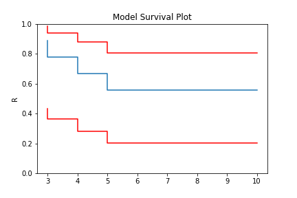
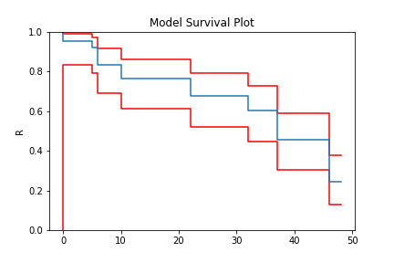
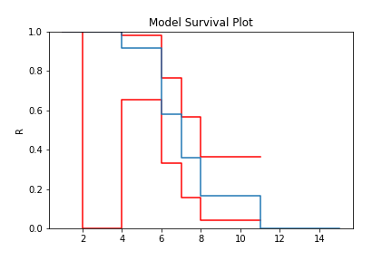
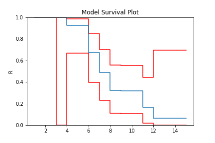

Non-Parametric SurPyval Modelling
=================================

To get started, let's import some useful packages, as such, for the rest of this page we will assume the following imports have occurred:

.. code:: python

    import surpyval as surv
    import numpy as np
    from matplotlib import pyplot as plt

Survival modelling with *surpyval* is very easy. This page will take you through a series of scenarios that can show you how to use the features of *surpyval* to get you the answers you need. The first example is if you simply have a list of event times and need to find the distribution of best fit.

In each of the examples below, each of the ``KaplanMeier``, ``NelsonAalen``, or ``FlemingHarrington`` can be substituted with any of the others. It is the choice of the analyst which should be used. The 
``Turnbull`` estimator has additional capabilities that can be used when you have right truncated, left censored, or interval censored data.

Complete Data
-------------

Using data of the stress of Bofors steel from Weibull's original paper we can esimtate the reliability, that is, the probability that a sample of steel will survive up to a given applied stress. So what does that mean?

We can find when the steel will break. This is particularly useful when we know the application.

For this example, lets say that the maximum tensile stress our design will see during use is 34 units. Lets try and estimate the proportion that will fail during operation.

For this we can use the Nelson-Aalen estimator of the hazard rate, then convert it to the reliability. This is all done with one easy call.

.. code:: python 

    >>> import surpyval as surv
    >>> import numpy as np
    >>> from matplotlib import pyplot as plt
    >>> 
    >>> x = np.array([32, 33, 34, 35, 36, 37, 38, 39, 40, 42])
    >>> n = np.array([10, 33, 81, 161, 224, 289, 336, 369, 383, 389])
    >>>
    >>> # Weibull's measurements are cumulative so we need to tranasform them
    >>> n = np.concatenate([[n[0]], np.diff(n)])
    >>>
    >>> bofors_steel_na = surv.NelsonAalen.fit(x, n=n)
    >>>
    >>> plt.figure(figsize=(10, 7));
    >>> plt.ylabel('Survival Probability')
    >>> plt.xlabel('Stress [1.275kg/mm2]')
    >>> plt.ylim([0, 1])
    >>> plt.xlim([31, 42])
    >>> plt.step(bofors_steel_na.x, bofors_steel_na.R)
    >>> plt.title('Survival Prob vs Stress of Bofors Steel');

.. image:: images/nonp-1.png
    :align: center

So what purpose is this?

With our non-parametric model of the Bofors steel. We can use this model to estimate the reliability in our application. Let's say that our application uses Bofors steel up to 34. What is our estimate of the number of failures?

.. code:: python

    >>> print(str(bofors_steel_na.sf(34).round(4).item() * 100) + "%")
    80.15%

The above shows that approximately 80% will survive up to a stress of 34. Therefore we will have an approximately 20% chance of our component failing in the design. 

It is up to the designer to determine whether this is acceptable.

What if we want to take into account our uncertainty about the reliability. The non-parametric class automatically computes the Greenwood variance and uses that to compute the upper and lower confidence intervals. Let's plot the intervals to see.

.. code:: python

    >>> plt.figure(figsize=(10, 7))
    >>> bofors_steel_na.plot(how='interp')
    >>> plt.xlabel('Stress [1.275kg/mm2]')
    >>> plt.ylabel('Survival Probability')
    >>> plt.ylim([0, 1])
    >>> plt.xlim([32, 42])
    >>> plt.title('Surv Prob vs Stress of Bofors Steel')

.. image:: images/nonp-2.png
    :align: center

The confidence bounds can also be used to estimate the probability of survival up to some point with some degree of confidence. For example:

.. code:: python

    >>> print(str(bofors_steel_na.R_cb(34, bound='lower', how='interp', confidence=0.95).round(4).item() * 100) + "%")
    76.46%

Therefore we can be 95% confident that the reliability at 34 is above 76%. You can also see that
the confidence interval stretches the entire span of the possible [0, 1] interval at the higest value.
This is because the variance at the final value is infinite using the Greenwood confidence interval.

Right Censored Data
-------------------

Non-Parametric estimation can handle right censored, this is possible because at the point of censoring the item is removed from the at risk group without couting a death/failure.

.. code:: python

    >>> import numpy as np
    >>> from surpyval import KaplanMeier as KM
    >>>
    >>> x = np.array([3, 4, 5, 6, 10])
    >>> c = np.array([0, 0, 0, 0, 1])
    >>> n = np.array([1, 1, 1, 1, 5])
    >>>
    >>> model = KM.fit(x=x, c=c, n=n)
    >>> model.R
    array([0.88888889, 0.77777778, 0.66666667, 0.55555556, 0.55555556])
    >>> model.plot()

In this example, we have included right censored data. This example can be done for the Nelson-Aalen,
Fleming-Harrington, and Turnbull estimators as well.

Left Truncated Data
-------------------

In some instances you will need to account for left truncated data. These data can be passed
stright to the same KM, NA, and FH fitters, Using one (of the many) excellent data sets from
the `lifelines <https://lifelines.readthedocs.io/en/latest/lifelines.datasets.html#lifelines.datasets.load_multicenter_aids_cohort_study>`_. package:

.. code:: python

    >>> from surpyval import KaplanMeier as KM
    >>> from lifelines.datasets import load_multicenter_aids_cohort_study
    >>> df = load_multicenter_aids_cohort_study()
    >>>
    >>> x = df["T"].values
    >>> c = 1. - df["D"].values
    >>> tl = df["W"].values
    >>>
    >>> model = KM.fit(x=x, c=c, tl=tl)
    >>> model_no_trunc = KM.fit(x=x, c=c)
    >>>
    >>> model.plot(plot_bounds=False)
    >>> model_no_trunc.plot(plot_bounds=False)
    >>> plt.legend(['Truncation', 'No Truncation'])

.. image:: images/nonp-4.png
    :align: center

The image above shows that if you fail to take into account the left truncation (using the ``tl`` keyword)
you will overstate the survival probability. This can be used with any of the other non-parametric fitters.

Arbitrarily Truncated and Censored Data
---------------------------------------

In the event you have data that has interval, left, or right censoring with no, left, or right truncation, the previous estimators will not work. Enter the ``Turnbull`` estimator. First an interval
estimation example:

.. code:: python

    >>> low = np.array([0, 0, 0, 4, 5, 5, 6, 7, 7, 11, 11, 15, 17, 17, 
    ...                 17, 18, 19, 18, 22, 24, 24, 25, 26, 27, 32, 33, 
    ...                 34, 36, 36, 36, 36, 37, 37, 37, 37, 38, 40, 45, 
    ...                 46, 46, 46, 46, 46, 46, 46, 46])
    >>> upp = np.array([7, 8, 5, 11, 12, 11, 10, 16, 14, 15, 18, np.inf, 
    ...                 np.inf, 25, 25, np.inf, 35, 26, np.inf, np.inf, 
    ...                 np.inf, 37, 40, 34, np.inf, np.inf, np.inf, 44, 
    ...                 48, np.inf, np.inf, 44, np.inf, np.inf, np.inf, 
    ...                 np.inf, np.inf, np.inf, np.inf, np.inf, np.inf, 
    ...                 np.inf, np.inf, np.inf, np.inf, np.inf])
    >>>
    >>> x = np.array([low, upp]).T
    >>> model = TB.fit(x)
    >>> model.plot()

And finally, an example with arbitrary censoring and truncation:

.. code:: python

    >>> from surpyval import Turnbull as TB
    >>> 
    >>> x = [1, 2, [3, 6], 7, 8, 9, [5, 9], [4, 10], [7, 10], 11, 12]
    >>> c = [1, 1, 2, 0, 0, 0, 2, 2, 2, -1, 0]
    >>> n = [1, 2, 1, 3, 2, 2, 1, 1, 2, 1, 1]
    >>> tl = [0, 0, 0, 0, 0, 2, 3, 3, 1, 1, 5]
    >>> tr = [np.inf, np.inf, 10, 10, 10, 10, np.inf, np.inf, np.inf, 15, 15]
    >>>
    >>> model = TB.fit(x=x, c=c, n=n, tl=tl, tr=tr)
    >>> model.plot()

With a completely arbitrary set of data we have created a non-parametric estimate of the survival
curve that can be used to estimate probabilities.

What is interesting about the Turbull estimate is that it first finds the data in the 'xrd' format.
This is done even though we might not have a complete failure occur in an interval. This can be seen by looking at the number of deaths/failures occur at each value.

.. code:: python

    >>> model.d
    array([0.00000000e+00, 0.00000000e+00, 0.00000000e+00, 2.76875496e-02,
           1.58808369e+00, 0.00000000e+00, 5.81471061e+00, 4.10951885e+00,
           3.54383160e+00, 7.67984832e-02, 3.93153047e-15, 3.09598691e+00,
           1.66794197e+00])

You can see that some values are 0 (or essentially 0) or that there is an interval where there were
4.1095188 failures. But because the Turbull estimate finds the x, r, d format we can actually elect to use the Nelson-Aalen or Kaplan-Meier estimate with the Turnbull estimates of x, r, and d.

.. code:: python

    >>> model = TB.fit(x=x, c=c, n=n, tl=tl, tr=tr, turnbull_estimator='Nelson-Aalen')
    >>> model.plot()

The Greenwood confidence intervals do give us a strange set of bounds. But you can see that 
using the Nelson-Aalen estimator instead of the Kaplan-Meier gives us a better approximation 
for the tail end of the distribution.

Some Issues with the Turnbull Estimate
^^^^^^^^^^^^^^^^^^^^^^^^^^^^^^^^^^^^^^

Caution must be given when using the Turnbull estimate when all values are truncated by some left and/or
right value. This will be shown below in the methods for estimating parameters with truncated values. But
essentially the Turnbull method cannot make any assumptions about the probability by which the smallest
value if left truncated should be adjusted. This is because there is no information available with the
non-parametric method below this smallest value. The same is true for the largest value if it is also
right truncated, there is no information available about the probability of its observation. Therefore
the Turnbull method makes an implicit assumption that the first value, if left truncated has 100% chance
of observation, and the highest value, if right truncated also has 100% chance of being observed. 

The implications of this are detailed in the Parametric section, because the only way to gain an understanding of these situations is by assuming a shape of the distribution. That is, by doing parametric analysis. This is possible since if the distribution within the truncated ends has a shape that matches to a particular distribution you can then extrapolate beyond the observed values. Parametric analysis is therefore incredibly powerful for prediction / extrapolation.

