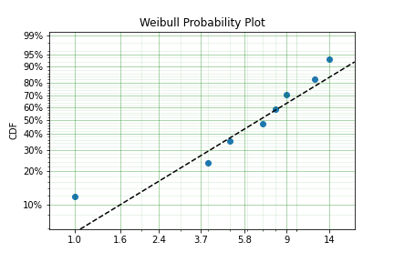

Parametric Estimation
=====================

Parametric modelling is the process of estimating the parameters of a particular distribution from a set of data. This is distinct from non-parametric modelling where we make no assumptions about the shape of the distribution. In parametric modelling we make some assumptions, explicit or implied, about the shape of the data that we have.

For this segment I will use the Weibull distribution as the example distribution. The Weibull distribution is a very useful distribution for one interesting reason. It is the distribution for the 'weakest link.' As the normal distribution is the limiting distribution of averages, the Weibull distribution is the limiting distribution for minimums. What does that mean? If we have a large number of sets of samples from something that is normally distributed the average of these sets will also be normally distributed but the minimums of these sets of samples will be Weibull distributed. This is analagous to a chain. It is common wisdom that a chain is only as strong as it's weakest link. The Weibull distribution enables us to model the strength of a chain based on the strength of the links.

The Weibull distribution can then be used in scenarios where we assume that the shape of the distribution will be due to a weakest link effect. This assumption holds in many scenarios, the strength of materials, the fielded life of equipment, the lifetime of animals, the time until another recession, or the time until germination of seeds. This example makes clear the assumption that we can make when using the Weibull distribution. Other distributions have differing processes that can result in their generation. If we know and understand these processes we can check them against the scenario we are analysing and chose a distribution from them. For example, a lognormal distribution can arise due to the combined effect of the product of random variables so in petroleum engineering the total recoverable oil is a product of the height, width, depth, features of the rock and an infinitude of other variables of the field. Therefore fields can be lognormally distributed. Similar considerations can be applied for many other types of distributions. Finally, If we don't know, or mind, what distribution we have, we can simply find the best fit amongst a set of distributions.

SurPyval offers users several methods for estimating parameters, these are:

- Method of Moments (MOM)
- Method of Probability Plotting (MPP)
- Mean Square Error (MSE)
- Maximum Likelihood Estimation (MLE)
- Minimum Product Spacing (MPS)

There are other methods that can be used, e.g. L-moments or generalised method of moments. These are interesting, and may be added in future, but for now surpyval offers the above estimation methods. Surpyval is unique in the capability to provide the estimation technique. Most other survival analysis methods do not allow for specifying different methods. The advantage of this flexibility will become apparent.

Method of Moments (MOM)
-----------------------

This method is the simplest (and least accurate) method to find parameters of a distribution. The intent of the Method of Moments (MOM) is to find the closest match of a distributions moments, to those of the moments of a sample of data.

For a given data set, or sample, the kth moment is defined as:

.. math::

	M_{k} = \frac{1}{n} \sum_{i=1}^{n}X_{i}^{k}

If the distribution has only one parameter, like the exponential distribution, then the method of moments is simply equates the sample moment to the dsitribution moment. For a continuous distribution the kth moment is defined as:

.. math::

	M_{k} = \int_{-\infty}^{\infty}x^{k}f(x)dx

Where f(x) is the density function of that distribution. Therefore, for the exponential distribution, the moments can be computed (with some working) to be:

.. math::

	E[X^{k}] = \frac{k!}{\lambda^{k}}

Because there is only one parameter of the exponential distribution, we need to only match the first moment of the distribution (k=1) to the first moment of the sample. Therefore we get:

.. math::

	\frac{1}{n} \sum_{i=1}^{n}X_{i} = \frac{1}{\lambda}

This is to say that the method of moments solution for the parameter of the exponential is simply the inverse of the average. This is an easy result. When we extend to other distributions with more than one parameter, such simple analytical solutions are not available, so numeric optimisation is needed. SurPyval uses numeric optimisation to compute the parameters for these distributions.

The method of moments, although interesting, can produce incorrect results, and it can only be used with observed data, so it cannot account for truncation or censoring. But it is good to understand as it is one of the oldest methods used to estimate the parameters of a distribution.

Method of Probability Plotting (MPP)
------------------------------------

Probability plotting is an extremely simple way to find the parameters of a distribution. This method has a long history because it is a simple activity to do while providing an easy to understand graphic. Further, probability plotting produces a good estimate for the parameters even with few data points. All this combined with the fact that probability plotting can be used for all types of data, observed, censored, and truncated, it is easy to understand why it is widely used.

SurPyval uses the MPP method as an initial guess, when not provided, because it is the only method that does not require an initial guess of the parameters. This is because numeric optimisers require an initial guess, however, when using a probability plotting method, an initial guess is not needed. It therefore provides an excellent method to get an initial guess for subsequent optimisation. But the method itself can be sufficient enough for the majority of applications.

So how does it work?

Probability plotting works of the idea that a distributions CDF can be made into a straight line if the data is transformed. This can be shown by rearranging the CDF of a dsitribution. For the Weibull:

.. math::

	F(x) = 1 - e^{-{(\frac{x}{\alpha}})^{\beta}}

If we negate, add one, and then take the log of each side we get:

.. math::

	\mathrm{ln}(1 - F(x)) = -{(\frac{x}{\alpha}})^{\beta}

Then take the log again:

.. math::

	\mathrm{ln}(-\mathrm{ln}(1 - F(x))) = \beta \mathrm{ln}(x) - \beta\mathrm{ln}(\alpha)

From here, we can see that there is a relationship between the CDF and x. That is, the log of the log of (1 - CDF) has a linear relationship with the log of x. Therefore, if we take the log of x, and take the log of the negative log of 1 minus the CDF and plot these, we will get a straight line. To make this work, we therefore need a method to estimate the CDF empirically. Traditionally, there have been heuristics used to create the CDF. However, we can also use the non-parametric estimate as discussed in the non-parametric session. Concretely, we can use the Kaplan-Meier, the Nelson-Aalen, Fleming-Harrington, or Turnbull estimates to approximate the CDF, F(x), transform it, plot, and then do the linear regression. SurPyval uses as a default, the Nelson-Aalen estimator for the plotting point.

Other methods are available. The simplest estimate, for complete data, is the empirical CDF:

.. math::

	\hat{F}(x) = \frac{1}{n}\sum_{i=1}^{n}1_{X_{i} \leq x}

This equation says, that (for a fully observed data set) for any given value, x, the estimate of the CDF at that value is simply the sum of all the observations that occurred below that value divided by the total number of observations. This is a simple percentage estimate that has failed at any given point. This equation will therefore make a step function that increases from 0 to 1.

One issues with this is that the highest value is always 1. But if this is transformed as above, this will be an undefined number. As such, you can adjust the value with a simple change:

.. math::

	\hat{F}(x) = \frac{1}{n+1}\sum_{i=1}^{n}1_{X_{i} \leq x}

By using this simple change, the highest value will not be 1, and will therefore be plottable, and not undefined. There are many different methods used to adjust the simple ECDF to be used with a plotting method to estimate the parameters of a distribution. For example, consider Blom's method:

.. math::

	\hat{F}_{k} = (k - 0.375)/(n + 0.25)

Where k is the rank of an observation k is in (1, 2, 3, 4.... n) for n observations. Using these methods we can therefore plot the linearised version above.

Combining this all together is simple witht surpyval.

.. code::

	x = [1, 4, 5, 7, 8, 9, 12, 14]
	model = surv.Weibull.fit(x, how='MPP', heuristic='Blom')
	model.plot()

In this example we have used the probability plotting method with the Blom heuristic to estimate the parameters of the distribution. SurPyval has the option to use many different plotting methods, including the regular KM, NA, and FH non-parametric estimates. All you need to do is change the 'heuristic' parameter; SurPyval includes:

.. list-table:: SurPyval Modelling Methods
   :header-rows: 1
   :align: center

   * - Method
     - A
     - B
   * - Blom
     - 0.375
     - 0.25
   * - Median
     - 0.3
     - 0.4
   * - ECDF
     - 0
     - 0
   * - ECDF_Adj
     - 0
     - 1
   * - Mean
     - 0
     - 1
   * - Weibull
     - 0
     - 1
   * - Modal
     - 1
     - -1
   * - DPW
     - 1
     - 0
   * - Midpoint
     - 0.5
     - 0
   * - Benard
     - 0.3
     - 0.2
   * - Beard
     - 0.31
     - 0.38
   * - Hazen
     - 0.5
     - 0
   * - Gringorten
     - 0.44
     - 0.12
   * - Larsen
     - 0.567
     - -0.134
   * - Larsen
     - 1/3
     - 1/3
   * - None
     - 0
     - 0

Which is used with the general formula to estimate the plotting position heuristic:

.. math::

	\hat{F}_{k} = (k - A)/(n + B)

One final option available is that of the Filliben estimate:

Mean Square Error (MSE)
-----------------------

MSE is essentially the same as probability plotting. Instead of finding the minimum against the transformed data in the x and y axes. The parameters are found by minimising the distance to the non-parametric estimate without transforming the data to be linear. Mathematically, MSE find the parameters by minimising:

.. math::

  \Sigma \left( \hat{F} - F(x; \theta) \right )^{2}

This is the difference between the, untransformed, empirical estimate of the CDF and the parametric distribution.

Maximum Likelihood Estimation (MLE)
-----------------------------------

Maximum Likelihood Estimation (MLE) is the most widely used, and most flexible of all the estimation methods. It's relative simplicity (because of modern computing power) makes it the reasonable first choice for parametric estimation. What does it do? Essentially MLE asks what parameters of a distribution are 'most likely' given the data that we have seen. Consider the following data and distributions:

.. image:: images/mle-1.png
	:align: center

The solid lines are the densities of two different Weibull distributions. The dashed lines represent the data we have observed, their height is the density of the two distributions at the x value for each observation. Given the data and the two distributions, which one seems to explain the distribution of the data better? That is, which distribution is more likely to produce, if sampled, the dashed lines? It should be fairly intuitive that the red distribution is more likely to do so. For example, the observation just above 10, you can see the height to the black line and the heigth to the red line. The red line is taller than the black line, therefore this observation is more 'likely' to have come from the red distribution than the black one. Conversely, the value near 15 is more likely to have come from the black distribution than the red one because the height to the black line is greater than the height to the red line. To find the distribution of best fit then we need to find the parameters that best averages the height of all these lines.

MLE formalises this concept by saying that the most likely distribution is the one that has the highest (geometric) mean of the height of the density function for each sample of data. The height of the density at a particular observation is known as the likelihood. Mathematically, (for uncensored data) MLE then maximises the following:

.. math::

	L = {\left ( \prod_{i=1}^{n}f(x_{i} | \theta ) \right )}^{1/n} 

f is the pdf of the distribution being estimated, x is the observed value, theta is the parameter vector, and L is the geometric mean of all the values. This is complicated, but a simplification is available by taking the log of this product yielding:

.. math::

	l = { \frac{1}{n}} \sum_{i=1}^{n} \ln f(x_{i} | \theta )

Therefore MLE simply finds the parameters of the distribution that maximise the average of the log of the likelihood for each point... One final transform that is used in optimisers is that we take the negative of the above equation so that we find the minimum of the negative log-likelihood.

Armed with the log likelihood we can then search for the parameter where the log likelihood is maximised. Using an Exponential distribution as an example, we can see the change in the value of the log likelihood as the exponential parameter changes. The following is a random sample of 100 observations with a parameter of 10. Then changing the value of the parameter 'lambda' from low to high we can see what the log-likelihood is and find the value at which it is maximized.

.. image:: images/mle-2.png
	:align: center

On the chart above you can see that the maximum is near 10. As we would expect given that we know that the answer is 10. It is this simple and intuitive approach that allows the parameters of distributions are estimated with the MLE.

What about censored data?

All the equations above are for observed data. Handling the likelihood of censored data also has an intuitive understanding. What we know about the point when the data point is censored is that we know it is above or below the value at which we observed. So for a right censored data point, we want to maximize the probability that we saw this observation, concretely we want a censored points contribution to the likelihood function is the probability that the point was left or right censored. This is simply the probability of failure (CDF) for left censored and the probability of surviving to that time (survival function). Formally:

.. math::

	l = { \frac{1}{n_{o}}} \sum_{i=1}^{n_{o}} \ln f(x_{o_{i}} | \theta ) +  { \frac{1}{n_{r}}} \sum_{i=1}^{n_{r}} \ln R(x_{r_{i}} | \theta ) +  { \frac{1}{n_{l}}} \sum_{i=1}^{n_{l}} \ln F(x_{l_{i}} | \theta )

An easy and intuitive way to understand this is to compare these two possibilities. With some randomly generated data with a few values made to be left censored, and a few to be right censored. We get:

.. image:: images/mle-3.png
	:align: center

In this example, again, we need to consider whether the red or black distribution is a more likely description of the observations, including some censored ones. Althought the right censored point for the black distribuiton is very likely, this does not mean it is a good fit because the 'average' across all observations is poor. Therefore, it should be obvious that the red distribution is the better fit.

But what about truncated data

Maximum Product of Spacings (MPS)
---------------------------------

Coming soon