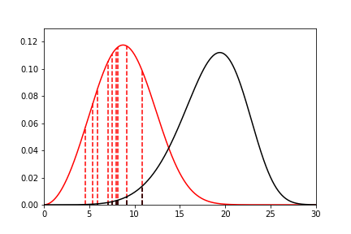
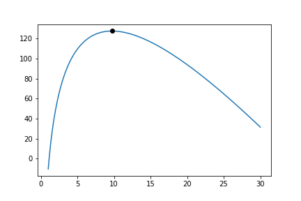
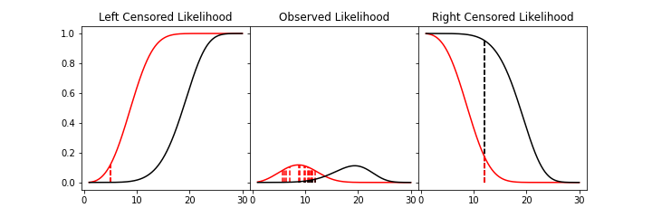

Parametric Estimation
=====================

Parametric modelling is the process of estimating the parameters of a particular distribution from a set of data. This is distinct from non-parametric modelling where we make no assumptions about the shape of the distribution. In parametric modelling we make some assumptions, explicit or implied, about the shape of the data that we have.

For this segment I will use the Weibull distribution as the example distribution. The Weibull distribution is a very useful distribution for one interesting reason. It is the distribution for the 'weakest link.' As the normal distribution is the limiting distribution of averages, the Weibull distribution is the limiting distribution for minimums. What does that mean? If we have a large number of sets of samples, the averages of these sets will be (approximately) normally distributed, whatever distribution with a finite variance the samples came from. If the samples come from something bounded below -- a strength or a lifetime can never be negative -- the minimums of these sets of samples will be (approximately) Weibull distributed. (Minimums of quantities with no lower bound, such as normally distributed ones, tend instead to the Gumbel distribution, which is also available in SurPyval as ``Gumbel``; its mirror image, the limit for *maximums*, is ``GumbelLEV``.) This is analogous to a chain. It is common wisdom that a chain is only as strong as its weakest link. The Weibull distribution enables us to model the strength of a chain based on the strength of the links.

The Weibull distribution can then be used in scenarios where we assume that the shape of the distribution will be due to a weakest link effect. This assumption holds in many scenarios, the strength of materials, the fielded life of equipment, the lifetime of animals, the time until another recession, or the time until germination of seeds. This example makes clear the assumption that we can make when using the Weibull distribution. Other distributions have differing processes that can result in their generation. If we know and understand these processes we can check them against the scenario we are analysing and choose a distribution from them. For example, a lognormal distribution can arise due to the combined effect of the product of random variables so in petroleum engineering the total recoverable oil is a product of the height, width, depth, features of the rock and an infinitude of other variables of the field. Therefore fields can be lognormally distributed. Similar considerations can be applied for many other types of distributions. Finally, If we don't know, or mind, what distribution we have, we can simply find the best fit amongst a set of distributions.

This page explains *how* the parameters are found. The companion page,
:doc:`Parametric SurPyval Modelling`, shows the code for every capability
described here and tabulates the distributions SurPyval provides, and the
API reference for each distribution is listed in :doc:`surpyval.parametric`.

.. rubric:: What a parametric model is

A parametric distribution is a family of curves indexed by a parameter
vector :math:`\theta`. For the Weibull, :math:`\theta = (\alpha, \beta)`: the
scale :math:`\alpha` stretches the curve along the time axis and the shape
:math:`\beta` bends it. Once :math:`\theta` is known, every quantity we care
about in survival analysis is known too, because they are all tied together:

- the CDF, or failure function, :math:`F(x) = P(X \leq x)` (``ff``);
- the survival, or reliability, function :math:`R(x) = 1 - F(x)` (``sf``);
- the density :math:`f(x) = \frac{d}{dx}F(x)` (``df``);
- the hazard rate :math:`h(x) = f(x) / R(x)` (``hf``), the instantaneous
  rate of failure among the units still surviving; and
- the cumulative hazard :math:`H(x) = \int_{0}^{x} h(u)\,du = -\ln R(x)`
  (``Hf``).

Any one of these determines all of the others. That is why, as the
:doc:`Parametric SurPyval Modelling` notes show, a completely new
distribution can be created from nothing more than its cumulative hazard
function. *Estimation* is the reverse problem: given data, which
:math:`\theta` should we believe?

.. rubric:: The data

Throughout, the data are written the way SurPyval stores them (see
:doc:`Types of Data` and :doc:`Conventions`). Observation :math:`i` has a
value :math:`x_{i}`, a censoring flag :math:`c_{i}`, a count :math:`n_{i}` of
how many units share that row, and a truncation window
:math:`(t_{l_{i}}, t_{r_{i}}]` inside which it had to fall to be recorded at
all. The censoring flag is

- :math:`c_{i} = 0`: observed exactly, the event happened at :math:`x_{i}`;
- :math:`c_{i} = 1`: right censored, the event happened *after* :math:`x_{i}`;
- :math:`c_{i} = -1`: left censored, the event happened at or *before*
  :math:`x_{i}`;
- :math:`c_{i} = 2`: interval censored, the event happened inside
  :math:`(x_{l_{i}}, x_{r_{i}}]`.

An untruncated observation has :math:`t_{l} = -\infty` and
:math:`t_{r} = \infty`. The total number of units is
:math:`N = \sum_{i} n_{i}`.

.. rubric:: The estimation methods

SurPyval offers users several methods for estimating parameters, these are:

- Method of Moments (MOM)
- Method of Probability Plotting (MPP)
- Mean Square Error (MSE)
- Maximum Likelihood Estimation (MLE)
- Maximum Product of Spacings (MPS)

There are other methods that can be used, e.g. L-moments or generalised method of moments. These are interesting, and may be added in future, but for now surpyval offers the above estimation methods. Surpyval is unusual in letting you choose the estimation technique; most other survival analysis packages fix the method for you. The advantage of this flexibility will become apparent. The method is chosen with the ``how`` argument of ``fit`` (``how='MLE'`` is the default).

Each method answers the question "which :math:`\theta` fits best?" with a
different definition of *best*, and so each accepts a different range of
data. The table below is a map of what the following sections explain; the
reasons for every entry are given there.

.. list-table:: What each method optimises and what it accepts
   :header-rows: 1
   :widths: 8 24 18 20 15 15

   * - ``how``
     - Chooses :math:`\theta` to...
     - Censoring
     - Truncation
     - Extras
     - Not available for
   * - MOM
     - match the sample moments
     - none
     - none
     - offset, ``fixed``
     -
   * - MPP
     - fit a straight line on a probability plot
     - right with any heuristic; left and interval with ``'Turnbull'``
     - left with ``'Nelson-Aalen'``, ``'Kaplan-Meier'``,
       ``'Fleming-Harrington'`` or ``'Turnbull'``; right with ``'Turnbull'``
     - offset (no ``fixed``)
     - Gamma, ExpoWeibull, Beta, Beta4, the discrete distributions,
       custom distributions
   * - MSE
     - minimise squared distance to the non-parametric CDF
     - right, left and interval
     - none
     - offset, ``fixed``
     -
   * - MLE
     - maximise the likelihood
     - all
     - any, per observation
     - offset, ``fixed``, ``lfp``, ``zi``, confidence bounds
     -
   * - MPS
     - maximise the geometric mean of the CDF spacings
     - right and left (no interval)
     - one common window (scalar ``tl`` / ``tr``)
     - offset, ``fixed``
     - the discrete distributions

Asking a method for data, options or a distribution outside its row raises an
error rather than returning a quietly wrong answer. Whatever the method, the
fitted model has every function the distribution provides (``sf``, ``ff``,
``df``, ``hf``, ``Hf``, ``qf``, ...) and its log-likelihood and information
criteria.

As a rule of thumb: use **MLE** unless you have a reason not to. It takes
any data, it is the only method that can fit limited-failure and
zero-inflated models, and it is the only one whose fitted model carries a
parameter covariance and therefore confidence bounds. Reach for **MPS** when
a parameter sets where the support starts or ends (an offset, the Uniform's
end points) or when an MLE fit struggles. Use **MPP** when you want a quick,
visual, assumption-light fit, or a starting point. **MSE** and **MOM** are
useful cross-checks and fall-backs.

Method of Moments (MOM)
-----------------------

This method is the simplest (and least accurate) method to find parameters of a distribution. The intent of the Method of Moments (MOM) is to find the closest match of a distribution's moments to the moments of a sample of data. The intuition is that a distribution's moments summarise its shape -- the first is its centre, the second (about the mean) its spread, the third its skew -- so a distribution whose moments agree with the sample's should look like the sample.

For a given data set, or sample, the kth moment is defined as:

.. math::

	M_{k} = \frac{1}{n} \sum_{i=1}^{n}X_{i}^{k}

(with counts, each :math:`X_{i}^{k}` is simply repeated :math:`n_{i}` times,
so :math:`M_{k} = \frac{1}{N}\sum_{i} n_{i} x_{i}^{k}`).

If the distribution has only one parameter, like the exponential distribution, then the method of moments simply equates the sample moment to the distribution moment. For a continuous distribution the kth moment is defined as:

.. math::

	E[X^{k}] = \int_{-\infty}^{\infty}x^{k}f(x)dx

Where f(x) is the density function of that distribution. Therefore, for the exponential distribution, the moments can be computed (with some working) to be:

.. math::

	E[X^{k}] = \frac{k!}{\lambda^{k}}

Because there is only one parameter of the exponential distribution, we need to only match the first moment of the distribution (k=1) to the first moment of the sample. Therefore we get:

.. math::

	\frac{1}{n} \sum_{i=1}^{n}X_{i} = \frac{1}{\lambda}

This is to say that the method of moments solution for the parameter of the exponential is simply the inverse of the average. We can check that SurPyval agrees:

.. jupyter-execute::

    import numpy as np
    import surpyval as surv

    np.random.seed(4)
    x = surv.Exponential.random(200, 0.5)

    print("1 / mean(x)  :", 1 / x.mean())
    print("MOM estimate :", surv.Exponential.fit(x, how='MOM').params[0])

This is an easy result. When we extend to other distributions with more than one parameter, we need one equation per unknown: a distribution with :math:`k` parameters is matched on its first :math:`k` moments, and an offset adds one more parameter and so one more moment. Such simple analytical solutions are not always available. A few distributions have them -- the Uniform and Beta solve their moment equations in closed form, and SurPyval uses those solutions directly when there is no offset and nothing is fixed -- but in general numeric optimisation is needed. SurPyval uses numeric optimisation to compute the parameters for these distributions.

One closed form is SurPyval's own choice and worth knowing about: for the
LogNormal, ``how='MOM'`` matches the mean and variance of :math:`\ln x`, not
of :math:`x`. Those are exactly the parameters :math:`\mu` and
:math:`\sigma^{2}` of the underlying normal, so the answer is simple and
stable, but it is the same as the maximum likelihood estimate on complete data
rather than the textbook method of moments (which solves
:math:`E[X] = e^{\mu + \sigma^{2}/2}` and
:math:`\mathrm{Var}(X) = (e^{\sigma^{2}} - 1)e^{2\mu + \sigma^{2}}` for the
raw data and gives slightly different values).

That optimisation matches *central* moments — the variance, and the skew- and
kurtosis-like higher moments about the mean — rather than the raw moments
:math:`E[X^{k}]`, and scales each by the corresponding power of the standard
deviation before comparing. Concretely, writing :math:`\hat{m}_{1}` for the
sample mean, :math:`\hat{m}_{j}` (:math:`j \geq 2`) for the sample central
moments, :math:`\mu_{j}(\theta)` for the same quantities of the model and
:math:`\hat{s} = \sqrt{\hat{m}_{2}}` for the sample standard deviation, the
parameters minimise

.. math::

    \sum_{j=1}^{K} \left( \frac{\hat{m}_{j} - \mu_{j}(\theta)}{\hat{s}^{\,j}} \right)^{2},

where :math:`K` is the number of distribution parameters, plus one for an
offset. Every term is dimensionless: the
first is the error in the mean measured in standard deviations, the second the
relative error in the variance, the third the error in the skewness.

The two are equivalent in exact arithmetic, since
one set is a binomial transform of the other, but they are not equally easy to
optimise. Raw moments of offset data are dominated by the offset: for data
sitting near :math:`\gamma`, every :math:`E[X^{k}]` is close to
:math:`\gamma^{k}`, so the moments grow like powers of the offset while the
differences that actually identify the shape parameters are swamped. Centring
removes that common term and the scaling puts each residual on a comparable
footing, which leaves the estimator far better conditioned on shifted data.

The moments of an offset distribution are themselves computed exactly. If
:math:`X = \gamma + Y`, the binomial theorem gives

.. math::

    E[X^{n}] = \sum_{k=0}^{n} \binom{n}{k} \gamma^{\,n-k} E[Y^{k}],

so only the moments of the un-shifted distribution are needed. Those come from
each distribution's closed form where one exists, and from numerical
integration of :math:`x^{k} f(x)` otherwise.

The optimiser (BFGS) runs to a tight tolerance and, if the moments are still
not matched, polishes the answer with Nelder-Mead. If the scaled mismatch above
is still larger than :math:`10^{-2}` SurPyval warns that the parameters may be
unreliable. A healthy fit lands far below that: at about :math:`10^{-12}` when
the moment equations have an exact solution, or at about :math:`10^{-3}` when
sampling noise means no parameter vector reproduces the sample moments exactly.

Fixing a parameter (``fixed=``) does not reduce :math:`K`: SurPyval still
matches as many moments as the distribution (plus offset) has parameters, now
with fewer free parameters to do it. The equations are then over-determined,
the answer is the closest compromise, and the mismatch warning above is to be
expected unless the fixed value happens to agree with the data. A Weibull with
:math:`\beta` fixed at 2, for example, is fitted to both the sample mean and
the sample variance with :math:`\alpha` alone.

The method of moments, although interesting, can produce incorrect results, and it can only be used with observed data, so it cannot account for truncation or censoring. It is also statistically inefficient: higher sample moments are dominated by the few most extreme observations, so they are noisy, and for heavy-tailed distributions (a LogLogistic with a small shape, say) the higher moments may not even exist. With an offset, matching three moments to three parameters is close to unidentifiable, so treat offset MOM fits with care. But it is good to understand as it is one of the oldest methods used to estimate the parameters of a distribution, and it is a quick cross-check on complete data.

Method of Probability Plotting (MPP)
------------------------------------

Probability plotting is an extremely simple way to find the parameters of a distribution. This method has a long history because it is a simple activity to do while providing an easy to understand graphic. Further, probability plotting produces a good estimate for the parameters even with few data points. All this combined with the fact that probability plotting can be used for all types of data, observed, censored, and truncated, it is easy to understand why it is widely used.

It also has a property that no other method here has: it needs no initial guess. Apart from a few closed-form cases, every other estimator is solved by a numeric optimiser, and a numeric optimiser has to start somewhere. That makes probability plotting an excellent way to *seed* the other methods, and many SurPyval distributions (the Weibull, Normal, Gumbel, Logistic and LogLogistic among them) build the starting point for their other fits this way; others use a quick moment estimate instead. But the method itself can be sufficient for the majority of applications.

So how does it work?

Probability plotting works off the idea that a distribution's CDF can be made into a straight line if the data is transformed. This can be shown by rearranging the CDF of a distribution. For the Weibull:

.. math::

	F(x) = 1 - e^{-{(\frac{x}{\alpha}})^{\beta}}

If we negate, add one, and then take the log of each side we get:

.. math::

	\mathrm{ln}(1 - F(x)) = -{(\frac{x}{\alpha}})^{\beta}

Then take the log again:

.. math::

	\mathrm{ln}(-\mathrm{ln}(1 - F(x))) = \beta \mathrm{ln}(x) - \beta\mathrm{ln}(\alpha)

From here, we can see that there is a relationship between the CDF and x. That is, the log of the log of (1 - CDF) has a linear relationship with the log of x. Therefore, if we take the log of x, and take the log of the negative log of 1 minus the CDF and plot these, we will get a straight line whose slope is :math:`\beta` and whose intercept is :math:`-\beta\ln\alpha`. To make this work, we therefore need a method to estimate the CDF empirically. Traditionally, there have been heuristics used to create the CDF. However, we can also use the non-parametric estimate as discussed in the :doc:`Non-Parametric Estimation` section. Concretely, we can use the Kaplan-Meier, the Nelson-Aalen, Fleming-Harrington, or Turnbull estimates to approximate the CDF, F(x), transform it, plot, and then do the linear regression. SurPyval uses as a default, the Nelson-Aalen estimator for the plotting point.

Other methods are available. The simplest estimate, for complete data, is the empirical CDF:

.. math::

	\hat{F}(x) = \frac{1}{n}\sum_{i=1}^{n}1_{X_{i} \leq x}

This equation says, that (for a fully observed data set) for any given value, x, the estimate of the CDF at that value is simply the sum of all the observations that occurred below that value divided by the total number of observations. This is a simple percentage estimate that has failed at any given point. This equation will therefore make a step function that increases from 0 to 1.

One issue with this is that the highest value is always 1. But if this is transformed as above, this will be an undefined number (:math:`\ln(-\ln 0)`). As such, you can adjust the value with a simple change:

.. math::

	\hat{F}(x) = \frac{1}{n+1}\sum_{i=1}^{n}1_{X_{i} \leq x}

By using this simple change, the highest value will not be 1, and will therefore be plottable, and not undefined. There are many different methods used to adjust the simple ECDF to be used with a plotting method to estimate the parameters of a distribution. For example, consider Blom's method:

.. math::

	\hat{F}_{k} = (k - 0.375)/(n + 0.25)

Where k is the rank of an observation k is in (1, 2, 3, 4.... n) for n observations. Using these methods we can therefore plot the linearised version above.

Fitting a distribution this way — the probability-plotting method with a chosen
heuristic — is nothing more than a straight-line fit through the transformed
points, and the slope and intercept give the parameters. For the Weibull the
line is :math:`y = \beta\ln x - \beta\ln\alpha`, so :math:`\beta` is the slope
and :math:`\alpha = e^{-\text{intercept}/\beta}`. We can do it by hand with
Blom's positions and check that SurPyval does the same thing:

.. jupyter-execute::

    np.random.seed(8)
    x = np.sort(surv.Weibull.random(20, 10., 2.))   # alpha = 10, beta = 2
    n = len(x)
    rank = np.arange(1, n + 1)
    F = (rank - 0.375) / (n + 0.25)               # Blom's plotting positions

    slope, intercept = np.polyfit(np.log(x), np.log(-np.log(1 - F)), 1)
    print("by hand  : alpha =", np.exp(-intercept / slope), " beta =", slope)

    model = surv.Weibull.fit(x, how='MPP', heuristic='Blom')
    print("how='MPP':", model.params)
    model.plot(heuristic='Blom')

The two agree exactly, and with twenty points they land near the
:math:`\alpha = 10`, :math:`\beta = 2` used to simulate the data. On the plot
the axes are already transformed (a log scale for :math:`x`, and the
double-log scale labelled with CDF values), so the fitted Weibull is the
straight line and the points are the Blom positions. SurPyval has the option to use many different plotting methods, including the regular KM, NA, and FH non-parametric estimates. All you need to do is change the ``heuristic`` parameter; the rank-based ones SurPyval includes are:

.. list-table:: Plotting-position heuristics :math:`\hat{F}_{k} = (k - A)/(n + B)`
   :header-rows: 1
   :align: center

   * - Method
     - A
     - B
   * - Blom
     - 0.375
     - 0.25
   * - Median
     - 0.3
     - 0.4
   * - ECDF
     - 0
     - 0
   * - ECDF_Adj
     - 0
     - 1
   * - Mean
     - 0
     - 1
   * - Weibull
     - 0
     - 1
   * - Modal
     - 1
     - -1
   * - DPW
     - 1
     - 0
   * - Midpoint
     - 0.5
     - 0
   * - Benard
     - 0.3
     - 0.2
   * - Beard
     - 0.31
     - 0.38
   * - Hazen
     - 0.5
     - 0
   * - Gringorten
     - 0.44
     - 0.12
   * - Larsen
     - 0.567
     - -0.134
   * - Tukey
     - 1/3
     - 1/3
   * - None
     - 0
     - 0

Which is used with the general formula to estimate the plotting position heuristic:

.. math::

	\hat{F}_{k} = (k - A)/(n + B)

Some names are synonyms: ``'ECDF'`` and ``'None'`` are the raw empirical CDF
:math:`k/n`, and ``'Mean'``, ``'Weibull'`` and ``'ECDF_Adj'`` are all
:math:`k/(n + 1)`, the expected value of the :math:`k`-th uniform order
statistic. Any point with :math:`\hat{F} = 0` or :math:`1` (the top point of
``'ECDF'``, for example) cannot be transformed and is left out of the fit.

One final option available is that of the Filliben estimate (``'Filliben'``),
an approximation to the *median* of each uniform order statistic:

The last group of options are the non-parametric estimators themselves:
``'Nelson-Aalen'`` (the default), ``'Kaplan-Meier'``, ``'Fleming-Harrington'``
and ``'Turnbull'`` (see :doc:`Non-Parametric Estimation`).

Censoring and truncation in a probability plot
^^^^^^^^^^^^^^^^^^^^^^^^^^^^^^^^^^^^^^^^^^^^^^

A right-censored unit has no failure time to plot, but it still matters: it
tells us that a unit survived past :math:`x_{i}`, so the units that fail
later must be ranked higher than their raw position suggests. The rank
heuristics above therefore adjust the ranks of the failures that follow a
censored unit (the "mean order number" adjustment), and the non-parametric
estimators handle right censoring natively through their risk sets.

Left- and interval-censored data do not have ranks at all, so they need the
Turnbull estimator (``heuristic='Turnbull'``), which spreads each censored
unit's probability over the times where it could have failed. Truncation
changes the risk set rather than the ranks, so left-truncated data needs one of
the estimators (``'Nelson-Aalen'``, ``'Kaplan-Meier'``,
``'Fleming-Harrington'`` or ``'Turnbull'``) and right-truncated data needs
``'Turnbull'``. The Turnbull estimator is expensive, so when
``heuristic='Turnbull'`` is asked for data with no left or interval censoring
and no right truncation, SurPyval uses the estimator named by
``turnbull_estimator`` (Fleming-Harrington by default) directly, which is
what Turnbull reduces to on such data. A pitfall: when *every* observation shares the same truncation
window, the non-parametric estimate cannot tell how much probability lies
outside that window, so a probability plot of such data runs from about 0 to
about 1 inside the window and the fitted line ignores the truncation. The
:doc:`Parametric SurPyval Modelling` notes show this and how MLE avoids it.

Details of the regression
^^^^^^^^^^^^^^^^^^^^^^^^^

Once the points are transformed, the line is found by least squares. By
default (``rr='y'``) the vertical distances are minimised, i.e. the
transformed CDF is regressed on the transformed x; ``rr='x'`` minimises the
horizontal distances instead. A plotting position at a time where nothing
failed (a time at which units were only censored, such as the end of a test)
carries no failure; ``on_d_is_0=False`` (the default) leaves such points out
of the regression and ``on_d_is_0=True`` keeps them.

An offset (``offset=True``, see below) cannot be read off a line, because
shifting :math:`x` bends the plot. SurPyval therefore searches for the shift
:math:`\gamma < \min(x)` that makes the transformed points *most* linear -- it
maximises their Pearson correlation -- and then fits the line to
:math:`x - \gamma`.

Probability plotting has real weaknesses. The transformation stretches the
tails, so a least-squares line gives the extreme points far more influence
than they deserve; the plotting positions are not independent, so the
regression carries no honest measure of uncertainty (MPP fits have no
confidence bounds); and parameters cannot be fixed. Some distributions have no
straight-line transform at all. The Gamma's CDF is the regularised incomplete
gamma function with the shape *inside* the special function, so the only
linearising axis depends on the shape you are trying to estimate; the same is
true of the exponentiated Weibull and of the Beta and four-parameter Beta.
SurPyval refuses ``how='MPP'`` for those rather than guess an axis, and it
refuses it for the discrete distributions too, whose step-shaped CDFs cannot be
linearised. (A fitted Gamma can still be *drawn* on a probability plot, since
by then the parameters are known.) A ``CustomDistribution`` knows only its
cumulative hazard, so it has no transform either: its plots use plain linear
axes, and ``how='MPP'`` is not available for it (at present it fails with an
``AttributeError`` rather than a helpful message).

Mean Square Error (MSE)
-----------------------

MSE is essentially the same as probability plotting. Instead of finding the minimum against the transformed data in the x and y axes. The parameters are found by minimising the distance to the non-parametric estimate without transforming the data to be linear. Mathematically, MSE find the parameters by minimising:

.. math::

  \Sigma \left( \hat{F} - F(x; \theta) \right )^{2}

This is the difference between the, untransformed, empirical estimate of the CDF and the parametric distribution.

More precisely, :math:`\hat{F}` is the Fleming-Harrington estimate of the CDF
(or, when there are left- or interval-censored observations, the Turnbull
estimate with Fleming-Harrington survival), evaluated at each distinct time
:math:`x_{j}` in the data, and the objective is

.. math::

    \sum_{j} \left( \hat{F}(x_{j}) - F(x_{j} - \gamma; \theta) \right)^{2},

with :math:`\gamma = 0` unless an offset is requested. The ``heuristic``
argument does not apply to MSE: it always uses this estimate. Each distinct
time contributes one term, however many units share it; the counts enter only
through the non-parametric estimate :math:`\hat{F}`.

Why bother, when probability plotting already fits a curve to the same
points? Because MSE works on the probability scale, where every point is
measured in the same units. The double-log transform of a Weibull plot turns a
CDF difference of 0.001 in the far tail into a large vertical gap; MSE sees it
as the 0.001 it is. MSE is therefore less driven by the few most extreme
points, and it works for any distribution with a CDF, including those that
have no probability-plot transform (Gamma, exponentiated Weibull, Beta) and
the discrete distributions.

Like MPP, MSE handles censoring through the non-parametric estimate, so right,
left and interval censoring are all accepted. It does not yet support
truncation (SurPyval raises ``NotImplementedError``), and like MPP it carries
no likelihood-based measure of uncertainty, so an MSE fit has no confidence
bounds. The minimisation is done with BFGS using the automatic gradient,
escalating to Newton-CG and then to a BFGS with finite-difference gradients
(scipy's default method) if a method fails.

Maximum Likelihood Estimation (MLE)
-----------------------------------

Maximum Likelihood Estimation (MLE) is the most widely used, and most flexible of all the estimation methods. Its relative simplicity (because of modern computing power) makes it the reasonable first choice for parametric estimation. What does it do? Essentially MLE asks what parameters of a distribution are 'most likely' given the data that we have seen. Consider the following data and distributions:

The solid lines are the densities of two different Weibull distributions. The dashed lines represent the data we have observed, their height is the density of the two distributions at the x value for each observation. Given the data and the two distributions, which one seems to explain the distribution of the data better? That is, which distribution is more likely to produce, if sampled, the dashed lines? It should be fairly intuitive that the red distribution is more likely to do so. For example, the observation just above 10, you can see the height to the black line and the height to the red line. The red line is taller than the black line, therefore this observation is more 'likely' to have come from the red distribution than the black one. Conversely, the value near 15 is more likely to have come from the black distribution than the red one because the height to the black line is greater than the height to the red line. To find the distribution of best fit then we need to find the parameters that best averages the height of all these lines.

MLE formalises this concept by saying that the most likely distribution is the one that has the highest (geometric) mean of the height of the density function for each sample of data. The height of the density at a particular observation is known as the likelihood. Mathematically, (for uncensored data) MLE then maximises the following:

.. math::

	L = {\left ( \prod_{i=1}^{n}f(x_{i} | \theta ) \right )}^{1/n}

f is the pdf of the distribution being estimated, x is the observed value, theta is the parameter vector, and L is the geometric mean of all the values. This is complicated, but a simplification is available by taking the log of this product yielding:

.. math::

	l = { \frac{1}{n}} \sum_{i=1}^{n} \ln f(x_{i} | \theta )

Therefore MLE simply finds the parameters of the distribution that maximise the average of the log of the likelihood for each point... One final transform that is used in optimisers is that we take the negative of the above equation so that we find the minimum of the negative log-likelihood.

Dividing by :math:`n` does not move the maximum, so it makes no difference to
the answer whether the average or the sum is maximised. SurPyval works with the
*sum*, the log-likelihood :math:`\ell(\theta) = \sum_{i} n_{i} \ln f(x_{i} \mid \theta)`
(counts simply multiply each term), and ``model.neg_ll()`` reports
:math:`-\ell(\hat{\theta})`, the total negative log-likelihood at the fitted
parameters. The sum is what the information criteria and the confidence bounds
below are built on.

Armed with the log likelihood we can then search for the parameter where the log likelihood is maximised. Using an Exponential distribution as an example, we can see the change in the value of the log likelihood as the exponential parameter changes. The following is a random sample of 100 observations with a parameter of 10. Then changing the value of the parameter 'lambda' from low to high we can see what the log-likelihood is and find the value at which it is maximized.

On the chart above you can see that the maximum is near 10. As we would expect given that we know that the answer is 10. It is this simple and intuitive approach that allows the parameters of distributions are estimated with the MLE.

Censored data
^^^^^^^^^^^^^

What about censored data?

All the equations above are for observed data. Handling the likelihood of censored data also has an intuitive understanding. What we know about the point when the data point is censored is that we know it is above or below the value at which we observed. So for a censored point, its contribution to the likelihood is the probability of what we *did* see: that the point was right censored (it survived to that time, the survival function), left censored (it had already failed, the CDF), or interval censored (it failed somewhere in the interval, the difference of two CDF values). Formally, the log-likelihood is a single sum over every observation, with each term chosen by that observation's censoring flag:

.. math::

    \ell(\theta) = \sum_{c_{i}=0} n_{i} \ln f(x_{i} \mid \theta)
                 + \sum_{c_{i}=1} n_{i} \ln R(x_{i} \mid \theta)
                 + \sum_{c_{i}=-1} n_{i} \ln F(x_{i} \mid \theta)
                 + \sum_{c_{i}=2} n_{i} \ln \left[ F(x_{r_{i}} \mid \theta) - F(x_{l_{i}} \mid \theta) \right]

It is one sum over all :math:`N` units, not an average taken separately
within each type of observation. (Averaging each group by its own size would
give a handful of censored units the same total weight as hundreds of
failures, and would move the maximum.)

This is not a special SurPyval formula: we can rebuild a fitted model's
likelihood by hand from the distribution functions and get exactly the number
the model reports.

.. jupyter-execute::

    x = [2, 4, 5, [6, 8], 9, 11, 12]
    c = [-1, 0, 0, 2, 0, 0, 1]
    model = surv.Weibull.fit(x, c)
    alpha, beta = model.params

    W = surv.Weibull
    ll = (np.log(W.df(np.array([4., 5., 9., 11.]), alpha, beta)).sum()  # observed
          + np.log(W.sf(12., alpha, beta))                                # right censored
          + np.log(W.ff(2., alpha, beta))                                 # left censored
          + np.log(W.ff(8., alpha, beta) - W.ff(6., alpha, beta)))        # interval
    print("by hand   :", -ll)
    print("neg_ll()  :", model.neg_ll())

An easy and intuitive way to understand this is to compare these two possibilities. With some randomly generated data with a few values made to be left censored, and a few to be right censored. We get:

In this example, again, we need to consider whether the red or black distribution is a more likely description of the observations, including some censored ones. Although the right censored point for the black distribution is very likely, this does not mean it is a good fit because the 'average' across all observations is poor. Therefore, it should be obvious that the red distribution is the better fit.

Truncated data
^^^^^^^^^^^^^^

Truncated data is handled with the same logic, but on the *conditional*
likelihood. A truncated observation was only observable because it fell inside
its truncation window :math:`(t_{l}, t_{r}]`, so each contribution is
renormalised by the probability of landing in that window:

.. math::

    \ell(\theta) = \sum_{i} n_{i} \ln \frac{f(x_{i} \mid \theta)}{F(t_{r_{i}} \mid \theta) - F(t_{l_{i}} \mid \theta)}

for exactly observed values (a censored value puts its own probability in the
numerator, as in the next section). This inflates the contribution of observations from a narrow window, correcting
for the units that could never have been seen — exactly the delayed-entry
(left-truncation) and right-truncation adjustments. With no right bound,
:math:`F(t_{r}) = 1` and the denominator is the survival :math:`R(t_{l})`; with
no left bound, :math:`F(t_{l}) = 0`. Because each observation carries its own
window, a late entry into a study (a different :math:`t_{l}` per unit) is
handled exactly.

Censored and truncated data
^^^^^^^^^^^^^^^^^^^^^^^^^^^

The two combine. An observation can be *both* censored and truncated: a unit
that entered a study late and was still running when it ended, or the
right-truncated failure of an instrument that can only record events below some
threshold. Such a point must be conditioned on its own window, so a
right-censored observation inside :math:`(t_{l}, t_{r}]` contributes

.. math::

    \frac{F(t_{r} \mid \theta) - F(x \mid \theta)}
         {F(t_{r} \mid \theta) - F(t_{l} \mid \theta)},

and a left-censored one contributes the mirror image with
:math:`F(x) - F(t_{l})` on top. The numerator matters: it must be capped by the
truncation bound rather than run out to infinity as :math:`R(x)` does. A ratio
of :math:`R(x)` to the window probability is not a probability at all — it grows
without bound as the fitted distribution puts less and less mass inside the
window, so an optimiser can drive the likelihood arbitrarily high and return a
meaningless answer while reporting success.

SurPyval sidesteps this by *rewriting* the observation rather than special-casing
the likelihood. A right-censored point with a finite :math:`t_{r}` is recast as
the interval :math:`(x, t_{r}]`, and a left-censored point with a finite
:math:`t_{l}` as :math:`(t_{l}, x]`, before the likelihood is ever evaluated.
The expressions above are then just the ordinary interval-censored contribution,
already conditioned by the truncation denominator. Where the relevant bound is
infinite there is nothing to cap, and the point stays a plain censored
observation so that the numerically stable ``log_sf`` is used.

This rewriting happens inside surpyval's internal representation of the data.
The ``x``, ``c``, ``n`` and ``t`` arrays you passed to ``fit`` are unchanged, and
the model reports the data back to you exactly as you supplied it.

Exact solutions: closed-form MLE
^^^^^^^^^^^^^^^^^^^^^^^^^^^^^^^^

For a few distributions the maximum can be found with pen and paper, and
SurPyval uses the exact answer instead of an optimiser whenever the data allow
it:

- **Exponential**, with exact and right-censored data (and any left
  truncation): setting the derivative of
  :math:`\ell = d \ln\lambda - \lambda \sum_{i} n_{i}(x_{i} - t_{l_{i}})` to zero gives

  .. math::

      \hat{\lambda} = \frac{d}{\sum_{i} n_{i} (x_{i} - t_{l_{i}})}
                    = \frac{\text{number of failures}}{\text{total time on test}},

  where :math:`d` is the number of exact failures and an untruncated unit
  enters at time zero. Left truncation only moves the start of each unit's
  exposure; left or interval censoring and right truncation make the equation
  transcendental, so those fits use the optimiser.
- **Normal**, with complete, untruncated data: :math:`\hat{\mu}` is the sample
  mean and :math:`\hat{\sigma}` the standard deviation dividing by :math:`N`
  (not :math:`N - 1`).
- **LogNormal**: the Normal solution applied to :math:`\ln x`.
- **Uniform**: :math:`\hat{a} = \min(x)` and :math:`\hat{b} = \max(x)`.
  SurPyval uses this for *every* Uniform MLE fit. It refuses interval-censored
  data, and data whose smallest (largest) value is left (right) censored or
  truncated, because then the extreme does not mark the end of the support.
  Be aware that it also ignores censored values *inside* the range: with
  right-censored units the true maximum of the likelihood can have :math:`b`
  well above the largest value, so for censored Uniform data prefer ``how='MPS'``.

A request for an offset, a limited failure population, zero inflation or any
fixed parameter adds structure that these formulas do not solve, so such fits
always go to the optimiser. A closed-form fit reports ``optimizer`` as
``'closed-form'``:

.. jupyter-execute::

    x  = np.array([2., 3., 5., 8., 13.])
    c  = [0, 0, 1, 0, 1]      # three failures, two survivors
    tl = [0, 1, 1, 2, 0]      # late entries

    model = surv.Exponential.fit(x, c, tl=tl)
    print("fitted rate     :", model.params[0])
    print("failures / time :", 3 / np.sum(x - np.array(tl)))
    print("optimizer       :", model.optimizer)

How SurPyval finds the maximum
^^^^^^^^^^^^^^^^^^^^^^^^^^^^^^

Everywhere else the likelihood is maximised numerically, in five steps. It is
worth knowing what they are, because they explain the warnings you may see.

1. **A starting point.** Unless you pass ``init``, each distribution
   builds its own initial guess -- from a probability plot for many, from a
   quick moment estimate or a rule of thumb for others, and for a
   ``CustomDistribution``, which knows nothing about its parameters, from the
   best log-likelihood on a coarse grid of magnitudes. Interval-censored points
   are imputed at their midpoints and left-censored points half way to the
   smallest value, for this purpose only. An offset starts at
   :math:`\min(x) - 1`, a limited-failure :math:`p` at the Nelson-Aalen
   estimate of the fraction failed (capped at 0.6), and a zero-inflation
   :math:`f_{0}` at the observed fraction of zeros.
2. **More than one start, when it matters.** Some likelihoods have more than
   one maximum, and the default start can lie nearer the worse one. For a
   limited failure population without zero inflation (where :math:`p` and the failure distribution
   trade off, see below) SurPyval also starts from the failures alone, fitted
   as a complete sample, with :math:`p` at the observed failure fraction; for a
   ``CustomDistribution`` it also tries the plain default of each parameter (1
   above a lower bound, the middle of a finite interval, 0 if unbounded). Each
   start is optimised and the fit with the best likelihood is kept. This
   happens only for an MLE fit with neither ``init`` nor ``fixed``: an
   explicit starting point is taken at its word.
3. **Removing the bounds.** Most parameters are constrained: a Weibull
   :math:`\alpha` must be positive, a probability must lie in :math:`(0, 1)`,
   an offset must sit below the smallest observation. Rather than use a
   constrained optimiser, SurPyval maps each parameter :math:`\theta` to an
   unbounded variable :math:`u` and searches that unbounded space:

   - bounded on one side, say :math:`\theta > L`: :math:`u = \ln(\theta - L)`
     close to the bound (:math:`\theta - L < 1`) and
     :math:`u = \theta - L - 1` further away, a smooth map that is logarithmic
     where the bound matters and linear where it does not (and the mirror
     image for an upper bound);
   - bounded on both sides, :math:`a < \theta < b`: a scaled inverse
     hyperbolic tangent,
     :math:`u = 10\,\mathrm{artanh}\left(2\frac{\theta - a}{b - a} - 1\right)`,
     for any finite interval (a probability's :math:`(0, 1)`, or whatever
     bounds a custom distribution declares);
   - unbounded: :math:`u = \theta`.

   The likelihood's gradient and Hessian come from automatic differentiation
   (``autograd``), which is why custom distributions must use
   ``autograd.numpy``.
4. **An optimiser ladder.** BFGS runs first; if it does not converge SurPyval
   tries TNC, then Newton-CG, then the derivative-free Nelder-Mead and Powell,
   and stops at the first that succeeds. Before BFGS runs, the search is
   rescaled so that the starting point is of order one in every coordinate and
   the objective is divided by its starting magnitude. That does not move the
   optimum, but it makes the convergence test mean the same thing whether your
   data are measured in hours or seconds, and for ten observations or a
   million.
5. **Checks.** Before fitting, SurPyval refuses data that cannot pin the
   parameters down: if there are fewer distinct non-right-censored values than
   free parameters the likelihood has a flat (or unbounded) direction and no
   unique answer exists. Fixing a parameter buys back a degree of freedom. After
   fitting, a non-finite parameter is never returned (SurPyval raises a
   ``ValueError`` instead). If every optimiser fails SurPyval warns ("MLE
   Failed; returning the optimiser's starting point ...") and returns the
   starting point, which for many distributions is the probability-plot fit;
   if the winning optimiser reports a loss of precision it warns "Precision
   was lost" and suggests checking the fit. The optimiser that succeeded is
   recorded in ``model.optimizer`` (``'closed-form'`` for the exact solutions
   above).

Offsets (threshold parameters)
^^^^^^^^^^^^^^^^^^^^^^^^^^^^^^

Many lifetimes cannot begin at zero: a part is guaranteed to survive its
burn-in, a material has a minimum strength. An *offset* (or threshold, or
location) :math:`\gamma` shifts a distribution supported on
:math:`[0, \infty)` so that it starts at :math:`\gamma` instead:

.. math::

    F(x) = F_{b}(x - \gamma), \qquad f(x) = f_{b}(x - \gamma), \qquad x > \gamma,

where :math:`F_{b}` and :math:`f_{b}` are the CDF and density of the
un-shifted, *base* distribution (the subscript :math:`b` is used for the
base distribution throughout the next three sections). This is
how the "three-parameter Weibull" or "two-parameter exponential" are built:
``offset=True`` adds :math:`\gamma` as one extra parameter. Every term of the
likelihood simply uses :math:`x - \gamma` (and truncation bounds are shifted
the same way), and :math:`\gamma` is constrained to lie below the smallest
observation. Offsets only make sense on a half-line support: a distribution on
the whole real line (Normal, Gumbel, Logistic) is already free to move, and one
with a bounded support (Beta) would stop being a member of its family if only
one end moved -- use ``Beta4`` to estimate both ends instead. Offsets are
also a continuous-time idea: the discrete lifetimes below count cycles from
one, and ``offset=True`` is not supported for them.

An offset is available with every estimation method, and each handles it in
its own way (MPP by maximising the straightness of the plot, MOM with the
binomial expansion above, MPS and MSE by shifting the data). But threshold
parameters are statistically awkward. :math:`\gamma` trades off against the
shape and scale, so the likelihood is flat along a ridge, and for shapes that
make the density infinite at the origin (a Weibull with :math:`\beta < 1`)
the likelihood grows without bound as :math:`\gamma` approaches the smallest
observation -- the MLE is then not even defined. This is where MPS, below,
earns its place. For the same reason a fitted :math:`\gamma` carries no
standard error: the regularity conditions behind the Wald approximation fail
for a threshold, so SurPyval holds :math:`\gamma` at its estimate when it
computes confidence bounds for the other parameters.

Limited failure populations
^^^^^^^^^^^^^^^^^^^^^^^^^^^

Sometimes only part of a population can fail from the cause being studied: a
defect affects only the units that carry it, a disease only those susceptible.
No matter how long we wait the failure curve levels off below one. A *limited
failure population* (LFP), or *defective subpopulation*, model captures this
with a proportion :math:`p` of units that are susceptible [Meeker1987lfp]_:

.. math::

    F(x) = p\,F_{b}(x), \qquad R(x) = 1 - p + p\,R_{b}(x), \qquad f(x) = p\,f_{b}(x).

As :math:`x \to \infty` the survival levels off at :math:`1 - p`, the fraction
that never fails. The likelihood is built from these functions exactly as
before: an observed failure contributes :math:`\ln p + \ln f_{b}(x)`, a
survivor :math:`\ln(1 - p + p R_{b}(x))`. The last term is the heart of the
model: a unit still running at the end of the test is *either* a susceptible
unit that has not failed yet *or* one that never will, and the likelihood
weighs both possibilities.

``lfp=True`` adds :math:`p` as a parameter. Two cautions. First, :math:`p` is
only identifiable if the data are followed long enough for the failure curve
to be seen levelling off; with short follow-up a small :math:`p` with a short
life and a large :math:`p` with a long life explain the data equally well.
The trade-off also shapes the likelihood surface. When the failures seen so
far are only the start of a slowly rising curve, :math:`F_{b}(x) \approx
(x/\alpha)^{\beta}` for a Weibull with a huge :math:`\alpha`, and
:math:`p F_{b}(x) \approx p\,\alpha^{-\beta} x^{\beta}` depends on
:math:`p` and :math:`\alpha` only through one combination. The likelihood then
has a long, nearly flat ridge on which the curve never levels off, and an
optimiser started on it can stop there. On Meeker's integrated-circuit data
(``surpyval.datasets.load_meeker_lfp``, 28 failures among 4156 units on a
1370-hour test) the default start is on that ridge and, on its own, stops at
:math:`p = 0.116` with a negative log-likelihood of 302.9, while the real
maximum, almost ten log-likelihood units better, is at :math:`p = 0.0067` with
a curve that does level off. That is why SurPyval starts an LFP fit from more
than one point (step 2 above) and keeps the better; the
:doc:`Parametric SurPyval Modelling` notes show both.

Second, because the model is written through its likelihood, only MLE can fit
it. Two consequences worth knowing: any quantile at or above :math:`p` is
infinite, because that proportion of units never fails; and ``mean()`` of such
a model is the *defective* mean :math:`p\,E[X_{b}]` (plus the offset, if any,
inside the expectation), in which a never-failing unit contributes nothing. It
is not the mean life of the susceptible units, which is the mean of the base
distribution, :math:`E[X_{b}]`.

Zero inflation
^^^^^^^^^^^^^^

The mirror image of units that never fail is units that have failed before we
start: dead on arrival, broken in shipping, seeds that never germinate. A
continuous distribution gives zero probability to failing at exactly zero, so
these units need their own mass. A *zero-inflated* (ZI) model puts a
proportion :math:`f_{0}` of the population at :math:`x = 0`. With both
features the general form SurPyval uses is

.. math::

    F(x) = f_{0} + (p - f_{0})\,F_{b}(x - \gamma), \qquad
    R(x) = 1 - f_{0} - (p - f_{0})\,F_{b}(x - \gamma),

so :math:`p` is the total proportion that ever fails (including the
:math:`f_{0}` that fail at once) and :math:`p - f_{0}` is the proportion that
fails from the continuous distribution. Without LFP, :math:`p = 1`; without
ZI, :math:`f_{0} = 0`; without an offset, :math:`\gamma = 0`. In the
likelihood, each observation at exactly :math:`x = 0` contributes
:math:`\ln f_{0}`, and every other observed failure
:math:`\ln\left[(p - f_{0}) f_{b}(x - \gamma)\right]`. The zero mass sits at zero even for an
offset model. ``zi=True`` requires a distribution whose support starts at
zero, and like LFP it can only be fitted by MLE.

Discrete distributions
^^^^^^^^^^^^^^^^^^^^^^

Everything so far has assumed that time is continuous. Many lifetimes are
counts instead: the number of cycles, demands or inspections until failure.
For a lifetime :math:`T` on the integers the functions change meaning slightly,
and it is worth being precise because the continuous intuition misleads here:

- ``df`` is the probability *mass* :math:`P(T = k)`, not a density;
- ``sf`` is :math:`R(k) = P(T > k)`, so ``ff`` is :math:`P(T \leq k)`;
- ``hf`` is the discrete hazard :math:`h(k) = P(T = k) / R(k - 1)`, the
  probability of failing on cycle :math:`k` given survival of the first
  :math:`k - 1`; it is a probability, never more than one;
- ``Hf`` is still :math:`H(k) = -\ln R(k)`, which is *not* the sum of the
  discrete hazards: :math:`H(k) = -\sum_{j \leq k} \ln(1 - h(j))`.

.. jupyter-execute::

    k = np.arange(1, 6)
    p = 0.2   # a Geometric lifetime: each cycle fails with probability 0.2
    G = surv.Geometric

    print("P(T = k)          :", G.df(k, p))
    print("h(k)              :", G.hf(k, p))
    print("P(T = k)/R(k - 1) :", G.df(k, p) / G.sf(k - 1, p))
    print("H(k)              :", G.Hf(k, p))
    print("cumsum of h(k)    :", np.cumsum(G.hf(k, p)))

The likelihood follows directly: an exact failure on cycle :math:`k`
contributes :math:`\ln P(T = k)`; a unit still working after cycle :math:`k`
(right censored) contributes :math:`\ln P(T > k)`; a left-censored one
:math:`\ln P(T \leq k)`; and an interval :math:`(a, b]` contributes
:math:`\ln\left[F(b) - F(a)\right] = \ln P(a < T \leq b)`. Truncation divides
by the probability of the window exactly as before.

MLE, MSE and MOM all work for the discrete distributions, with one exception:
MOM for the Beta-Geometric. Its moments are infinite unless the shape
:math:`a` exceeds the moment's order, and its default starting point sits
exactly where they are infinite, so ``how='MOM'`` currently returns that start
unchanged; use MLE. MPP does not work for any of them, since a
step-shaped CDF cannot be linearised, and MPS does not either: spacings are
increments of a continuous CDF, and repeated integer values make them
degenerate. The Geometric, Negative Binomial, discrete Weibull, Beta-Geometric
and discretised continuous distributions live on :math:`\{1, 2, \dots\}`, so
the value zero is free to carry a zero-inflation mass; the Poisson and Binomial
include zero in their support and so cannot be zero inflated.

Some models are simple enough to need no optimiser at all, and have their own,
narrower ``fit``:

- **Bernoulli**, a single pass/fail outcome with :math:`P(X = 1) = p`, and
  **FixedEventProbability**, a probability :math:`p` of the event with no
  time axis: :math:`\hat{p}` is the (count-weighted) proportion of ones.
- **Binomial**, the number of events in a known number of trials :math:`m`:
  :math:`\hat{p} = \sum_{i} n_{i} x_{i} / (m \sum_{i} n_{i})`.
- **ExactEventTime**, an event known to occur at a single time :math:`T`,
  estimated from right-censored ("not yet") and left-censored ("already")
  observations: every :math:`T` between the latest "not yet" and the earliest
  "already" has likelihood one, and SurPyval reports the midpoint.
- **InstantlyOccurs** and **NeverOccurs** have no parameters at all; they are
  the degenerate limits (all mass at zero, all mass at infinity) that turn up
  as components of larger models.

Uncertainty: confidence bounds
^^^^^^^^^^^^^^^^^^^^^^^^^^^^^^

A point estimate is only half an answer; we also need to know how far to trust
it. The likelihood tells us. Near its maximum the log-likelihood is shaped
like an upside-down bowl: a sharply curved bowl means the data pin
:math:`\theta` down tightly, a flat one means many values fit almost equally
well. The curvature is measured by the Hessian (the matrix of second
derivatives) of the negative log-likelihood, the *observed information*
:math:`I(\hat{\theta})`, and large-sample theory says the estimate is
approximately normally distributed with covariance

.. math::

    \mathrm{Cov}(\hat{\theta}) \approx I(\hat{\theta})^{-1}.

SurPyval computes this Hessian by automatic differentiation in the unbounded
space the optimiser searched and maps it back to the parameters with the
*delta method*: if :math:`\theta = g(u)` then
:math:`\mathrm{Cov}(\hat{\theta}) \approx J\,\mathrm{Cov}(\hat{u})\,J^{T}`
with :math:`J` the Jacobian of :math:`g`. User-fixed parameters carry no
variance, the offset :math:`\gamma` is held at its estimate (see above), and
:math:`p` and :math:`f_{0}` are included. Only a likelihood fit has this
curvature to measure, so **confidence bounds are available only for models fit
by MLE** (including the closed forms). The Uniform is the exception that
proves the rule: its MLE sits on the edge of the support rather than at the top
of a bowl, so it has no covariance and SurPyval declines to give bounds.

**Wald bounds on a parameter** (``param_cb``, the default ``method='wald'``)
use the standard error :math:`se = \sqrt{\mathrm{Var}(\hat{\theta})}` and the
normal quantile :math:`z`. A symmetric interval
:math:`\hat{\theta} \pm z\,se` could stray outside a parameter's valid range,
so it is built on a scale where the parameter is unbounded and mapped back:
for a parameter bounded to :math:`(0, \infty)` on the log scale,
:math:`\hat{\theta}\exp(\pm z\,se/\hat{\theta})`; for one bounded to
:math:`(0, 1)`, such as :math:`p` and :math:`f_{0}`, on the logit scale; and
for any other parameter on the natural scale,
:math:`\hat{\theta} \pm z\,se` (which, for a parameter with some other
bound, can cross it). The offset :math:`\gamma` has no standard error, so it
has no ``param_cb``.

.. jupyter-execute::

    np.random.seed(3)
    x = surv.Weibull.random(15, 10, 2)
    model = surv.Weibull.fit(x)

    beta = model.params[1]
    se = np.sqrt(model.hess_inv[1, 1])
    z = 1.959964                      # the 97.5% normal quantile
    print("by hand   :", beta * np.exp(np.array([-z, z]) * se / beta))
    print("param_cb  :", model.param_cb('beta'))

**Wald bounds on a function** (``cb``) apply the delta method once more, to a
function of the parameters: the variance of :math:`\hat{R}(x)` is
:math:`\nabla R\,\mathrm{Cov}(\hat{\theta})\,\nabla R^{T}`. The interval is
formed on the logit of :math:`R`, which keeps it inside :math:`(0, 1)`:

.. math::

    R_{\text{bound}} = \frac{\hat{R}}{\hat{R} + (1 - \hat{R})
    \exp\left(\pm z\,se(\hat{R}) / [\hat{R}(1 - \hat{R})]\right)}.

Bounds on :math:`F` and :math:`H` follow from those on :math:`R`
(:math:`F = 1 - R`, :math:`H = -\ln R`), and bounds on the hazard and density
are formed on the log scale so they stay positive.

**Likelihood-ratio (profile) bounds** (``method='lr'``) avoid the bowl
approximation altogether and read the interval straight off the likelihood.
For a parameter, the profile likelihood :math:`\ell_{p}(\theta_{j})` is the
best log-likelihood attainable with :math:`\theta_{j}` held at a given value
and the other parameters re-optimised; the interval is every value whose
deviance is small enough,

.. math::

    2\left[\ell(\hat{\theta}) - \ell_{p}(\theta_{j})\right] \leq \chi^{2}_{1, 1 - \alpha},

with :math:`\chi^{2}_{1, 1 - \alpha}` the :math:`\chi^{2}` critical value
with one degree of freedom. For a function such as :math:`R(x)` the bound at
each :math:`x` is the most extreme value of the function over all parameter
vectors inside that same likelihood region. These bounds are invariant to how
the model is parameterised, respect the parameter's range naturally, and are
usually better calibrated than Wald bounds in small or heavily censored
samples, which is why they are the reliability-engineering convention. They
cost more (every bound is an optimisation), they need the original data, and
they are not yet available for offset, limited-failure-population or
zero-inflated models.

Comparing models: information criteria
^^^^^^^^^^^^^^^^^^^^^^^^^^^^^^^^^^^^^^

The log-likelihood also lets us choose *between* models. A model with more
parameters will always fit at least as well, so the comparison must penalise
complexity. With :math:`k` the number of parameters of the model (the
distribution's own, plus :math:`\gamma`, :math:`p` and :math:`f_{0}` when the
model has them),

.. math::

    \mathrm{AIC} = 2k + 2\,\mathrm{nll}, \qquad
    \mathrm{AIC_{c}} = \mathrm{AIC} + \frac{2k^{2} + 2k}{N - k - 1}, \qquad
    \mathrm{BIC} = k \ln d + 2\,\mathrm{nll},

where :math:`\mathrm{nll} = -\ell(\hat{\theta})` is ``neg_ll()``, :math:`N`
is the total number of units and :math:`d` is the number of exactly observed
failures. Using the failures rather than all units in the BIC penalty follows
[Volinsky2000bic]_: a censored unit carries less information than a failure.
Lower is better. Because the likelihood is a property of the parameters and the
data, not of how they were found, these criteria are available after a fit by
*any* method (but not for a model built with ``from_params``, which has no
data). One convention to be aware of: SurPyval counts a parameter held with
``fixed`` in :math:`k` too, so a Weibull with its shape fixed is penalised as a
two-parameter model. When comparing a fixed-parameter fit with a free one,
subtract 2 from its AIC for each fixed parameter (and :math:`\ln d` from its
BIC) to penalise only what was estimated.

Two pitfalls. Compare only models fitted to the *same* data. And do not compare
a discrete model with a continuous one this way: a probability mass and a
probability density are measured in different units, so their likelihoods are
not on the same scale.

Maximum Product of Spacings (MPS)
---------------------------------

Maximum product of spacings — also called maximum spacing estimation, after Cheng & Amin [Cheng1983mps]_ and, independently, Ranneby [Ranneby1984mps]_ — is a close cousin of MLE that repairs the situations where MLE misbehaves. Where MLE maximises the geometric mean of the density *heights* at each observation, MPS maximises the geometric mean of the *gaps between the CDF values* of the ordered data.

The intuition is this. If a distribution really did generate the data, then pushing the observations through its own CDF, :math:`u_{i} = F(x_{i} \mid \theta)`, should produce values that look uniformly spread across :math:`[0, 1]` — this is the probability integral transform. A good fit is therefore one whose ordered CDF values are spaced as *evenly* as possible, and MPS makes that precise by scoring the spacings between consecutive ordered CDF values.

Order the observations :math:`x_{(1)} \leq x_{(2)} \leq \dots \leq x_{(n)}` and define the spacings

.. math::

    D_{i}(\theta) = F(x_{(i)} \mid \theta) - F(x_{(i-1)} \mid \theta),
    \qquad i = 1, \dots, n + 1,

with the conventions :math:`F(x_{(0)}) = 0` and :math:`F(x_{(n+1)}) = 1` for the two end gaps. There are :math:`n + 1` spacings and, because :math:`F` runs from 0 to 1, they always sum to one. MPS chooses the parameters that maximise their geometric mean,

.. math::

    S(\theta) = \left( \prod_{i=1}^{n+1} D_{i}(\theta) \right)^{1/(n+1)},

or, taking logs and negating for the optimiser exactly as we did for MLE,

.. math::

    -\frac{1}{n + 1} \sum_{i=1}^{n+1} \ln D_{i}(\theta).

Because a geometric mean is largest when its terms are equal, this is maximised when the spacings are as uniform as possible — precisely the "evenly spread" condition above. We can look at the spacings of a fitted model directly; they always sum to one, and on a small sample they are far from equal, which is exactly the randomness the estimator has to average over:

.. jupyter-execute::

    np.random.seed(1)
    x = np.sort(surv.Weibull.random(8, 10, 2))
    model = surv.Weibull.fit(x, how='MPS')

    u = model.ff(x)
    D = np.diff(np.concatenate([[0], u, [1]]))
    print("spacings :", D.round(3))
    print("sum      :", D.sum())

Why bother, when MLE already works so well? The answer is those two *end* spacings, :math:`D_{1} = F(x_{(1)}) - 0` and :math:`D_{n+1} = 1 - F(x_{(n)})`. They let MPS "see" the room beyond the smallest and largest observations — information MLE simply throws away. This matters most when a parameter controls where the distribution's support *starts or ends*: an offset (three-parameter) distribution, or a finitely bounded one such as the Uniform. There the likelihood is badly behaved, because MLE can drive the density to infinity by sliding the support boundary right up against the most extreme data point — a degenerate, unbounded likelihood. MPS cannot be fooled this way: pushing the boundary onto :math:`x_{(1)}` forces the first spacing :math:`D_{1}` to zero, and :math:`\ln 0 = -\infty` is the *worst* possible score, so the estimator is pulled back to a sensible interior solution. This is exactly why, in the :doc:`Parametric SurPyval Modelling` notes, ``how='MPS'`` places the Uniform's end points outside the sample instead of on its extremes, and fits an offset Log-Logistic to ten points on which the MLE fails.

Censoring, ties and truncation
^^^^^^^^^^^^^^^^^^^^^^^^^^^^^^

Censoring, ties and truncation are folded in with the same reasoning used for the likelihood. A right- or left-censored point contributes its survival :math:`R(x \mid \theta)` or CDF :math:`F(x \mid \theta)` — all we know is that the true value lies beyond the one we saw — and repeated (tied) observations contribute density terms, so exact ties do not collapse a spacing to zero. Left and right truncation are handled by renormalising the spacings over the observation window: every CDF value is rescaled as :math:`\left(F(x) - F(t_{l})\right) / \left(F(t_{r}) - F(t_{l})\right)` before the gaps are taken, so the spacings again run over a unit interval, now *conditional* on the observation having fallen inside the window. This renormalisation is what lets surpyval fit right-truncated data with MPS, which the plotting-based estimators handle only through the Turnbull estimate and MSE and MOM do not handle at all.

Written out in full, with :math:`W = F(t_{r}) - F(t_{l})` the probability of
the window, SurPyval minimises

.. math::

    -\frac{1}{N}\left[
      \sum_{i=1}^{m+1} \ln D_{i}
      + \sum_{\text{tied } x_{j}} (n_{j} - 1) \ln \frac{f(x_{j})}{W}
      + \sum_{c_{i} = 1} n_{i} \ln \frac{F(t_{r}) - F(x_{i})}{W}
      + \sum_{c_{i} = -1} n_{i} \ln \frac{F(x_{i}) - F(t_{l})}{W}
    \right],

where the :math:`m + 1` normalised spacings are taken over the :math:`m`
distinct observed failure times. It is a single sum, so every unit carries the
same weight whatever kind of observation it is; dividing by :math:`N` only
scales the objective. With an offset, the data and the truncation bounds are
shifted together.

The construction also sets MPS's limits. Spacings need one ordering of the
data within one window, so the truncation must be common to every observation
(scalar ``tl`` and ``tr``, not per-unit entry times), and there is no spacing
for an interval, so interval-censored data must use MLE (or MPP with the
Turnbull heuristic). Spacings are increments of a continuous CDF, so MPS is not
available for discrete distributions. And MPS has no likelihood curvature to
offer, so an MPS fit carries no confidence bounds (its ``neg_ll`` and
information criteria are still available). The objective is minimised with
BFGS with the automatic gradient, escalating to Newton-CG and then to a
finite-difference BFGS (scipy's default) if needed; if that too fails,
SurPyval warns ("MPS FAILED: Try alternate estimation method").

Trading the density for spacings costs nothing asymptotically: under the usual regularity conditions MPS is consistent and asymptotically as efficient as MLE, attaining the same asymptotic variance. Its advantage is that it *stays* consistent in the awkward cases — J- or U-shaped densities, and distributions with unknown support — where the maximum likelihood estimate is inconsistent or fails to exist at all. In surpyval it is requested with ``how='MPS'`` and, like every other estimator, returns a fully-featured model (see the :doc:`Parametric SurPyval Modelling` notes for the code). This makes it a robust fall-back whenever an MLE fit struggles with an offset or a bounded support.

.. rubric:: References

.. [Cheng1983mps] Cheng, R. C. H. and Amin, N. A. K. (1983). Estimating parameters in continuous univariate distributions with a shifted origin. *Journal of the Royal Statistical Society: Series B (Methodological)*, 45(3), 394-403.

.. [Ranneby1984mps] Ranneby, B. (1984). The maximum spacing method. An estimation method related to the maximum likelihood method. *Scandinavian Journal of Statistics*, 11(2), 93-112.

.. [Meeker1987lfp] Meeker, W. Q. (1987). Limited failure population life tests: application to integrated circuit reliability. *Technometrics*, 29(1), 51-65.

.. [Volinsky2000bic] Volinsky, C. T. and Raftery, A. E. (2000). Bayesian information criterion for censored survival models. *Biometrics*, 56(1), 256-262.
