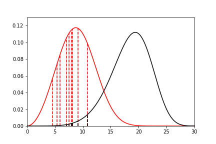
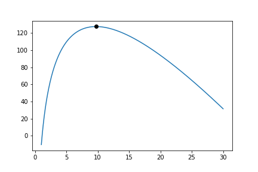
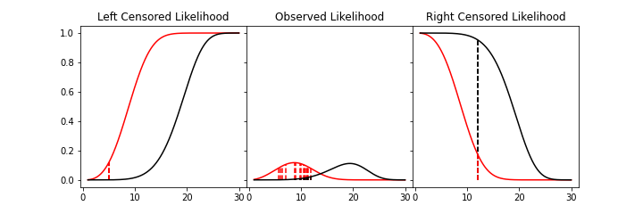

Parametric Estimation
=====================

Parametric modelling is the process of estimating the parameters of a particular distribution from a set of data. This is distinct from non-parametric modelling where we make no assumptions about the shape of the distribution. In parametric modelling we make some assumptions, explicit or implied, about the shape of the data that we have.

For this segment I will use the Weibull distribution as the example distribution. The Weibull distribution is a very useful distribution for one interesting reason. It is the distribution for the 'weakest link.' As the normal distribution is the limiting distribution of averages, the Weibull distribution is the limiting distribution for minimums. What does that mean? If we have a large number of sets of samples from something that is normally distributed the average of these sets will also be normally distributed but the minimums of these sets of samples will be Weibull distributed. This is analagous to a chain. It is common wisdom that a chain is only as strong as it's weakest link. The Weibull distribution enables us to model the strength of a chain based on the strength of the links.

The Weibull distribution can then be used in scenarios where we assume that the shape of the distribution will be due to a weakest link effect. This assumption holds in many scenarios, the strength of materials, the fielded life of equipment, the lifetime of animals, the time until another recession, or the time until germination of seeds. This example makes clear the assumption that we can make when using the Weibull distribution. Other distributions have differing processes that can result in their generation. If we know and understand these processes we can check them against the scenario we are analysing and chose a distribution from them. For example, a lognormal distribution can arise due to the combined effect of the product of random variables so in petroleum engineering the total recoverable oil is a product of the height, width, depth, features of the rock and an infinitude of other variables of the field. Therefore fields can be lognormally distributed. Similar considerations can be applied for many other types of distributions. Finally, If we don't know, or mind, what distribution we have, we can simply find the best fit amongst a set of distributions.

SurPyval offers users several methods for estimating parameters, these are:

- Method of Moments (MOM)
- Method of Probability Plotting (MPP)
- Mean Square Error (MSE)
- Maximum Likelihood Estimation (MLE)
- Minimum Product Spacing (MPS)

There are other methods that can be used, e.g. L-moments or generalised method of moments. These are interesting, and may be added in future, but for now surpyval offers the above estimation methods. Surpyval is unique in the capability to provide the estimation technique. Most other survival analysis methods do not allow for specifying different methods. The advantage of this flexibility will become apparent.

Method of Moments (MOM)
-----------------------

This method is the simplest (and least accurate) methods to find parameters of a distribution.

Maximum Likelihood Estimation (MLE)
-----------------------------------

Maximum Likelihood Estimation (MLE) is the most widely used, and most flexible of all the estimation methods. It's relative simplicity (because of modern computing power) makes it the reasonable first choice for parametric estimation. What does it do? Essentially MLE asks what parameters of a distribution are 'most likely' given the data that we have seen. Consider the following data and distributions:

The solid lines are the densities of two different Weibull distributions. The dashed lines represent the data we have observed, their height is the density of the two distributions at the x value for each observation. Given the data and the two distributions, which one seems to explain the distribution of the data better? That is, which distribution is more likely to produce, if sampled, the dashed lines? It should be fairly intuitive that the red distribution is more likely to do so. For example, the observation just above 10, you can see the height to the black line and the heigth to the red line. The red line is taller than the black line, therefore this observation is more 'likely' to have come from the red distribution than the black one. Conversely, the value near 15 is more likely to have come from the black distribution than the red one because the height to the black line is greater than the height to the red line. To find the distribution of best fit then we need to find the parameters that best averages the height of all these lines.

MLE formalises this concept by saying that the most likely distribution is the one that has the highest (geometric) mean of the height of the density function for each sample of data. The height of the density at a particular observation is known as the likelihood. Mathematically, (for uncensored data) MLE then maximises the following:

.. math::

	L = {\left ( \prod_{i=1}^{n}f(x_{i} | \theta ) \right )}^{1/n} 

f is the pdf of the distribution being estimated, x is the observed value, theta is the parameter vector, and L is the geometric mean of all the values. This is complicated, but a simplification is available by taking the log of this product yielding:

.. math::

	l = { \frac{1}{n}} \sum_{i=1}^{n} \ln f(x_{i} | \theta )

Therefore MLE simply finds the parameters of the distribution that maximise the average of the log of the likelihood for each point... One final transform that is used in optimisers is that we take the negative of the above equation so that we find the minimum of the negative log-likelihood.

Armed with the log likelihood we can then search for the parameter where the log likelihood is maximised. Using an Exponential distribution as an example, we can see the change in the value of the log likelihood as the exponential parameter changes. The following is a random sample of 100 observations with a parameter of 10. Then changing the value of the parameter 'lambda' from low to high we can see what the log-likelihood is and find the value at which it is maximized.

On the chart above you can see that the maximum is near 10. As we would expect given that we know that the answer is 10. It is this simple and intuitive approach that allows the parameters of distributions are estimated with the MLE.

What about censored data?

All the equations above are for observed data. Handling the likelihood of censored data also has an intuitive understanding. What we know about the point when the data point is censored is that we know it is above or below the value at which we observed. So for a right censored data point, we want to maximize the probability that we saw this observation, concretely we want a censored point it's contribution to the likelihood function is the probability that the point was left or right censored. This is simply the probability of failure (CDF) for left censored and the probability of surviving to that time (survival function). Formally:

.. math::

	l = { \frac{1}{n_{o}}} \sum_{i=1}^{n_{o}} \ln f(x_{o_{i}} | \theta ) +  { \frac{1}{n_{r}}} \sum_{i=1}^{n_{r}} \ln R(x_{r_{i}} | \theta ) +  { \frac{1}{n_{l}}} \sum_{i=1}^{n_{l}} \ln F(x_{l_{i}} | \theta )

An easy and intuitive way to understand this is to compare these two possibilities. With some randomly generated data with a few values made to be left censored, and a few to be right censored. We get:

In this example, again, we need to consider whether the red or black distribution is a more likely description of the observations, including some censored ones. Althought the right censored point for the black distribuiton is very likely, this does not mean it is a good fit because the 'average' across all observations is poor. Therefore, it should be obvious that the red distribution is the better fit.

But what about truncated data

