Parametric SurPyval Modelling
=============================

The parametric API is essentially the exact same as the non-parametric API. All models are fit by a 
call to the ``fit()`` method. However, the parametric models have more options that are only applicable to parametric modelling. The inputs of ``x`` for the random variable, ``c`` for the censoring flag, ``n``
for count of each ``x``, ``xl`` and ``xr`` for intervally censored data (can't be used with ``x``) ``t``
for the truncation matrix, ``tl`` for the left truncation scalar or array, and ``tr`` for the right truncation scalar or array all remain.

Complete Data
-------------

The easiest and simplest case is that when you have a dataset of exactly observed data. that is, 
you have one array of data with the values at which they failed. Fitting a parametric distribution
to the data can be done with a simple call to the ``fit()`` method:

.. code:: python

    np.random.seed(1)
    x = surv.Weibull.random(50, 30., 9.)
    model = surv.Weibull.fit(x)
    print(model)

.. code:: text

    Parametric Surpyval model with Weibull distribution fitted by MLE yielding parameters (29.805137406871953, 10.296037991991037)

To visualise the outcome of this fit we can inspect the results on a probability plot:

.. code:: python

    model.plot()

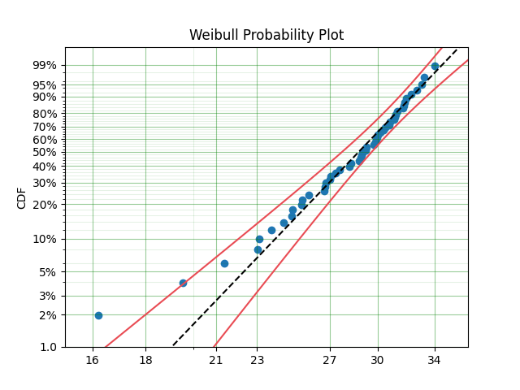

The :code:`model` object from the above example can be used to calculate the density of the distribution with the parameters found with the best fit from above. This is very easy to do:

.. code:: python

    x = np.linspace(10, 50, 1000)
    f = model.df(x)

    plt.plot(x, f)

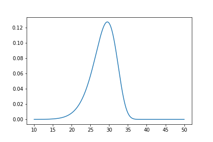

The CDF :code:`ff()`, Survival (or Reliability) :code:`sf()`, hazard rate :code:`hf()`, or cumulative hazard rate :code:`Hf()` can be computed as well. This functionality makes it very easy to work with surpyval models to determine risks or to pass the function to other libraries to find optimal trade-offs. 

Using censored data
-------------------

A common complication in survival analysis is that all the data is not observed up to the point of failure (or death). In this case the data is right censored, see the types of data section for a more detailed discussion, surpyval offers a very clean and easy way to model this. First, let's create a simulated data set:

.. code:: python

    np.random.seed(10)
    x = surv.Weibull.random(50, 30, 2.)

    observation_limit = 40
    # Censoring flag
    c = (x >= observation_limit).astype(int)
    x[x >= observation_limit] = observation_limit

In this example, we created 50 random Weibull distributed values with alpha = 30 and beta = 2. For this example the observation window has been set to 40. This value is where we stopped observing the events. For all the randomly generated values that are above this limit we create the censoring flag array c. This array has zeros where the event time was observed, and a 1 where the value is above the recorded value. For all the values in the data that are above 40 we set them to 40. This is a common occurence in survival analysis and surpyval is designed to accept this input with a simple call:

.. code:: python

    model = surv.Weibull.fit(x, c)
    print(model)
    model.plot()

.. code:: text

    Parametric Surpyval model with Weibull distribution fitted by MLE yielding parameters (29.249243175047084, 2.2291485877428756)

The plot for this can be seen to be:

.. image:: images/surpyval-modelling-3.png
    :align: center

The results from this model are very close to the data we input, and with only 50 samples. This example can be extended to another kind of censoring; left censored data. This is the case where the values are known to fall below a particular value. We can change our example data set to have a start observation time for which we will left censor all the data below that:

.. code:: python

    observation_start = 10
    # Censoring flag
    c[x <= observation_start] = -1
    x[x <= observation_start] = observation_start

That is, we set the start of the observations at 10 and flag that all the values at or below this are left censored. We can then use the updated values of x and c:

.. code:: python

    model = surv.Weibull.fit(x, c)
    print(model)
    model.plot()

.. code:: text

    Parametric Surpyval model with Weibull distribution fitted by MLE yielding parameters (29.347097662381277, 2.304902790957594)

The values did not substantially change, although the plot does look different as there are no values below 10.

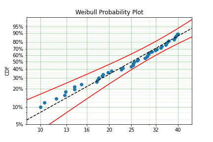

The next type of censoring that is naturally handled by surpyval is interval censoring. Creating another example data set:

.. code:: python

    np.random.seed(30)
    x = surv.Weibull.random(50, 30, 10.)
    n, xx = np.histogram(x, bins=[20, 23, 26, 29, 32, 35, 38])
    x = np.vstack([xx[0:-1], xx[1::]]).T

In this example we have created the varable x with a matrix of the intervals within which each of the obervations have failed. That is each exact observation has been binned into a window and the x array has an entry [left, right] within which the event failed. We also have the n array that has the count of the failures within the window. With these two values we can make the simple surpyval call:

.. code:: python

    model = surv.Weibull.fit(x, n=n)
    print(model)

.. code:: text

    Parametric Surpyval model with Weibull distribution fitted by MLE yielding parameters (30.074154903683105, 9.637405285678366)

Again, we have a result that is very close to the original parameters. SurPyval can take as input an arbitrary combination of censored data. If we plot the data we will see:

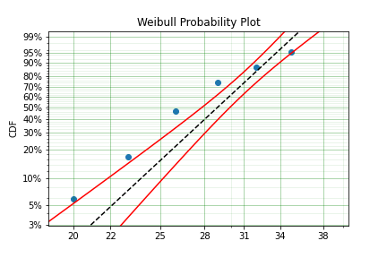

This does not look to be such a good fit. This is because the Turbull estimator finds the probability of failing in a window, not at a given point. So if we align the model plot to the end of the window instead of start with:

.. code:: python

    np_model = surv.Turnbull.fit(x, n=n)
    plt.step(np_model.x, np_model.R, where='post')
    x_plot = np.linspace(20, 37.5, 1000)
    plt.plot(x_plot, model.sf(x_plot), color='k', linestyle='dashed')

We get:

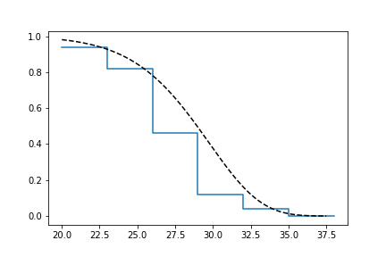

Which is, visually, clearly a better fit. You need to be careful when using the Turnbull plotting points to estimate the parameters of a distribution. This is because it is not known where in the intervals a death has actually occurred. However it is good to check the start and end of the window (changing 'where' betweek 'pre' and 'post' or 'mid') to see the goodness-of-fit.

Using truncated data
--------------------

Surpyval has the capacity to handle arbitrary truncated data. A common occurence of this is in the insurance industry data. When customers make a claim on their policies they have to pay an 'excess' which is a charge to submit a claim for processing. If say, the excess on a set of policies in an area is $250, then it would not be logical for a customer to submit a claim for a loss of less than that number. Therefore there will be no claims under $250. This can also happen in engineering where a part may be tested up to some limit prior to be sold, therefore, as a customer you need to make sure you take into account the fact that some parts would have been rejected at the end of the line which you may not have seen. So a washing machine may run through 25 cycles prior to shipping. This is similar to, but distinct from censoring. When something is left censored, we know there was a failure or event below the threshold.  Whereas with truncation, we do not see any variables below the threshold. A simulated example may explain this better:

.. code:: python

    np.random.seed(10)
    x = surv.Weibull.random(100, alpha=100, beta=0.6)
    # Keep only those values greater than 250
    threshold = 25
    x = x[x > threshold]

We have therefore simulated a scenario where we have taken 100 random samples from a fat tailed Weibull distribution. We then filter to keep only those records that are above the threshold. In this case we assume we haven't seen the data for the washing machines with less than 25 cycles. To understand what could go wrong if we ignore this, what do we get if we assume all the data are failures and there is no truncation?

.. code:: python

    model = surv.Weibull.fit(x=x)
    print(model.params)

.. code:: text

    (218.39245675499225, 1.050718601374874)

With a plot that looks like:

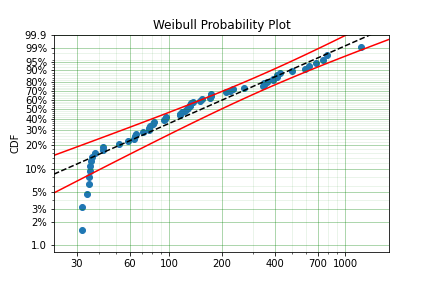

Looking at the parameters of the distribution, you can see that the beta value is greater than 1. Although only slightly, this implies that this distribution has an increasing hazard rate. If you were the operator of the washing machines (e.g. a hotel or a laundromat) and any downtime had a cost, you would conclude from this that replacing the machines after a fixed time would be a good policy.

But if you take the truncation into account:

.. code:: python

    model = surv.Weibull.fit(x=x, tl=threshold)
    print(model.params)

.. code:: text

    (127.32704868357536, 0.7105357186212391)

With the plot:

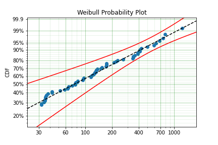

You can see now that the model fits the data much better, but also that the beta parameter is actually below 1. This shows that ignoring the left-truncated data in parametric estimation can lead to errors in prediction. This example can be continued for right-truncated data as well.

.. code:: python

    np.random.seed(10)
    x = surv.Normal.random(100, mu=100, sigma=10)
    # Keep only those values greater than 250
    tl = 85
    tr = 115
    # Truncate the data
    x = x[(x > tl) & (x < tr)]

    model = surv.Weibull.fit(x=x, tl=tl, tr=tr)
    print(model.params)

.. code:: text

    (102.27078400794343, 12.479061358290593)

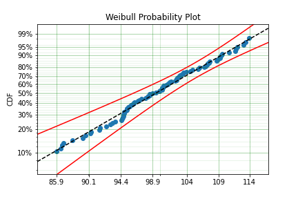

From the output above, the number of data points we have has been reduced from the simulated 100, downt to 87. Then with the 87 samples we now have we estimated the parameters to be quite close to the parameters used in the simulation. Further, the plot looks as though the parametric distribution fits the non-parametric distribution quite well.

In the cases above we used a scalar value for the truncation values. But some data has individual values for left truncation. This is seen in trials where someone may join the trial as a late entry. Therefore each data point as an entry time. For example:

.. code:: python

    x  = [3, 4, 6, 7, 9, 10]
    tl = [0, 0, 0, 0, 5, 2]

    model = surv.Weibull.fit(x, tl=tl)
    print(model.params)

.. code:: text

    (7.058547173157075, 2.700966723124606)

Surpyval can even work with arbitrary left and right truncation:

.. code:: python

    x  = [3, 4, 6, 7, 9, 10]
    tl = [0, 0, 0, 0, 5, 2]
    tr = [10, 9, 8, 10, 15]

    model = surv.Weibull.fit(x, tl=tl, tr=tr)
    print(model.params)

.. code:: text

    (8.123776023131574, 2.5691703597563285)

In the above example we used both the tl and tr. However, surpyval has a flexible API where it can take the truncation data as a two dimensional array:

.. code:: python

    x  = [3, 4, 6, 7, 9, 10]
    t =   [[ 0, 10],
           [ 0,  9],
           [ 0,  8],
           [ 0, 10],
           [ 5, 15],
           [ 2, 15]]

    model = surv.Weibull.fit(x, t=t)
    print(model.params)

.. code:: text

    (8.123776023131574, 2.5691703597563285)

Which, obviously, gives the same result. This shows the flexibility of the surpyval API, you can use scalar, array, or matrix values for the truncations using the t, tl, and tr keywords with the fit method and surpyval does the rest.

Offsets
-------

Another common feature in survival analysis is a requirement to fit a distribution with an offset. For example, the three three parameter Weibull distribution. Using data from Weibull's original paper for the strenght of Bofor's steel shows when this might be necessary.

.. code:: python

    from surpyval.datasets import BoforsSteel

    df = BoforsSteel.df
    x = df['x']
    n = df['n']

    model = surv.Weibull.fit(x=x, n=n)
    print(model.params)
    model.plot()

.. code:: text

    (47.36735846101269, 17.57131949975446)

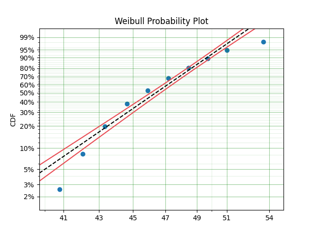

The above plot does not look to be a good fit. However, if we use an offset we can use the three parameter Weibull distribution to attempt to get a better fit. Using offset values with surpyval is very easy:

.. code:: python

    model = surv.Weibull.fit(x=x, n=n, offset=True)
    print(model.params, model.gamma)
    model.plot()

.. code:: text

    (7.141925216146573, 2.620452404013804) 39.76562962867473

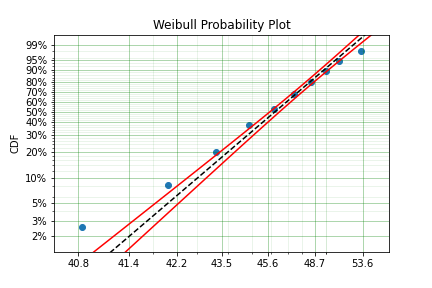

This is evidently a much better fit! The offset value for an offset distribution is saved as 'gamma' in the model object. Offsets can be used for any distribution supported on the half real line. Currently, this is the Weibull, Gamma, LogNormal, LogLogistic, and Exponential. For example:

.. code:: python

    np.random.seed(10)
    x = surv.LogLogistic.random(100, 10, 3) + 10
    model = surv.LogLogistic.fit(x, offset=True, how='MLE')
    print(model)
    model.plot()

.. code:: text

    Offset Parametric Surpyval model with LogLogistic distribution fitted by MLE yielding parameters (10.189469674675024, 3.4073259756607106) with offset of 9.562707940500465

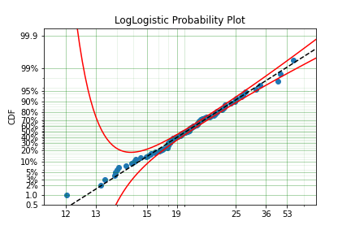

A four parameter exponentiated Weibull can also be found:

.. code:: python

    np.random.seed(10)
    x = surv.ExpoWeibull.random(100, 10, 1.2, 4) + 10
    model = ExpoWeibull.fit(x, offset=True)
    print(model)
    model.plot(plot_bounds=False)

.. code:: text

    Offset Parametric Surpyval model with ExpoWeibull distribution fitted by MLE yielding parameters [11.47511146  1.39697851  2.84530724] with offset of 10.701280166556678

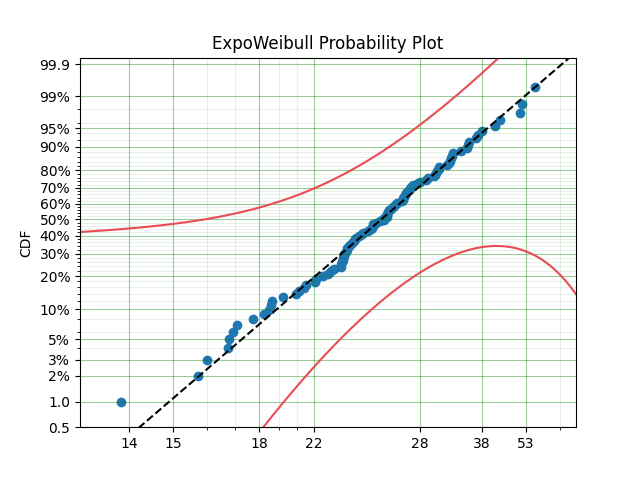

Fixing parameters
-----------------

Another useful feature of surpyval is the ability to easily fix parameters. For example:

.. code:: python

    np.random.seed(30)
    x = surv.Normal.random(50, 10., 2)
    model = surv.Normal.fit(x, fixed={'mu' : 10})
    print(model)
    model.plot()

.. code:: text

    Parametric Surpyval model with Normal distribution fitted by MLE yielding parameters (10.0, 1.9353643871115993)

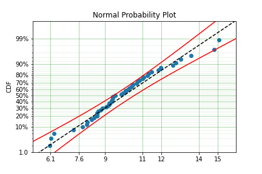

You can see that the mu parameter has been fixed at 10. This can work for distribuitons with many more parameters, including the offset.

.. code:: python

    np.random.seed(30)
    x = surv.ExpoWeibull.random(50, 10., 2, 4) + 10
    model = surv.ExpoWeibull.fit(x, offset=True, fixed={'mu' : 4, 'gamma' : 10, 'alpha' : 10})
    print(model)
    model.plot()

.. code:: text

    Offset Parametric Surpyval model with ExpoWeibull distribution fitted by MLE yielding parameters (10.0, 2.044204898692162, 4.0) with offset of 10.0

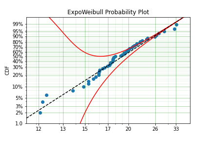

We have fit three of the four parameters for an offset exponentiated-Weibull distribution.

Modelling with arbitrary input
------------------------------

The surpyval API is extremely flexible. All the unique examples provided above can all be used at once. That is, data can be censored, truncated, and directly observed with offsets and fixing parameters. The API is completely flexible. This makes surpyval an extremely useful tool for analysts where the data is gathered in a manner where it's cleanliness is not guaranteed.

.. code:: python

    x  = [0, 1, 2, [3, 4], [6, 10], [4, 8], 5, 19, 10, 13, 15]
    c  = [0, 0, 1, 2, 2, 2, 0, -1, 0, 1, 0]
    tl = [-1, 0, 0, 0, 0, 0, 2, 2, -np.inf, 0, 0]
    tr = 25
    model = surv.Normal.fit(x, c=c, tl=tl, tr=tr, fixed={'mu' : 1.})
    print(model)

.. code:: text

    Parametric Surpyval model with Normal distribution fitted by MLE yielding parameters (1.0, 9.11973420034752)

Using alternate estimation methods
----------------------------------

Surpyval's API is very flexible because you can change which method is used to estimate parameters. This is useful when a more appropriate method is needed or the method you are using fails. 

The default parametric method for surpyval is the maximum likelihood estimation (MLE), this is because it can take any arbitrary input. However, the MLE is not always the best estimator. Consider an example with the uniform distribution:

.. code:: python

    np.random.seed(5)
    x = surv.Uniform.random(20, 5, 10)
    print(x.min(), x.max())

    mle_model = surv.Uniform.fit(x)
    print(*mle_model.params)

.. code:: text

    5.9386061433062585 9.593054539689607
    5.9386061433062585 9.593054539689607

You can see that the results are the same. This is because the maximum likelihood estimate of the parameters of a uniform distriubtion are just the smallest and largest values in the sample. If however we use the 'Maximum Product Spacing' method we get:

.. code:: python

    mps_model = surv.Uniform.fit(x, how='MPS')
    print(*mps_model.params)

.. code:: text

    5.532556321486052 9.999104361509815

You can see that using the MPS method we have parameters that are closer to the real values. This is because the MPS method can 'look outside' the existing values to estimate where the real value lies. See the details of this method in the 'Parametric Estimation' section. But the MPS method is useful when you need to estimate the point at which a distribution's support starts or for any disttribution that has unknown support. Concretely, this includes any offset distribution or a distribution with a finite upper and lower support (Uniform, Generalised Beta, Triangle)

The other important use case is when, for some reason, an alternate estimation method just does not work. For example:

.. code:: python

    np.random.seed(30)
    x = surv.LogLogistic.random(10, 4., 2) + 10
    model = surv.LogLogistic.fit(x, how='MLE', offset=True)

.. code:: text

    MLE with autodiff hessian and jacobian failed, trying without hessian
    MLE with autodiff jacobian failed, trying without jacobian or hessian
    MLE FAILED: Likelihood function appears undefined; try alternate estimation method

This shows, that the Maximum Likelihood Estimation failed for this data. However, because we have access to other methods, we can use an alternate estimation method:

.. code:: python

    model = surv.LogLogistic.fit(x, how='MPS', offset=True)
    print(model)
    model.plot(plot_bounds=False)

.. code:: text

    Offset Parametric Surpyval model with LogLogistic distribution fitted by MPS yielding parameters (2.631868521887908, 0.9657662293516666) with offset of 11.524905733806891

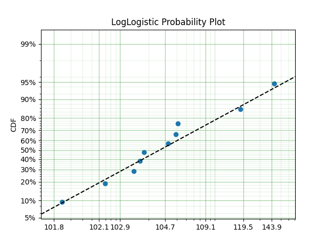

Our estimation has worked! Even though we used the MPS estimate for the parameters, we can still call all the same functions with the created variable to find the density :code:`df()`, hazard :code:`hf()`, CDF :code:`ff()`, SF :code:`sf()` etc. So regardless of the estimation method, we can still use the model.

This shows the power of the flexible API that surpyval offers, because if your modelling fails using one estimation method, you can use another. In this case, the MPS method is quite good at handling offset distributions. It is therefore a good approach to use when using offset distributions.

As stated in the Non-Parametric section, there is a risk that using the Turnbull estimator when all
values are trunctated by the same values. We will now show what happens. First, some example data:

.. code:: python

    import surpyval as surv
    import numpy as np

    np.random.seed(1)
    x = surv.Normal.random(1000, 100, 10)
    tl = 90
    tr = 110
    x = x[x > tl]
    x = x[x < tr]

    mpp_model = surv.Normal.fit(x, tl=tl, tr=tr, how='MPP')
    mpp_model.plot()
    mpp_model

.. code:: text 

    Parametric Surpyval model with Normal distribution fitted by MPP yielding parameters (99.44586157765144, 5.819425236010943)

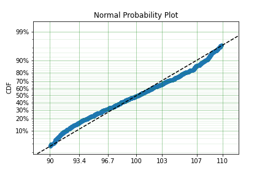

You can see that there is a strange match between the Turnbull estimate of the CDF and the parametric
model. Also, you can see that the CDF at 90 is near 0% and the CDF at 110 is near 100%. This shows
that it has not taken into account the truncation. Instead, if we use MLE we get:

.. code:: python

    model = surv.Normal.fit(x, tl=tl, tr=tr, how='MLE')
    model.plot()
    model

.. code:: text 

    Parametric Surpyval model with Normal distribution fitted by MLE yielding parameters [100.13045398   9.17784957]

.. image:: images/mpp-turnbull-2.png
    :align: center

We can see that the MLE method is a much better fit to this data, further, the MLE estimate of the 
:math:`\sigma` parameter is much closer. The plotting points for the MLE plot
have been adjusted in accordance with the truncation that the MLE model has estimated at the first entry.
This is because it is known to be truncated and needs to be adjusted. This is not possible with the MPP
method because the Turnbull estimator cannot adjust the truncation at the first and last value as it
can make no assumptions about the truncation at those points.

This is just a word of warning for when using Truncation and the MPP method, make sure not all values
are truncated by the same value, otherwise it will give a poor fit.

Mixture Models
--------------

On occarion, it can appear as though there are one, or two different distributions in the data you are using. On these occasions it can be useful to use a different type of distribuiton; or really, distributions. A mixture model is a distribution made from the partial combination of several distributions. Intuitively, it can be understood as a distribution where there is a proportion that fail for each kind of distribution. So 60% may come from a Weibull(3, 4) distribution but then another 40% come from a Weibull(19, 2) distribution.

SurPyval uses Expectation-Maximisation to 

.. code:: python

    x = [1, 2, 3, 4, 5, 6, 6, 7, 8, 10, 13, 15, 16, 17 ,17, 18, 19]
    x_ = np.linspace(np.min(x), np.max(x))

    model = surv.Weibull.fit(x)
    wmm = surv.MixtureModel(x=x, dist=surv.Weibull, m=2)

    model.plot(plot_bounds=False)
    plt.plot(x_, wmm.ff(x_))

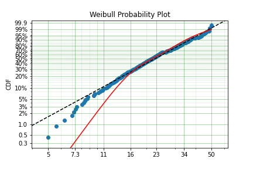

You can see that the mixture model, in blue, tracks the data more closely than does the single model. SurPyval has incredible flexibility. The number of distributions can be changed by simply changing the value of m, and, the distribution used in the mixture can also be changed. Consider:

.. code:: python

    np.random.seed(1)
    x1 = surv.Normal.random(20, -10, 5)
    x2 = surv.Normal.random(30, 10, 10)
    x3 = surv.Normal.random(40, 50, 15)
    x = np.concatenate([x1, x2, x3])
    np.random.shuffle(x)
    x_ = np.linspace(np.min(x), np.max(x))

    normal = surv.Normal.fit(x)
    gmm = surv.MixtureModel(x=x, dist=surv.Normal, m=3)

    normal.plot(plot_bounds=False)
    plt.plot(x_, gmm.ff(x_), color='red')

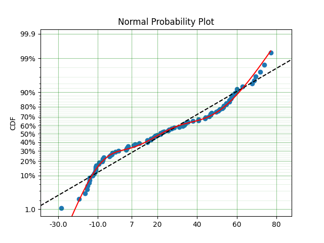

It was that simple to create a gaussian mixture model using m=3 and the dist=surv.Normal parameters. SurPuyval does default to 2 Weibull distributions if neither parameters are provided, but it can take any distribution in SurPyval as an input distribution.

Finally, mixture models can take counts and censoring flags as input (but not, yet, truncation). This makes SurPyval a truly powerful package for your survival analysis.

Limited Failure Population
--------------------------

Another kind of model that is useful in survival analysis is when a population has a limited number of items in the population that are susceptible to the failure. This is also known as a 'Defective Subpopulation' model. As such, no matter how long a test continues, it will not be possible for all items to fail (with the particular death/failure).

As an example:

.. code:: python

    lfp_weibull = LFP(surv.Weibull)
    np.random.seed(10)
    x1 = surv.Weibull.random(60, 10, 2)
    c1 = np.zeros_like(x1)
    x2 = np.ones(40) * (np.max(x1) + 1)
    c2 = np.ones_like(x2)
    x = np.concatenate([x1, x2])
    c = np.concatenate([c1, c2])

    model = surv.Weibull.fit(x=x, c=c)
    model.plot(plot_bounds=False)
    lfp_model = lfp_weibull.fit(x=x, c=c)
    print(lfp_model)
    xx = np.linspace(np.min(x), np.max(x)*2)
    plt.plot(xx, lfp_model.ff(xx), color='red')

.. code:: text

    Parametric Surpyval model with LFP distribution fitted by MLE yielding parameters [ 0.60363768 10.06681404  2.0920684 ]

.. image:: images/surpyval-modelling-18.png
    :align: center

LFP models can be computed with each method that handles censoring, the default, as always is MLE, but you can use MPS, MSE, but not (yet) MPP.

Zero-Inflated Modelling
-----------------------

In survival analysis you might have the scenario where many failure times are 0, known as being dead on arrival. In this case
we need a model that can account for the fact that many will be failed at 0, this is a situation that cannot be handled by
regular distribuitons, since most have a 0% chance of failing at 0. Therefore what we need is something that is symmetrical
to the LFP/DS case, where a proportion of the failures occur at 0 instead of there being a proportion that will never fail.

Examples coming soon.

Confidence Intervals
--------------------

*SurPyval* can be used to compute the confidence interval for any of the functions of a distribution. That is, *SurPyval* can 
compute the confidence interval for ``ff()``, ``sf()``, ``hf()``, ``Hf()``, and ``df()``.

Once you have a model, this can easily be computed with the ``cb()`` method.

.. code:: python

    from surpyval import Weibull
    from autograd import numpy as np
    from matplotlib import pyplot as plt

    x = Weibull.random(100, 10, 3)

    model = Weibull.fit(x)

    x_plot = np.linspace(0, 20, 100)
    plt.plot(x_plot, model.sf(x_plot), color='black')
    plt.plot(x_plot, model.cb(x_plot, on='sf', alpha_ci=0.1), color='red', linestyle='--')

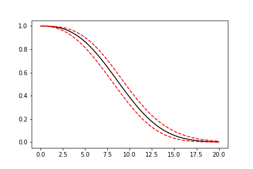

This shows that we can change the confidence level with ``alpha_ci`` and that we can change the function for which
we want the confidence interval. That is, the ``on`` keyword can be any of ``sf``, ``ff``, ``df``, ``hf``, or ``Hf``.
This will work with models that you create as well, so even a user defined Distribution will be able to have the
confidence intervals computed. Creating these models is discussed in the section below.

Creating a custom Distribution
------------------------------

Given the implementation in SurPyval, it is possible to create a new distribution and use all the 
previously listed techniques. For example, the Gompertz distribution is not implemented in the 
surpyval API, this however can be quickly overcome. First, we set up a random number generator.
Because SurPyval works based on the autograd numpy implementation, it is essential that you 
use the autograd numpy import to make this work.

.. code:: python

    import surpyval as surv
    from autograd import numpy as np

    def qf(p, mu, b):
        return (np.log(((-np.log(p)/mu))) + 1)/b

    # Generate random values from Gompertz distribution
    np.random.seed(1)
    x = qf(np.random.uniform(0, 1, 100), .3, 1.1)

Now that we have our random data set, we can fit a Gompertz distribution to it. To do so, we need
to create a Gompertz distribution class, and to do this we need the cumulative hazard function, 
the names of the parameters, the bounds of the parameters, and the distribution support.

.. code:: python

    name = 'Gompertz'

    def Hf(x, *params):
        return params[0] * np.exp(params[1] * x - 1)

    param_names = ['nu', 'b']
    bounds = ((0, None), (0, None))
    support = (-np.inf, np.inf)
    Gompertz = surv.parametric.Distribution(name, Hf, param_names, bounds, support)

With this now created, all the calls to the regular surpyval API can be used.

.. code:: python

    Gompertz.fit(x)

.. code:: text

    Parametric Surpyval model with Gompertz distribution fitted by MLE yielding parameters [0.30887091 1.04352087]

If we transform the data slightly, we can show that this can be used with censored and truncated data
as well.

.. code:: python

    c = np.zeros_like(x)
    # Right censor all values above 2
    c[x > 2] = 1
    x[x > 2] = 2
    # Left truncate all values below 0
    tl = 0
    c = c[x > tl]
    x = x[x > tl]

    Gompertz.fit(x=x, c=c, tl=tl)

.. code::text

    Parametric Surpyval model with Gompertz distribution fitted by MLE yielding parameters [0.24876072 1.16574707]

This is extraordinary! We have created a new distribution using only the cumulative hazard function, but
are able to handle arbitrary censoring and truncation. It shows the power of the SurPyval API and
functionality.

Credit for this idea must be given to the creators of the *lifelines* package. *lifelines* is capable
of receiving a cumulative hazard function that can then be used as a distribution to fit parameters.
However, at the time of writing it could not handle arbitrarily censored or truncated data.

Even with a user defined ``Hf()`` we can still use the confidence bounds as well. The results of this
can be seen by simply calling the plot function:

.. code:: python

    model.plot(alpha_ci=0.5)

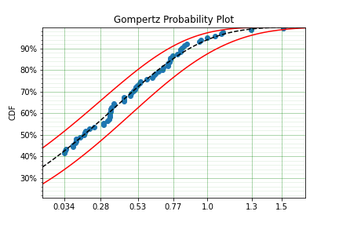

You can see that the distribution is not linearised. This is because the Hf is not readily convertible 
into the transformation function needed to do the linearisation of the CDF. The defaults are a simple
linear scale for both the x and y axis and it shows that the confidence bounds have worked nicely.

.. warning::
    Due to the implementation of confidence bounds in surpyval it can result 
    in numeric overflows which results in incredulous bounds. Please take caution when 
    using the cb with non surpyval implemented distributions.