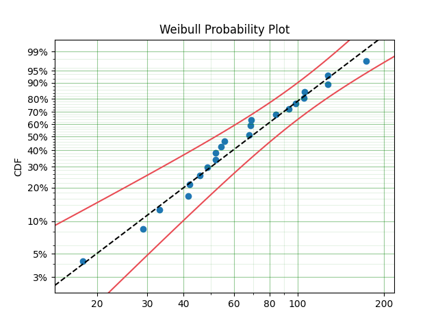

Quickstart
==========

So, you know what survival analysis is and you just want to see what this can do.

Alas

.. code:: python

	import surpyval as surv

	x = [17.88, 28.92, 33, 41.52, 42.12, 45.6, 48.4, 51.84, 
	 51.96, 54.12, 55.56, 67.8, 68.64, 68.64, 68.88, 84.12, 
	 93.12, 98.64, 105.12, 105.84, 127.92, 128.04, 173.4]

	model = surv.Weibull.fit(x)
	model.plot()

This gives us the Weibull plot

