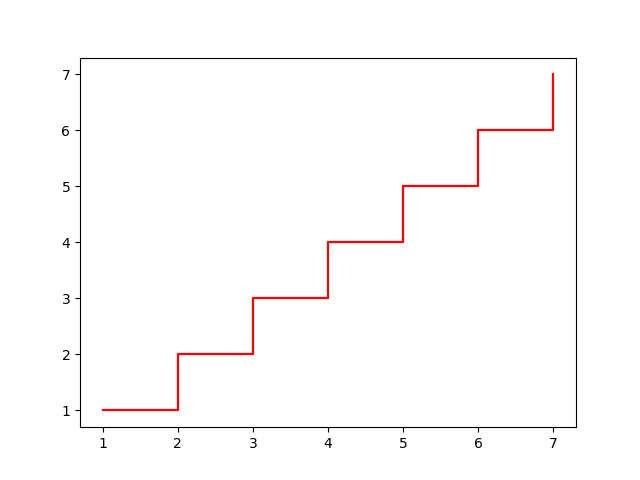
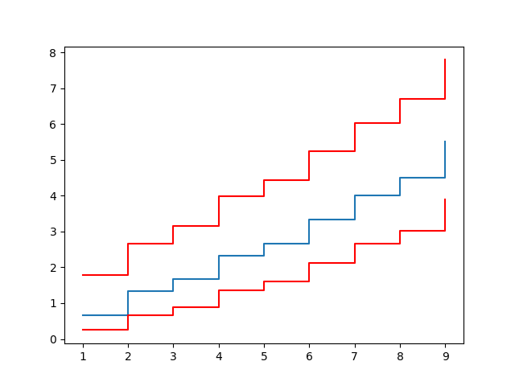
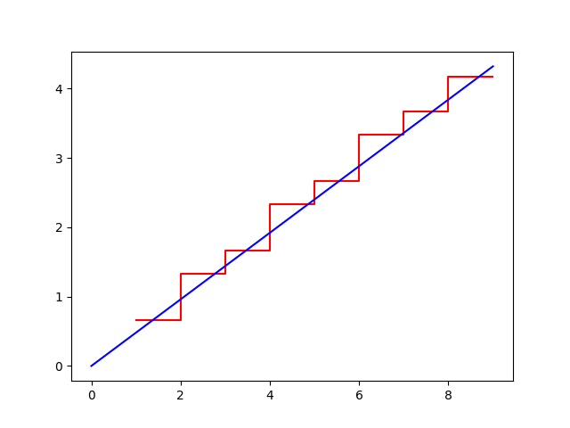
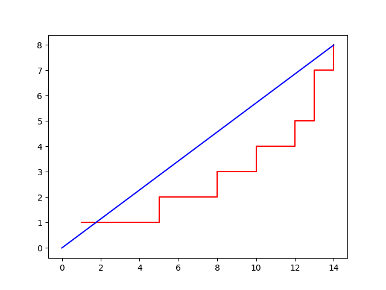
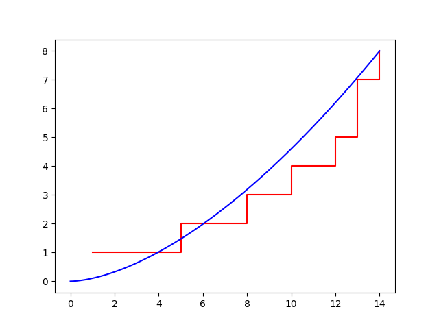
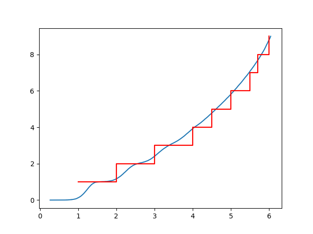
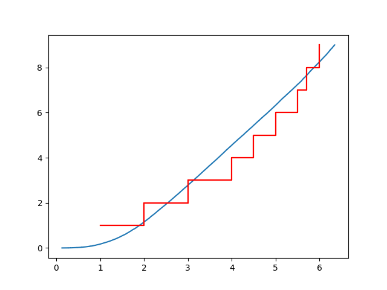
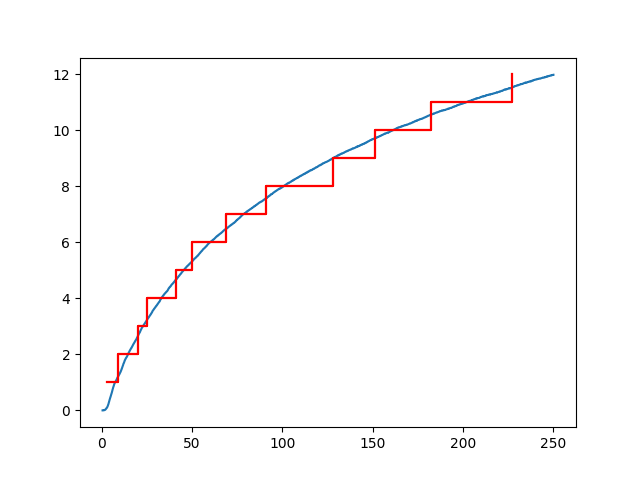

Counting Process Modelling with SurPyval
========================================

This section is aims to show how you can use SurPyval to model counting
processes.

Recurrent Event SurPyval Modelling
----------------------------------

First, we will start with recurrent events, and a simple non-parametric model.

Non-Parametric Counting Model with Surpyval
~~~~~~~~~~~~~~~~~~~~~~~~~~~~~~~~~~~~~~~~~~~

Creating a Non-Parametric MCF with surpyval is easy. Simply collect the data and
pass it to the ``fit`` call of the ``NonParametricCounting`` class.

.. code-block:: python

    >>> from surpyval import NonParametricCounting
    >>> import numpy as np
    >>> 
    >>> x = [1, 2, 3, 4, 5, 6, 7]
    >>> 
    >>> model = NonParametricCounting.fit(x)
    >>> model.plot()

This shows the expected number of events at any time. The model is a step
function since it is parametric and we have made no assumptions about the
count between observed events.

The result of this is a Non-Parametric Counting model that can be used just like 
all other models in surpyval. It is important to note that the ``fit`` function
takes the values of x as the *cumulative* time to the event, not the inter-arrival
time. If you do have inter-arrival data (which is sorted in the correct order)
all you need do is take the cumulative sum of the obervations along the length
of the array. For example:

.. code-block:: python

    >>> from surpyval import NonParametricCounting
    >>> import numpy as np

    >>> interarrival_times = [1, 1, 2, 4, 3, 1, 2, 1]
    >>> x = np.cumsum(interarrival_times)

    >>> model = NonParametricCounting.fit(x)

We can then use this model to estimate the number of failures at any time. For
example, let's say we wanted to know how many failures we would expect to see
after 10 units of time. We can do this by using the ``mcf`` method of the model.

.. code-block:: python

    >>> from surpyval import NonParametricCounting
    >>> import numpy as np

    >>> interarrival_times = [1, 1, 2, 4, 3, 1, 2, 1]
    >>> x = np.cumsum(interarrival_times)

    >>> model = NonParametricCounting.fit(x)
    >>> model.mcf(10)
    array([4.])

The above two examples use only one item, but we can get the expected number
of events based on data from any number of items. Let's say we had three items
observed until the last event. Let's do some modelling.

.. code-block:: python

    >>> from surpyval import NonParametricCounting
    >>> import numpy as np

    >>> x = [1, 2, 3, 4, 5, 6, 7, 1, 4, 6, 9, 2, 7, 8, 9]
    >>> i = [1, 1, 1, 1, 1, 1, 1, 2, 2, 2, 2, 3, 3, 3, 3]

    >>> model = NonParametricCounting.fit(x, i=i)
    >>> model.plot()

Here we have the expected number of events over time based on the observations 
of three different items. 

These functions work with censoring as well. We need to keep in mind that the
only right censored points we can have for an item is the last. This is because
it doesn't make any sense to have a right censored point followed by another 
event. The same is true for left censored and truncated data. Therefore the 
"timeline" for a single item must be coherent for the model to work.

Let's look at how we can use right censoring.

.. code-block:: python

    >>> from surpyval import NonParametricCounting
    >>> import numpy as np

    >>> x = [1, 2, 3, 4, 5, 6, 7, 1, 4, 6, 9, 2, 7, 8, 9]
    >>> i = [1, 1, 1, 1, 1, 1, 1, 2, 2, 2, 2, 3, 3, 3, 3]
    >>> c = [0, 0, 0, 0, 0, 0, 1, 0, 0, 0, 1, 0, 0, 0, 1]

    >>> model = NonParametricCounting.fit(x, i=i, c=c)
    >>> model.plot()

.. image:: images/counting_processes_np_mcf_multiple_items_with_censoring.png
    :align: center

At present the ``NonParametricCounting`` model does not support fitting with
truncated data.

Let's say this data was for the time, in years,
between repairs on home air conditioners of a specific model. We can then use
this model to estimate the number of reparis we would need on a newly installed
air conditioner. Let's say we wanted to know how many repairs we would expect to see
after 8 years. We can do this by using the ``mcf`` method of the model.

If however, we wanted to know how many reparis were needed after 10 years, we
could not do so since the data only goes up to 9 years. To address this we would
instead need to use a parametric model.

Parametric Recurrent Event Models with Surpyval
~~~~~~~~~~~~~~~~~~~~~~~~~~~~~~~~~~~~~~~~~~~~~~~

Just as is the case with single event survival analysis, non-parametric models
are not always the best choice. In the case of recurrent events, we can use
parametric models to model the number of events at any time. This is done by
assuming a hazard rate for the inter-arrival times. This also has the same
limitations as per single event survival analysis. That is, given we use a
parametric representation of the hazard rate we are making assumptions about the
shape of the cumulative incidence function. This allows us to extrapolate
above the highest observed values but may not be a good fit to the data.

Let's fit a parametric model.

.. code-block:: python

    >>> from surpyval import HPP
    >>> import numpy as np
    >>> 
    >>> x = [1, 2, 3, 4, 5, 6, 7, 1, 4, 6, 9, 2, 7, 8, 9]
    >>> i = [1, 1, 1, 1, 1, 1, 1, 2, 2, 2, 2, 3, 3, 3, 3]
    >>> c = [0, 0, 0, 0, 0, 0, 1, 0, 0, 0, 1, 0, 0, 0, 1]
    >>> 
    >>> model = HPP.fit(x, i=i, c=c)
    >>> model.plot()

This model is a good fit to the data, althouhg it is just a straight line. But
we can extraplotate above the highest observed value. Let's say we wanted to
know how many events would happen up to "15", we can do this with the ``cif``
method of the model.

.. code-block:: python

    >>> model.cif(15)
    7.2

This means that we would expect to see 7.2 events up to "15" (in whatever units
this model is in). Let's see a different example:

.. code-block:: python

    >>> x = [1, 5, 8, 10, 12, 13, 13, 14]
    >>> HPP.fit(x).plot()

This HPP model, in this case, is not a good fit to the data. This is because
the model assumes that the accumulation of events will tend to be a straight
line whereas the data appears to be increasing over time. In this case, we have
made a poor assumption in using the HPP model. Let's try another one.

.. code-block:: python

    >>> from surpyval import Duane
    >>> x = [1, 5, 8, 10, 12, 13, 13, 14]
    >>> 
    >>> model = HPP.fit(x, i=i, c=c)
    >>> model.plot()

This is clearly a much better fit. Have a look at the api documentation to see
what other parametric models are available in SurPyval.

Renewal Modelling in SurPyval
-----------------------------

In contrast to the above, where the cumulative count of events are assumed to
have an underlying rate of occurence, renewal models assume that there is an
underlying distribution of the inter-arrival times where each subsequent
inter-arrival time is affected by some restoration factor.

Generalised Renewal Process with SurPyval
~~~~~~~~~~~~~~~~~~~~~~~~~~~~~~~~~~~~~~~~~

Generalized Renewal Process modelling is simple with SurPyval:

.. code-block:: python

    >>> from surpyval import GeneralizedRenewal, Weibull, NonParametricCounting
    >>> import numpy as np
    >>>
    >>> x = np.array([1, 2, 3, 4, 4.5, 5, 5.5, 5.7, 6])
    >>>
    >>> model = GeneralizedRenewal.fit(x, dist=Weibull)
    >>> model
    Generalized Renewal SurPyval Model
    ==================================
    Distribution        : Weibull
    Fitted by           : MLE
    Kijima Type         : i
    Restoration Factor  : 0.1573211400037486
    Parameters          :
        alpha: 1.261338468404201
        beta: 8.93900788677076

We cannot plot the cumulative incidence function of the model since it does
not have a closed form solution. We can however plot the cumulative incidence
function of a monte carlo simulation of the model. Let's do that and compare
it to a non-parametric description of the MCF:

.. code-block:: python

    >>> np_model = model.count_terminated_simulation(len(x), 5000)
    >>> ax = np_model.plot()
    >>> NonParametricCounting.fit(x).plot(ax=ax)

We have simulated the model we created up to the number of failures we saw in
the data with the ``count_terminated_simulation`` method. This method takes
two arguments, the first is the number of failures to simulate up to and the
second is the number of simulations to run. The more simulations you run the
more accurate the model will be. The method returns a ``NonParametricCounting``
model that can be used to plot the results.

You can see that the cumulative incidence function of the model is a very good
fit to the data. You can also see that it is "wavy." This is because the
underlying distribution is Weibull with a reasonably high shape parameter. This
means that the first inter-arrival time is going to be within a relatively
narrow period. After the first failure, and the subsequent restoration, the
next inter-arrival time is going to be in a larger range since it will be the
sum of the first inter-arrival time and the second inter-arrival time. This
process continues for each subsequent inter-arrival time. Eventually the waves
will become smaller as the mixing of previous inter-arrival times makes the
spread of the next inter-arrival time larger and larger. It looks essentially
like a smooth line at the higher values.

SurPyval uses the Kijima Type i as the default. Let's change this to
Kijima Type ii and see what happens.

.. code-block:: python

    >>> from surpyval import GeneralizedRenewal, Weibull, NonParametricCounting
    >>> import numpy as np
    >>>
    >>> x = np.array([1, 2, 3, 4, 4.5, 5, 5.5, 5.7, 6])
    >>>
    >>> model = GeneralizedRenewal.fit(x, dist=Weibull)
    >>>
    >>> np_model = model.count_terminated_simulation(len(x), 5000)
    >>> ax = np_model.plot()
    >>> NonParametricCounting.fit(x).plot(ax=ax)

We can see that this model is not as good a fit as the kijima type i model.
This implies that the restoration that is done only repairs damage done since
the last event. We could then use this model, via the non-parametric
simulations of it, to estimate the number of events up to a given time.

G1 Renewal Process with SurPyval
~~~~~~~~~~~~~~~~~~~~~~~~~~~~~~~~

G1 Modelling can easily be done with SurPyval:

.. code-block:: python

    >>> from surpyval import GeneralizedOneRenewal, Exponential
    >>> import numpy as np
    >>> x = np.array([3, 6, 11, 5, 16, 9, 19, 22, 37, 23, 31, 45]).cumsum()
    >>>
    >>> model = GeneralizedOneRenewal.fit(x, dist=Exponential)
    >>> model
    G1 Renewal SurPyval Model
    =========================
    Distribution        : Exponential
    Fitted by           : MLE
    Restoration Factor  : 0.2318306601166155
    Parameters          :
        lambda: 0.20919291887716013

This data is from [1]_ and shows the inter-arrival times, and not the total
time to each event. We therefore need to take the cumulative sum of all the
times before passing it to the ``fit`` method. These are the same results as
achieved by Kaminskiy and Krivtsov in their paper [2]_ introducing the G1
Renewal Process.

Surpyval allows you to use any distribution in SurPyval as the underlying
distribution. Let's use the same data with a Weibull G1 Renewal Process.

.. code-block:: python

    >>> from surpyval import GeneralizedOneRenewal, Weibull, NonParametricCounting
    >>> import numpy as np
    >>> x = np.array([3, 6, 11, 5, 16, 9, 19, 22, 37, 23, 31, 45]).cumsum()
    >>>
    >>> model = GeneralizedOneRenewal.fit(x, dist=Weibull)
    >>> model
    G1 Renewal SurPyval Model
    =========================
    Distribution        : Weibull
    Fitted by           : MLE
    Restoration Factor  : 0.2163030528695554
    Parameters          :
        alpha: 5.722202157616563
        beta: 3.4642271577145127

We can see that the restoration factor is quite similar. What is interesting is
that the underlying Weibull distribution has a shape parameter greater than 1.
This indicates that the underlying distribution is not exponential. Since the
G1 Renewal Process does not have a closed form solution for the cif we can
create a non-parametric model from a monte carlo simulation. Let's do this and
compare it to the data MCF.

.. code-block:: python

    >>> np_model = model.time_terminated_simulation(250, 1000)
    >>> np_model.plot()
    >>> NonParametricCounting.fit(x).plot()

In this code we created a ``NonParametricCounting`` model using the G1 Models
``time_terminated_simulation`` method. This method takes two arguments, the
first is the time to run the simulation to while the second is the number of
simulations to run. The more simulations you run the more accurate the model
will be. The method returns a ``NonParametricCounting`` model that can be
used to plot the results. We then also add the raw data to the plot for
comparison.

The image above shows that the blue line (the model from the simulation) is in
very good agreement to the data. This is a good indication that the underlying
distribution is Weibull and that the repair effectiveness has been correctly
estimated.

References
----------

.. [1] Basu, A.P. and Rigdon, S.E., 2000. Statistical methods for the reliability of repairable systems. John Wiley & Sons.

.. [2] Kaminskiy, M.P. and Krivtsov, V.V., 2010. G1-renewal process as repairable system model. Reliability: Theory & Applications, 5(3), pp.7-14.
