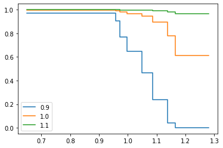

Regression Modelling with SurPyval
=================================

This section is about how we can understand the effect that covariates can have on survival times. As per the other entries in these docs, let's import some useful packages, as such, for the rest of this page we will assume the following imports have occurred:

.. code:: python

    import surpyval as surv
    import numpy as np
    from matplotlib import pyplot as plt

Regression survival modelling with *surpyval* is very easy. This page will take you through a series of scenarios that can show you how to use the features of *surpyval* to get you the answers you need. 

Semi-Parametric - Cox Proportional Hazards Model
------------------------------------------------

The first example is the Cox Proportional Hazards model. In this example we will use the data from Krivtsov et al. This data set is the results of testing tires time to failure with measurements about those tires. The authors of this paper intended to determine what factors affected tire reliability.

.. code:: python

    from surpyval.datasets import Tires
    from surpyval import CoxPH

    x = Tires.data['Survival']
    c = Tires.data['Censoring']
    Z = Tires.data[['Tire age', 'Wedge gauge', 'Interbelt gauge', 'EB2B', 'Peel force',
        'Carbon black (%)', 'Wedge gauge×peel force']]
    model = CoxPH.fit(x=x, Z=Z, c=c)
    model

.. code:: text

    Regression SurPyval Model
    =========================
    Type                : Proportional Hazards
    Kind                : Cox
    Parameterization    : Semi-Parametric
    Parameters          :
        beta_0  :  2.109496593744941
        beta_1  :  -9.686078593632743
        beta_2  :  -10.67809536747068
        beta_3  :  -13.67594841333851
        beta_4  :  -34.29448581473381
        beta_5  :  -48.35286747450483
        beta_6  :  20.84037862912251

We can see that we have a micture of coefficients. We can check the p-values:

.. code:: python

    print(model.p_values)

.. code:: text
    [0.13000628, 0.03677433, 0.02074066, 0.0918419 , 0.01200102, 0.14831534, 0.01867559]

We can asee that it is only 1, 2, 4, and 6 that are significant at the 0.05 level.

We can redo the model using only those covariates:

.. code:: python

    from surpyval.datasets import Tires
    from surpyval import CoxPH

    x = Tires.data['Survival']
    c = Tires.data['Censoring']
    Z = Tires.data[['Wedge gauge', 'Interbelt gauge', 'Peel force', 'Wedge gauge×peel force']]
    model = CoxPH.fit(x=x, Z=Z, c=c)
    print(model.p_values)
    model

.. code:: text

    [0.02207978 0.01368372 0.00956108 0.01030372]

    Regression SurPyval Model
    =========================
    Type                : Proportional Hazards
    Kind                : Cox
    Parameterization    : Semi-Parametric
    Parameters          :
        beta_0  :  -9.313960179920473
        beta_1  :  -7.069295556681021
        beta_2  :  -27.413473066027667
        beta_3  :  18.105822313415462

All the coefficients can now be seen to be significant. It also shows that as the wedge gauge, interbelt gauge, and peel force increase, the hazard rate will decrease and the life will therefore increase. The opposite is the case for the wedge gague x peel force coefficient.

We can plot the survival curves of the average tire and the 10% above and 10% below average tire:

.. code:: python

    Z_mean = Tires.data[['Wedge gauge', 'Interbelt gauge', 'Peel force', 'Wedge gauge×peel force']].mean().values

    plot_x = np.linspace(x.min(), x.max())
    for f in [0.9, 1., 1.1]:
        plt.step(plot_x, model.sf(plot_x, Z=Z_mean * f), label=f)
    plt.legend()

We can see that as the covariates increase there is a decrease in the probability of survival up to 1.2. The Semi-Parametric nature of the model can also be seen clearly in this plot. You can see that the baseline is non-parametric, but the baseline has been affected by the covariates.