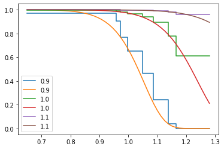

Regression Modelling with SurPyval
==================================

This section is about how we can understand the effect that covariates can have on survival times. As per the other entries in these docs, let's import some useful packages, as such, for the rest of this page we will assume the following imports have occurred:

.. jupyter-execute::

    import surpyval as surv
    import numpy as np
    from matplotlib import pyplot as plt

Regression survival modelling with *surpyval* is very easy. This page will take you through a series of scenarios that can show you how to use the features of *surpyval* to get you the answers you need.

Semi-Parametric - Cox Proportional Hazards Model
------------------------------------------------

The first example is the Cox Proportional Hazards model. In this example we will use the data from Krivtsov et al. This data set is the results of testing tires time to failure with measurements about those tires. The authors of this paper intended to determine what factors affected tire reliability.

.. jupyter-execute::

    from surpyval.datasets import load_tires_data
    from surpyval import CoxPH

    tires = load_tires_data()
    x = tires['Survival']
    c = tires['Censoring']
    Z = tires[['Tire age', 'Wedge gauge', 'Interbelt gauge', 'EB2B', 'Peel force',
        'Carbon black (%)', 'Wedge gauge×peel force']]
    model = CoxPH.fit(x=x, Z=Z, c=c)
    model

We can see that we have a micture of coefficients. We can check the p-values:

.. jupyter-execute::

    print(model.p_values)

We can asee that it is only 1, 2, 4, and 6 that are significant at the 0.05 level.

We can redo the model using only those covariates:

.. jupyter-execute::

    from surpyval.datasets import load_tires_data
    from surpyval import CoxPH

    tires = load_tires_data()
    x = tires['Survival']
    c = tires['Censoring']
    Z = tires[['Wedge gauge', 'Interbelt gauge', 'Peel force', 'Wedge gauge×peel force']]
    model = CoxPH.fit(x=x, Z=Z, c=c)
    print(model.p_values)
    model

All the coefficients can now be seen to be significant. It also shows that as
the wedge gauge, interbelt gauge, and peel force increase, the hazard rate will decrease and the life will therefore increase. The opposite is the case for the wedge gague x peel force coefficient.

We can plot the survival curves of the average tire and the 10% above and 10% below average tire:

.. jupyter-execute::

    Z_mean = tires[['Wedge gauge', 'Interbelt gauge', 'Peel force', 'Wedge gauge×peel force']].mean().values

    plot_x = np.linspace(x.min(), x.max())
    for f in [0.9, 1., 1.1]:
        plt.step(plot_x, model.sf(plot_x, Z=Z_mean * f), label=f)
    plt.legend()

We can see that as the covariates increase there is a decrease in the probability of survival up to 1.2. The Semi-Parametric nature of the model can also be seen clearly in this plot. You can see that the baseline is non-parametric, but the baseline has been affected by the covariates.

Parametric Proportional Hazards Modelling
-----------------------------------------

In the above example we used a semi-parametric model where the 'baseline' hazard rate was a non-parametric model but the hazard was multiplied by a parametric function of the covariates. We can use fully parametric models instead. These come with the advantages of parametric models, namely extrapolation, but are also disadvantaged by the assumption needed about the shape of the distribution. SurPyval has two Proportional Hazard models that are ready to use with any number of covariate inputs (just like the CoxPH model); these are the `ExponentialPH` and the `WeibullPH` models. We will analyse the tires data using the Weibull Proportional hazards model.

.. jupyter-execute::

    from surpyval.datasets import load_tires_data
    from surpyval import WeibullPH

    tires = load_tires_data()
    x = tires['Survival']
    c = tires['Censoring']
    Z = tires[['Wedge gauge', 'Interbelt gauge', 'Peel force', 'Wedge gauge×peel force']]
    weibull_ph_model = WeibullPH.fit(x=x, Z=Z, c=c)
    weibull_ph_model

You can see from the above that the coefficients for the covariates are very similar.

Parametric - Accelerated Failure Time Model
-------------------------------------------

Coming Soon

Parametric - Accelerated Life Models
------------------------------------

An accelerated life model is one in which the life parameter of a distribution
is substitued with a function of the covariates. This is useful when we want to
model the effect of covariates on the life of a product. For example, we may
want to know how the life of a product changes with temperature. We can use an
accelerated life model to do this. SurPyval has many ALT models available to
use. These are based on a combination of the available life model and the
distribution.

There are multiple types of life models available in SurPyval. For single
covariate models, we have:

    - Power
    - InversePower
    - Linear
    - Log-Linear
    -
    -

You can even create your own life model. For example, if you wanted to use a
multiple linear regression model as the life model, you could do the following:

.. jupyter-execute::
    :stderr:

    from surpyval import Weibull
    from surpyval import Linear
    from surpyval import ParameterSubstitutionFitter

    life_model = Linear
    dist = Weibull
    weibull_linear = ParameterSubstitutionFitter(
        "Accelerated Life", "WeibullLinear", dist, life_model, "alpha"
    )
    Z = tires[['Wedge gauge']]
    model = weibull_linear.fit(x=x, Z=Z, c=c)
    model
