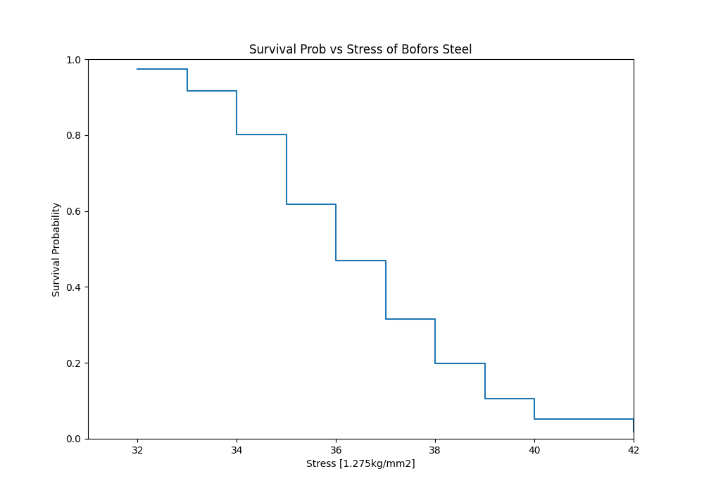
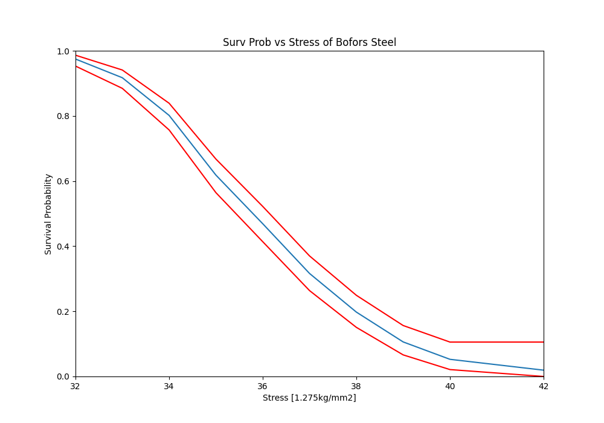

SurPyval Modelling
==================

To get started, let's import some useful packages, as such, for the rest of this page we will assume the following imports have occurred:

.. code:: python

	import surpyval as surv
	import numpy as np
	from matplotlib import pyplot as plt

Non-Parametric
--------------

Nelson-Aalen
^^^^^^^^^^^^

.. code:: python

	x = np.array([32, 33, 34, 35, 36, 37, 38, 39, 40, 42])
	n = np.array([10, 33, 81, 161, 224, 289, 336, 369, 383, 389])

	# Weibull's measurements are cumulative so we need to tranasform them
	n = np.concatenate([[n[0]], np.diff(n)])

Using this data we can esimtate the reliability, that is, the probability that a sample of steel will survive up to a given applied stress. So what does that mean?

We can find when the steel will break. This is particularly useful when we know the application.

For this example, lets say that the maximum tensile stress our design will see during use is 33 units. Lets try and estimate the proportion that will fail during operation.

For this we can use the Nelson-Aalen estimator of the hazard rate, then convert it to the reliability. This is all done with one easy call.

.. code:: python 

	bofors_steel_na = surv.NelsonAalen.fit(x, n=n)

	plt.figure(figsize=(10, 7));
	plt.ylabel('Survival Probability')
	plt.xlabel('Stress [1.275kg/mm2]')
	plt.ylim([0, 1])
	plt.xlim([31, 42])
	plt.step(bofors_steel_na.x, bofors_steel_na.R)
	plt.title('Survival Prob vs Stress of Bofors Steel');

So what purpose is this?

With our non-parametric model of the Bofors steel. We can use this model to estimate the reliability in our application. Let's say that our application uses Bofors steel up to 34. What is our estimate of the number of failures?

.. code:: python

	print(str(bofors_steel_na.sf(34).round(4).item() * 100) + "%")

Which gives:

.. code:: text
	
	80.15%

The above shows that approximately 80% will survive up to a stress of 34. Therefore we will have an approximately 20% chance of our component failing in the design. 

It is up to the designer to determine whether this is acceptable.

What if we want to take into account our uncertainty about the reliability. The non-parametric class automatically computes the Greenwood variance and uses that to compute the upper and lower confidence intervals. Let's plot the intervals to see.

.. code:: python

	plt.figure(figsize=(10, 7))
	bofors_steel_na.plot(how='interp')
	plt.xlabel('Stress [1.275kg/mm2]')
	plt.ylabel('Survival Probability')
	plt.ylim([0, 1])
	plt.xlim([32, 42])
	plt.title('Surv Prob vs Stress of Bofors Steel')

The confidence bounds can also be used to estimate the probability of survival up to some point with some degree of confidence. For example:

.. code:: python

	print(str(bofors_steel_na.R_cb(34, bound='lower', how='interp', confidence=0.95).round(4).item() * 100) + "%")

.. code:: text

	76.46%

Therefore we can be 95% confident that the reliability at 34 is above 76%.

Parametric
----------

Survival modelling with *surpyval* is very easy. This page will take you through a series of scenarios that can show you how to use the features of *surpyval* to get you the answers you need. The first example is if you simply have a list of event times and need to find the distribution of best fit.

.. code:: python

	np.random.seed(1)
	x = surv.Weibull.random(50, 30., 9.)
	model = surv.Weibull.fit(x)
	print(model)

.. code:: text

	Parametric Surpyval model with Weibull distribution fitted by MLE yielding parameters (29.805137406871953, 10.296037991991037)

To visualise the outcome of this fit we can inspect the results on a probability plot:

.. code:: python

	model.plot()

.. image:: images/surpyval-modelling-1.png
	:align: center

The :code:`model` object from the above example can be used to calculate the density of the distribution with the parameters found with the best fit from above. This is very easy to do:

.. code:: python

	x = np.linspace(10, 50, 1000)
	f = model.df(x)

	plt.plot(x, f)

.. image:: images/surpyval-modelling-2.png
	:align: center

The CDF :code:`ff()`, Survival (or Reliability) :code:`sf()`, hazard rate :code:`hf()`, or cumulative hazard rate :code:`Hf()` can be computed as well. This functionality makes it very easy to work with surpyval models to determine risks or to pass the function to other libraries to find optimal trade-offs. 

Using censored data
^^^^^^^^^^^^^^^^^^^

A common complication in survival analysis is that all the data is not observed up to the point of failure (or death). In this case the data is right censored, see the types of data section for a more detailed discussion, surpyval offers a very clean and easy way to model this. First, let's create a simulated data set:

.. code:: python

	np.random.seed(10)
	x = surv.Weibull.random(50, 30, 2.)

	observation_limit = 40
	# Censoring flag
	c = (x >= observation_limit).astype(int)
	x[x >= observation_limit] = observation_limit

In this example, we created 50 random Weibull distributed values with alpha = 30 and beta = 2. For this example the observation window has been set to 40. This value is where we stopped observing the events. For all the randomly generated values that are above this limit we create the censoring flag array c. This array has zeros where the event time was observed, and a 1 where the value is above the recorded value. For all the values in the data that are above 40 we set them to 40. This is a common occurence in survival analysis and surpyval is designed to accept this input with a simple call:

.. code:: python

	model = surv.Weibull.fit(x, c)
	print(model)
	model.plot()

.. code:: text

	Parametric Surpyval model with Weibull distribution fitted by MLE yielding parameters (29.249243175047084, 2.2291485877428756)

The plot for this can be seen to be:

.. image:: images/surpyval-modelling-3.png
	:align: center

The results from this model are very close to the data we input, and with only 50 samples. This example can be extended to another kind of censoring; left censored data. This is the case where the values are known to fall below a particular value. We can change our example data set to have a start observation time for which we will left censor all the data below that:

.. code:: python

	observation_start = 10
	# Censoring flag
	c[x <= observation_start] = -1
	x[x <= observation_start] = observation_start

That is, we set the start of the observations at 10 and flag that all the values at or below this are left censored. We can then use the updated values of x and c:

.. code:: python

	model = surv.Weibull.fit(x, c)
	print(model)
	model.plot()

.. code:: text

	Parametric Surpyval model with Weibull distribution fitted by MLE yielding parameters (29.347097662381277, 2.304902790957594)

The values did not substantially change, although the plot does look different as there are no values below 10.

.. image:: images/surpyval-modelling-4.png
	:align: center

The next type of censoring that is naturally handled by surpyval is interval censoring. Creating another example data set:

.. code:: python

	np.random.seed(30)
	x = surv.Weibull.random(50, 30, 10.)
	n, xx = np.histogram(x, bins=[20, 23, 26, 29, 32, 35, 38])
	x = np.vstack([xx[0:-1], xx[1::]]).T

In this example we have created the varable x with a matrix of the intervals within which each of the obervations have failed. That is each exact observation has been binned into a window and the x array has an entry [left, right] within which the event failed. We also have the n array that has the count of the failures within the window. With these two values we can make the simple surpyval call:

.. code:: python

	model = surv.Weibull.fit(x, n=n)
	print(model)

.. code:: text

	Parametric Surpyval model with Weibull distribution fitted by MLE yielding parameters (30.074154903683105, 9.637405285678366)

Again, we have a result that is very close to the original parameters. SurPyval can take as input an arbitrary combination of censored data. If we plot the data we will see:

.. image:: images/surpyval-modelling-5.png
	:align: center

This does not look to be such a good fit. This is because the Turbull estimator finds the probability of failing in a window, not at a given point. So if we align the model plot to the end of the window instead of start with:

.. code:: python

	np_model = surv.Turnbull.fit(x, n=n)
	plt.step(np_model.x, np_model.R, where='post')
	x_plot = np.linspace(20, 37.5, 1000)
	plt.plot(x_plot, model.sf(x_plot), color='k', linestyle='dashed')

We get:

.. image:: images/surpyval-modelling-6.png
	:align: center

Which is, visually, clearly a better fit. You need to be careful when using the Turnbull plotting points to estimate the parameters of a distribution. This is because it is not known where in the intervals a death has actually occurred. However it is good to check the start and end of the window (changing 'where' betweek 'pre' and 'post' or 'mid') to see the goodness-of-fit.

Using truncated data
^^^^^^^^^^^^^^^^^^^^

Surpyval has the capacity to handle arbitrary truncated data. A common occurence of this is in the insurance industry data. When customers make a claim on their policies they have to pay an 'excess' which is a charge to submit a claim for processing. If say, the excess on a set of policies in an area is $250, then it would not be logical for a customer to submit a claim for a loss of less than that number. Therefore there will be no claims under $250. This can also happen in engineering where a part may be tested up to some limit prior to be sold, therefore, as a customer you need to make sure you take into account the fact that some parts would have been rejected at the end of the line which you may not have seen. So a washing machine may run through 25 cycles prior to shipping. This is similar to, but distinct from censoring. When something is left censored, we know there was a failure or event below the threshold.  Whereas with truncation, we do not see any variables below the threshold. A simulated example may explain this better:

.. code:: python

	np.random.seed(10)
	x = surv.Weibull.random(100, alpha=100, beta=0.6)
	# Keep only those values greater than 250
	threshold = 25
	x = x[x > threshold]

We have therefore simulated a scenario where we have taken 100 random samples from a fat tailed Weibull distribution. We then filter to keep only those records that are above the threshold. In this case we assume we haven't seen the data for the washing machines with less than 25 cycles. To understand what could go wrong if we ignore this, what do we get if we assume all the data are failures and there is no truncation?

.. code:: python

	model = surv.Weibull.fit(x=x)
	print(model.params)

.. code:: text

	(218.39245675499225, 1.050718601374874)

With a plot that looks like:

.. image:: images/surpyval-modelling-7.png
	:align: center

Looking at the parameters of the distribution, you can see that the beta value is greater than 1. Although only slightly, this implies that this distribution has an increasing hazard rate. If you were the operator of the washing machines (e.g. a hotel or a laundromat) and any downtime had a cost, you would conclude from this that replacing the machines after a fixed time would be a good policy.

But if you take the truncation into account:

.. code:: python

	model = surv.Weibull.fit(x=x, tl=threshold)
	print(model.params)

.. code:: text

	(127.32704868357536, 0.7105357186212391)

With the plot:

.. image:: images/surpyval-modelling-8.png
	:align: center

You can see now that the model fits the data much better, but also that the beta parameter is actually below 1. This shows that ignoring the left-truncated data in parametric estimation can lead to errors in prediction. This example can be continued for right-truncated data as well.

.. code:: python

	np.random.seed(10)
	x = surv.Normal.random(100, mu=100, sigma=10)
	# Keep only those values greater than 250
	tl = 85
	tr = 115
	# Truncate the data
	x = x[(x > tl) & (x < tr)]

	model = surv.Weibull.fit(x=x, tl=tl, tr=tr)
	print(model.params)

.. code:: text

	(102.27078400794343, 12.479061358290593)

.. image:: images/surpyval-modelling-9.png
	:align: center

From the output above, the number of data points we have has been reduced from the simulated 100, downt to 87. Then with the 87 samples we now have we estimated the parameters to be quite close to the parameters used in the simulation. Further, the plot looks as though the parametric distribution fits the non-parametric distribution quite well.

In the cases above we used a scalar value for the truncation values. But some data has individual values for left truncation. This is seen in trials where someone may join the trial as a late entry. Therefore each data point as an entry time. For example:

.. code:: python

	x  = [3, 4, 6, 7, 9, 10]
	tl = [0, 0, 0, 0, 5, 2]

	model = surv.Weibull.fit(x, tl=tl)
	print(model.params)

.. code:: text

	(7.058547173157075, 2.700966723124606)

Surpyval can even work with arbitrary left and right truncation:

.. code:: python

	x  = [3, 4, 6, 7, 9, 10]
	tl = [0, 0, 0, 0, 5, 2]
	tr = [10, 9, 8, 10, 15]

	model = surv.Weibull.fit(x, tl=tl, tr=tr)
	print(model.params)

.. code:: text

	(8.123776023131574, 2.5691703597563285)

In the above example we used both the tl and tr. However, surpyval has a flexible API where it can take the truncation data as a two dimensional array:

.. code:: python

	x  = [3, 4, 6, 7, 9, 10]
	t =   [[ 0, 10],
	       [ 0,  9],
	       [ 0,  8],
	       [ 0, 10],
	       [ 5, 15],
	       [ 2, 15]]

	model = surv.Weibull.fit(x, t=t)
	print(model.params)

.. code:: text

	(8.123776023131574, 2.5691703597563285)

Which, obviously, gives the same result. This shows the flexibility of the surpyval API, you can use scalar, array, or matrix values for the truncations using the t, tl, and tr keywords with the fit method and surpyval does the rest.

Offsets
^^^^^^^

Another common feature in survival analysis is a requirement to fit a distribution with an offset. For example, the three three parameter Weibull distribution. Using data from Weibull's original paper for the strenght of Bofor's steel shows when this might be necessary.

.. code:: python

	from surpyval.datasets import BoforsSteel

	df = BoforsSteel.df
	x = df['x']
	n = df['n']

	model = surv.Weibull.fit(x=x, n=n)
	print(model.params)
	model.plot()

.. code:: text

	(47.36735846101269, 17.57131949975446)

.. image:: images/surpyval-modelling-10.png
	:align: center

The above plot does not look to be a good fit. However, if we use an offset we can use the three parameter Weibull distribution to attempt to get a better fit. Using offset values with surpyval is very easy:

.. code:: python

	model = surv.Weibull.fit(x=x, n=n, offset=True)
	print(model.params, model.gamma)
	model.plot()

.. code:: text

	(7.141925216146573, 2.620452404013804) 39.76562962867473

.. image:: images/surpyval-modelling-11.png
	:align: center

This is evidently a much better fit! The offset value for an offset distribution is saved as 'gamma' in the model object. Offsets can be used for any distribution supported on the half real line. Currently, this is the Weibull, Gamma, LogNormal, LogLogistic, and Exponential. For example:

.. code:: python

	np.random.seed(10)
	x = surv.LogLogistic.random(100, 10, 3) + 10
	model = surv.LogLogistic.fit(x, offset=True, how='MLE')
	print(model)
	model.plot()

.. code:: text

	Offset Parametric Surpyval model with LogLogistic distribution fitted by MLE yielding parameters (10.189469674675024, 3.4073259756607106) with offset of 9.562707940500465

.. image:: images/surpyval-modelling-12.png
	:align: center

Fixing parameters
^^^^^^^^^^^^^^^^^

Another usefule feature of surpyval is the ability to easily fix parameters. For example:

.. code:: python

	np.random.seed(30)
	x = surv.Normal.random(50, 10., 2)
	model = surv.Normal.fit(x, fixed={'mu' : 10})
	print(model)
	model.plot()

.. code:: text

	Parametric Surpyval model with Normal distribution fitted by MLE yielding parameters (10.0, 1.9353643871115993)

.. image:: images/surpyval-modelling-13.png
	:align: center

You can see that the mu parameter has been fixed at 10. This can work for distribuitons with many more parameters, including the offset.

.. code:: python

	np.random.seed(30)
	x = surv.ExpoWeibull.random(50, 10., 2, 4) + 10
	model = surv.ExpoWeibull.fit(x, offset=True, fixed={'mu' : 4, 'gamma' : 10, 'alpha' : 10})
	print(model)
	model.plot()

.. code:: text

	Offset Parametric Surpyval model with ExpoWeibull distribution fitted by MLE yielding parameters (10.0, 2.044204898692162, 4.0) with offset of 10.0

.. image:: images/surpyval-modelling-14.png
	:align: center

We have fit three of the four parameters for an offset exponentiated-Weibull distribution.

Modelling with arbitrary input
^^^^^^^^^^^^^^^^^^^^^^^^^^^^^^

The surpyval API is extremely flexible. All the unique examples provided above can all be used at once. That is, data can be censored, truncated, and directly observed with offsets and fixing parameters. The API is completely flexible. This makes surpyval an extremely useful tool for analysts where the data is gathered in a manner where it's cleanliness is not guaranteed.

.. code:: python

	x  = [0, 1, 2, [3, 4], [6, 10], [4, 8], 5, 19, 10, 13, 15]
	c  = [0, 0, 1, 2, 2, 2, 0, -1, 0, 1, 0]
	tl = [-1, 0, 0, 0, 0, 0, 2, 2, -np.inf, 0, 0]
	tr = 25
	model = surv.Normal.fit(x, c=c, tl=tl, tr=tr, fixed={'mu' : 1.})
	print(model)

.. code:: text

	Parametric Surpyval model with Normal distribution fitted by MLE yielding parameters (1.0, 9.11973420034752)

Using alternate estimation methods
^^^^^^^^^^^^^^^^^^^^^^^^^^^^^^^^^^

Surpyval's API is very flexible because you can change which method is used to estimate parameters. This is useful when a more appropriate method is needed or the method you are using fails. 

The default parametric method for surpyval is the maximum likelihood estimation (MLE), this is because it can take any arbitrary input. However, the MLE is not always the best estimator. Consider an example with the uniform distribution:

.. code:: python

	np.random.seed(5)
	x = surv.Uniform.random(20, 5, 10)
	print(x.min(), x.max())

	mle_model = surv.Uniform.fit(x)
	print(*mle_model.params)

.. code:: text

	5.9386061433062585 9.593054539689607
	5.9386061433062585 9.593054539689607

You can see that the results are the same. This is because the maximum likelihood estimate of the parameters of a uniform distriubtion are just the smallest and largest values in the sample. If however we use the 'Maximum Product Spacing' method we get:

.. code:: python

	mps_model = surv.Uniform.fit(x, how='MPS')
	print(*mps_model.params)

.. code:: text

	5.532556321486052 9.999104361509815

You can see that using the MPS method we have parameters that are closer to the real values. This is because the MPS method can 'look outside' the existing values to estimate where the real value lies. See the details of this method in the 'Parametric Estimation' section. But the MPS method is useful when you need to estimate the point at which a distribution's support starts or for any disttribution that has unknown support. Concretely, this includes any offset distribution or a distribution with a finite upper and lower support (Uniform, Generalised Beta, Triangle)

The other important use case is when, for some reason, an alternate estimation method just does not work. For example:

.. code:: python

	np.random.seed(30)
	x = surv.LogLogistic.random(10, 4., 2) + 10
	model = surv.LogLogistic.fit(x, how='MLE', offset=True)

.. code:: text

	MLE with autodiff hessian and jacobian failed, trying without hessian
	MLE with autodiff jacobian failed, trying without jacobian or hessian
	MLE FAILED: Likelihood function appears undefined; try alternate estimation method

This shows, that the Maximum Likelihood Estimation failed for this data. However, because we have access to other methods, we can use an alternate estimation method:

.. code:: python

	model = surv.LogLogistic.fit(x, how='MPS', offset=True)
	print(model)
	model.plot(plot_bounds=False)

.. code:: text

	Offset Parametric Surpyval model with LogLogistic distribution fitted by MPS yielding parameters (2.631868521887908, 0.9657662293516666) with offset of 11.524905733806891

.. image:: images/surpyval-modelling-15.png
	:align: center

Our estimation has worked! Even though we used the MPS estimate for the parameters, we can still call all the same functions with the created variable to find the density :code:`df()`, hazard :code:`hf()`, CDF :code:`ff()`, SF :code:`sf()` etc. So regardless of the estimation method, we can still use the model.

This shows the power of the flexible API that surpyval offers, because if your modelling fails using one estimation method, you can use another. In this case, the MPS method is quite good at handling offset distributions. It is therefore a good approach to use when using offset distributions.

