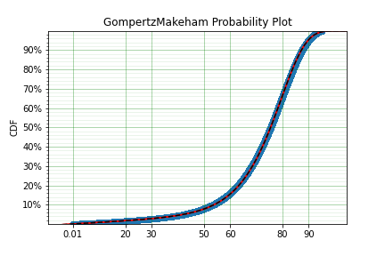

Example Applications
====================

This section documents some of the applications that a survival analysis toolkit can be useful to you, no matter what discipline you need it for.

Reliability Engineering
-----------------------

In 

Demographics / Actuarial
------------------------

In demographics and actuarial studies, the distribution of the life of a population is of interest. For the demographer, it is necessary to understand how a population might change, in particular, how the expected lifespan is changing over time. The same applies to an actuary, an actuary is interested in lifetimes to understand the risk of payouts among those who own a life insurance policy.

The `Gompertz-Makeham <https://en.wikipedia.org/wiki/Gompertz–Makeham_law_of_mortality>`_ is a distribution used in demography and actuarial studies to estimate the lifetime of a population. This can be implemented in surpyval with relative ease.

.. code:: python

    import surpyval as surv
    from autograd import numpy as np
    from matplotlib import pyplot as plt
    from scipy.special import lambertw

    bounds = ((0, None), (0, None), (0, None),)
    support = (0, np.inf)
    param_names = ['lambda', 'alpha', 'beta']
    def Hf(x, *params):
        Hf = params[0] * x + (params[1]/params[2])*(np.exp(params[2]*x))
        return Hf
        
    GompertzMakeham = surv.Distribution('GompertzMakeham', Hf, param_names, bounds, support)

We now have a GM distribution object that can be used to fit data. But we need some data:

.. code:: python

    # GM qf()
    def qf(p, params):
        lambda_ = params[0]
        alpha = params[1]
        beta = params[2]
        return (alpha/(lambda_ * beta) - (1./lambda_)*np.log(1 - p)
                - (1./beta)*lambertw((alpha*np.exp(alpha/lambda_)*(1 - p)**(-(beta/lambda_)))/(lambda_))).real

    np.random.seed(1)
    params = np.array([.68, 28.7e-3, 102.3])/1000
    x = qf(np.random.uniform(0, 1, 100_000), params)
    # Filter out some numeric overflows.
    x = x[np.isfinite(x)]

The parameters for the distribution come from Gavrilov et al. ([GGN]_), specifically the parameters for the lifespans of the 1974-1978 data. So in this case we have (simulated) data on the lifespans of 100,000 thousand people and we need to determine the GM parameters. This can be compared to the historic parameters to see if the age related mortality has changed or has remained roughly constant. To do so, all we need do with surpyval is to put the data to the ``fit()`` method.

.. code:: python

    model = GompertzMakeham.fit(x)
    model.plot(alpha_ci=0.99, heuristic='Nelson-Aalen')
    model

.. code:: text

    Parametric SurPyval Model
    =========================
    Distribution        : GompertzMakeham
    Fitted by           : MLE
    Parameters          :
        lambda: 0.0007827108147066848
         alpha: 2.1199267751549727e-05
          beta: 0.10690878152126947

You can see that the model is a good fit to the data. Using the model we can determine the probability of death in a given term for a random individual from the population. This is useful to price the premium of a life insurance policy. For example, if a 60 year old was to take out a two year policy, what premium should we charge them for the policy. First, we need to determine the probability of death:

.. code:: python
    
    p_death = model.ff(62) - model.ff(60)
    policy_payout = 100_000
    expected_loss = policy_payout * p_death
    print(p_death, expected_loss)

.. code:: text

    0.025337351289907883 2533.7351289907883

From the results above, you can see that the probability of death over the two year interval is approximately 2.5%. Given the contract is to payout $100,000 in this event, the expected loss is therefore $2,533.74. Therefore, to make a profit, the policy will need to cost more than $2,533.74. So say the company has a strategy of making 10% from each policy, the policy cost to the individual would therefore be $2,787.11. If we divide this payment scheme into a per month basis over the two years we get a monthly payment of $116.13 for two years (in the case of death the amount owing can be subtracted from the payout).

Although this is a basic example, as insurance companies would have much more sophisticated models, it shows the basics of how demographic and actuarial data can be used. This shows the application of surpyval to actuarial and demogrphic studies.

References
----------

.. [GGN] Gavrilov, L. A., Gavrilova, N. S., & Nosov, V. N. (1983). Human life span stopped increasing: why?. Gerontology, 29(3), 176-180.

