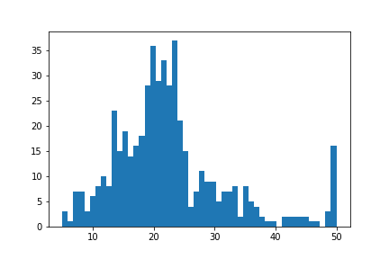
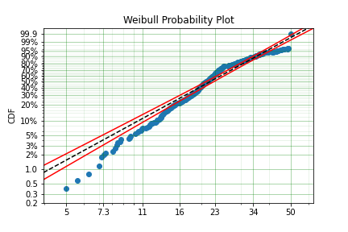
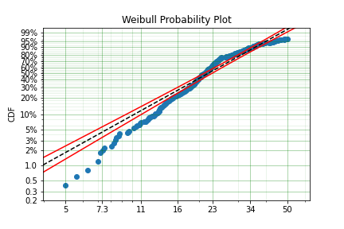
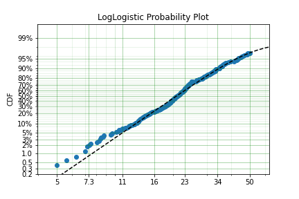
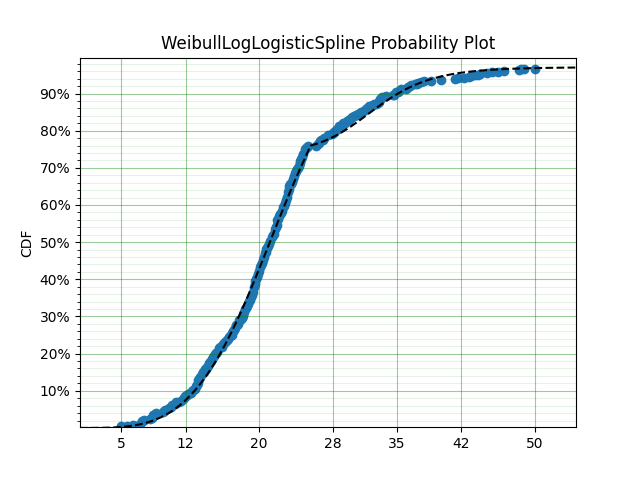
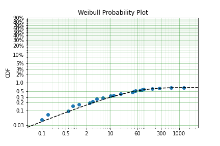
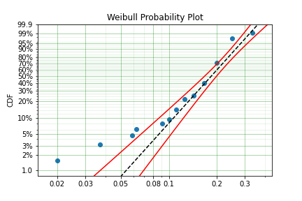
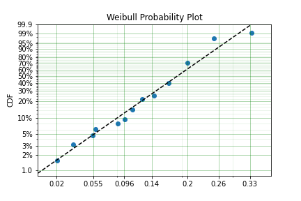
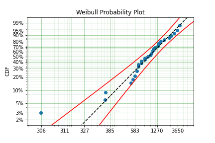

Example Applications
====================

This section documents some of the applications that SurPyval as a survival analysis toolkit can be useful to you, no matter what discipline you need it for.

Boston House Prices
-------------------

No statistical analysis package can avoid doing the 'hello world' task of analysing the 'Boston House Pricing' dataset. What might surprise some readers is that this would even be considered... The myriad blogs and Kaggle posts looking into this problem can not surely be improved upon. I agree, however, it is a good example of why one needs to be aware of censoring and how flexible the SurPyval API is when dealing with it. Looking at the boston house pricing dataset you can see that there is a suspicous number of houses at the top end that all have the same price:

On consideration, one can see that there are no houses above $50,000 and that the density at that point is much higher than we would expect because we would expect some form of a 'fat-tail.' That is, we should expect a decreasing number of houses at the highest costs. It is therefore safe to conclude that all values above $50,000 have been set to $50,000; which is to say that the sale price is right censored! And because it is a censored observation we will need to use an analysis tool that can handle censored observations, lest we may be wrong in our estimates of the distribution of housing prices. So lets load the data and see what results we can get, starting with the raw data.

.. code:: python

    import surpyval as surv
    x = Boston.df['medv'].values
    x, c, n, _ = surv.xcnt_handler(x)

    model = surv.Weibull.fit(x, c, n)
    print(model)
    model.plot()

.. code:: text

    Parametric SurPyval Model
    =========================
    Distribution        : Weibull
    Fitted by           : MLE
    Parameters          :
         alpha: 25.386952832397032
          beta: 2.5651903209947684

From the above plot you can see that near 50, the parametric model diverges substantially from the actual data. So we can see that having not censored the highest values means that our model could be improved by doing so. Let's see:

.. code:: python

    import surpyval as surv
    x = Boston.df['medv'].values
    x, c, n, _ = surv.xcnt_handler(x)
    # Right censor the highest value
    c[-1] = 1

    model = surv.Weibull.fit(x, c, n)
    print(model)
    model.plot()

.. code:: text

    Parametric SurPyval Model
    =========================
    Distribution        : Weibull
    Fitted by           : MLE
    Parameters          :
         alpha: 25.53669601993307
          beta: 2.469159446459548

We can see that the model has changed slightly, however, there appears to be a 'disconnect' near 24 that makes the model a poor fit above and below the value. Let's see if a different distribution will improve the fit:

.. code:: python

    import surpyval as surv
    x = Boston.df['medv'].values
    x, c, n, _ = surv.xcnt_handler(x)
    # Right censor the highest value
    c[-1] = 1

    model = surv.LogLogistic.fit(x=x, c=c, n=n, lfp=True)
    print(model)
    model.plot()

.. code:: text

    Parametric SurPyval Model
    =========================
    Distribution        : LogLogistic
    Fitted by           : MLE
    Max Proportion (p)  : 0.9861133787129936
    Parameters          :
         alpha: 20.804405478058186
          beta: 4.56190516414644

This appears to be a much better fit, however, there is still quite a bit of difference between the data and the model in the middle of the distribution. Lets create a custom spline to see if we can perfect the fit.

.. code:: python

    import surpyval as surv
    x = Boston.df['medv'].values
    x, c, n, _ = surv.xcnt_handler(x)
    # Right censor the highest value
    c[-1] = 1

    def Hf(x, *params):
        x = np.array(x)
        Hf = np.zeros_like(x)
        knot = params[0]
        params = params[1:]
        dist1 = surv.Weibull
        dist2 = surv.LogLogistic
        Hf = np.where(x < knot, dist1.Hf(x, *params[0:2]), Hf)
        Hf = np.where(x >= knot, (dist1.Hf(knot, *params[0:2])
                                + dist2.Hf(x, *params[2::])), Hf)
        return Hf
    bounds = ((0, 50), (0, None), (0, None), (0, None), (0, None),)
    param_names = ['knot', 'alpha_w', 'beta_w', 'alpha_ll', 'beta_ll']
    name = 'WeibullLogLogisticSpline'
    support = (0, np.inf)

    WeibullLogLogisticSpline = surv.Distribution(name, Hf, param_names, bounds, support)

    model = WeibullLogLogisticSpline.fit(x=x, c=c, n=n, lfp=True)

    print(model)
    model.plot()

.. code:: text

    Parametric SurPyval Model
    =========================
    Distribution        : WeibullLogLogisticSpline
    Fitted by           : MLE
    Max Proportion (p)  : 0.9711459340639835
    Parameters          :
          knot: 25.0000103742294
       alpha_w: 22.735658691657452
        beta_w: 3.926996942307611
      alpha_ll: 32.2716411336919
       beta_ll: 10.120540049344006

Much better!

It must be said that this is a bit 'hacky'. There is no theory that we are using to guide the choice of the spline model, we are simply finding the best fit to the data. For example, this model would not able to be used for extrapolation too far beyond $50,0000, this is because the model is limited to 97.1% of houses. A separate spline would be needed to model those data. However, the example shows the importance of censoring and the power of the surpyval API!

Applided Reliability Engineering
--------------------------------

In reliability engineering we might be interested in the proportion of a population that will experience a particular failure mode. We do not want to ship the items that will fail so that our customers do not have a poor experience. But, we will want to determine the minimum duration of a test that can establish whether a component will fail. This is because a test that is too long we will waste time and money in testing and if a test is too short we will ship too many items that will fail in the field. We need to optimise this interval the minimize the cost of testing but also the number of items at risk in the field.

Using data from the paper that introduced the Limited Failure Population model (also known as the Defective Subpopulation) to the reliability engineering world [Meeker]_ we can show how surpyval can be used in part to calculate an optimal 'burn-in' test duration.

.. code:: python

    import surpyval as surv

    f = [.1, .1, .15, .6, .8, .8, 1.2, 2.5, 3., 4., 4., 6., 10., 10., 
         12.5, 20., 20., 43., 43., 48., 48., 54., 74., 84., 94., 168., 263., 593.]
    s = [1370.] * 4128

    x, c, n = surv.fs_to_xcn(f, s)
    model = surv.Weibull.fit(x, c, n, lfp=True)
    print(model)
    model.plot()

.. code:: text

    Parametric SurPyval Model
    =========================
    Distribution        : Weibull
    Fitted by           : MLE
    Max Proportion (p)  : 0.006744450944727198
    Parameters          :
         alpha: 28.367193779799038
          beta: 0.4959762140288241

We can see from these results that at maximum we will have approximately 0.67% fail. If the company accepts a 0.1% probability of their products failing in the field then we can calculate the interval at which the difference between the total population and the proportion failed in the test is 0.1%.

.. code:: python

    from scipy.optimize import minimize
    fun = lambda x : (0.001 - np.abs(model.p - model.ff(x)))**2

    res = minimize(fun, 10, tol=1e-50)
    print(res.x)

.. code:: text

    [104.43741352]

Therefore we should do a burn in test up to approximately 104.4 to make sure we minimize the number of items shipped that are defective while also minimizing the duration of the test. We can simply change the value of ``0.001`` in the above code to any value we may wish to use.

Demographics / Actuarial
------------------------

In demographics and actuarial studies, the distribution of the life of a population is of interest. For the demographer, it is necessary to understand how a population might change, in particular, how the expected lifespan is changing over time. The same applies to an actuary, an actuary is interested in lifetimes to understand the risk of payouts among those who own a life insurance policy.

The `Gompertz-Makeham <https://en.wikipedia.org/wiki/Gompertz–Makeham_law_of_mortality>`_ is a distribution used in demography and actuarial studies to estimate the lifetime of a population. This can be implemented in surpyval with relative ease.

.. code:: python

    import surpyval as surv
    from autograd import numpy as np
    from matplotlib import pyplot as plt
    from scipy.special import lambertw

    bounds = ((0, None), (0, None), (0, None),)
    support = (0, np.inf)
    param_names = ['lambda', 'alpha', 'beta']
    def Hf(x, *params):
        Hf = params[0] * x + (params[1]/params[2])*(np.exp(params[2]*x))
        return Hf
        
    GompertzMakeham = surv.Distribution('GompertzMakeham', Hf, param_names, bounds, support)

We now have a GM distribution object that can be used to fit data. But we need some data:

.. code:: python

    # GM qf()
    def qf(p, params):
        lambda_ = params[0]
        alpha = params[1]
        beta = params[2]
        return (alpha/(lambda_ * beta) - (1./lambda_)*np.log(1 - p)
                - (1./beta)*lambertw((alpha*np.exp(alpha/lambda_)*(1 - p)**(-(beta/lambda_)))/(lambda_))).real

    np.random.seed(1)
    params = np.array([.68, 28.7e-3, 102.3])/1000
    x = qf(np.random.uniform(0, 1, 100_000), params)
    # Filter out some numeric overflows.
    x = x[np.isfinite(x)]

The parameters for the distribution come from [Gavrilov]_, specifically the parameters for the lifespans of the 1974-1978 data. So in this case we have (simulated) data on the lifespans of 100,000 thousand people and we need to determine the GM parameters. This can be compared to the historic parameters to see if the age related mortality has changed or has remained roughly constant. To do so, all we need do with surpyval is to put the data to the ``fit()`` method.

.. code:: python

    model = GompertzMakeham.fit(x)
    model.plot(alpha_ci=0.99, heuristic='Nelson-Aalen')
    model

.. code:: text

    Parametric SurPyval Model
    =========================
    Distribution        : GompertzMakeham
    Fitted by           : MLE
    Parameters          :
        lambda: 0.0007827108147066848
         alpha: 2.1199267751549727e-05
          beta: 0.10690878152126947

.. image:: images/applications-demography-1.png
    :align: center

You can see that the model is a good fit to the data. Using the model we can determine the probability of death in a given term for a random individual from the population. This is useful to price the premium of a life insurance policy. For example, if a 60 year old was to take out a two year policy, what premium should we charge them for the policy. First, we need to determine the probability of death:

.. code:: python
    
    p_death = model.ff(62) - model.ff(60)
    policy_payout = 100_000
    expected_loss = policy_payout * p_death
    print(p_death, expected_loss)

.. code:: text

    0.025337351289907883 2533.7351289907883

From the results above, you can see that the probability of death over the two year interval is approximately 2.5%. Given the contract is to payout $100,000 in this event, the expected loss is therefore $2,533.74. Therefore, to make a profit, the policy will need to cost more than $2,533.74. So say the company has a strategy of making 10% from each policy, the policy cost to the individual would therefore be $2,787.11. If we divide this payment scheme into a per month basis over the two years we get a monthly payment of $116.13 for two years (in the case of death the amount owing can be subtracted from the payout).

Although this is a basic example, as insurance companies would have much more sophisticated models, it shows the basics of how demographic and actuarial data can be used. This shows the application of surpyval to actuarial and demogrphic studies.

Applied Reliability Engineering - 2
-----------------------------------

In reliability engineering you can come across the case where a new product has been built that is similar in design to a previous, but has better materias, geometry, seals.. etc. You have data from the tests of the old product and new results for the same test on the new product. The only problem, the new product only had one failure in the test! What will you do?

Given the similarities, it is common to use the same shape parameter, the :math:`\beta` value, from a similar product as an initial estimate. In this case, we may need to know the reliability of the item in the field. We can create a model of this new product, but first the old product:

.. code:: python

    import surpyval as surv

    x_old = [ 5.2, 10.7, 16.3, 22. , 32.9, 38.6, 42.1, 58.7, 92.8, 93.8]
    old = surv.Weibull.fit(x_old)
    print(old)

.. code:: text

    Parametric SurPyval Model
    =========================
    Distribution        : Weibull
    Fitted by           : MLE
    Parameters          :
         alpha: 45.27418484669478
          beta: 1.377623372184365

We can use the above value of beta with the new data:

.. code:: python

    x_new = [87, 100]
    c_new = [0, 1]
    n_new = [1, 9]

    surv.Weibull.fit(x_new, c_new, n_new, fixed={'beta' : 1.3776}, init=[100.])

.. code:: text

    Parametric SurPyval Model
    =========================
    Distribution        : Weibull
    Fitted by           : MLE
    Parameters          :
         alpha: 525.1398140084557
          beta: 1.3776

The characteristic life of the new bearing is over 10 times higher! Quite an improved new design. This new model can be used as part of the sales of the new product (10x more life!) and to provide recommendations for maintenance.

Social Science / Criminology
----------------------------

Another application of surpyval is when encountering extreme values. The Weibull distribution is one of the limiting cases of the Generalized Extreme Value distribution. In other words, the Weibull distribution is the distribution that can model the strength of a chain because it can model the extreme value, in this case the minimum, of a collection of distributions. A chain is as only as strong as it's weakest link. If there are many many links in a chain (which is a fair assumption) then links of which follow a known strength distribution, then the strength of the chain will will follow a Weibull distribution. It is for this reason that the Weibull distribution is so widely used.

Another extreme value is the maximum. The maximum extreme value distribution is the Frechet distribution. But, if you simply inverse a minimum, you can get a maxmimum. Therefore, if we know our data is following a process of finding a maximum, then we can use the Weibull distribution to model the phenonmena.

.. warning::
    This may be a distressing topic for some readers.

Social scientists and criminologists are interested in understanding the phenomena of mass shootings in an effort to eliminate the scourge from society. A mass shooting is an extreme event, and an extreme event can be modelled to understand the risks of future occurence, and with that understanding, the effect of interventions can also be understood.

Using the gun violence data from `Kaggle <https://www.kaggle.com/jameslko/gun-violence-data>`_ we can model the process. That is, if we take the maximum number of deaths in a given month over several years, we have data that can be used to estimate the probability of something even worse occuring. This data covers the period from 2013 to 2018, see Kaggle for more details.

.. code:: python

    import surpyval as surv
    import pandas as pd

    # Data not in surpyval, available at https://www.kaggle.com/jameslko/gun-violence-data
    gun_violence_df = pd.read_csv('../gun-violence-data_01-2013_03-2018.csv', parse_dates=['date'])

    # Find the maximum number of people killed each month
    gun_violence_df = gun_violence_df.groupby(pd.Grouper(key='date', freq='M')).agg({'n_killed' : 'max'})

    x = df['n_killed'].values

    # Inverse the data to get the maximum
    model = surv.Weibull.fit(1./x)
    model.plot()

It is worth reminding that since we have taken the inverse, it is the lower values that represent more victims. And it is the extremes that we are trying to capture. You can see from the above plot that the model does not fit the data from 0.02 to 0.1 very well. We can try using a different approach

.. code:: python

    # Inverse the data to get the maximum
    mpp_model = surv.Weibull.fit(1./x, how='MPP', offset=True)
    mpp_model.plot()

You can see that this model is a much better description of the data. However, the problem is that it cannot have a real interpretation. Because the offset is negative, that means there is a non-zero probability of 0, which because the data was inversed, means that there is a non-zero probability of having a shooting with infinite victims. This model is therefore not a good option for such extreme extrapolations. The model can however, be used to estimate the probabiltiy of having a shooting as bad or worse than the most extreme event up to 2040.

.. code:: python

    p_happening = mpp_model.ff(1./50)
    p_not_happening = 1 - p_happening
    # Months from 2022 to 2040
    months = 12 * (2040 - 2022)
    p_not_happening_before_2040 = (p_not_happening)**(months)
    (1 - p_not_happening_before_2040)*100

.. code:: text

    (1.6077640040390584, 96.98325003600236)

The model estimates that there is an approximately 1.6% chance of an event killing 50 or more people in a given month, which may seem low, however, because there are 216 months between 2022 and 2040 the chances of not having as extreme an event over that time period becomes horrifyingly small. The model suggests that the probability of having a month in which an event with more than 50 people will be killed, has a 97.0% chance of happening from 2022 to 2040. Chilling.

This is a bit higher than other reports of the same prediction, see [Duwe]_ who report at 35% probability, which is some, but not even close to complete, relief.

Economics
---------

Economists are interested in the times between recessions. This information helps them formulate policy proscriptions that may (or may not) reduce the duration of a recession, or the time between recessions. Using data from Tadeu Cristino et al. [TC]_ we can use real data to esimate the probability of a recession.

.. code:: python

    import pandas as pd
    import surpyval as surv

    start = [np.nan, "June 1857", "October 1860", "April 1865", "June 1869", 
             "October 1873", "March 1882", "March 1887", "July 1890", "January 1893",
             "December 1895", "June 1899", "September 1902", "May 1907", "January 1910",
             "January 1913", "August 1918", "January 1920", "May 1923", "October 1926",
             "August 1929", "May 1937", "February 1945", "November 1948", "July 1953",
             "August 1957", "April 1960", "December 1969", "November 1973", 
             "January 1980", "July 1981", "July 1990", "March 2001", "December 2007"]

    end = [
        "December 1854", "December 1858", "June 1861", "December 1867", "December 1870",
        "March 1879", "May 1885", "April 1888", "May 1891", "June 1894", "June 1897",
        "December 1900", "August 1904", "June 1908", "January 1912", "December 1914",
        "March 1919", "July 1921", "July 1924", "November 1927", "March 1933", 
        "June 1938", "October 1945", "October 1949", "May 1954", "April 1958", 
        "February 1961", "November 1970", "March 1975", "July 1980", "November 1982",
        "March 1991", "November 2001", "June 2009"
    ]

    df = pd.DataFrame({'start' : pd.to_datetime(start),
                       'end' : pd.to_datetime(end)})

    # Compute time from end of last recession to peak of next.
    x = (df.start - df.end.shift(1)).dropna().dt.days.values

    model = surv.Weibull.fit(x, offset=True)
    print(model)
    model.plot()

.. code:: text

    Parametric SurPyval Model
    =========================
    Distribution        : Weibull
    Fitted by           : MLE
    Offset (gamma)      : 304.0659320899125
    Parameters          :
         alpha: 895.3220718605215
          beta: 1.0629492868473804

You can see from the above the data is a good fit to the model! Great. So now what?

We can communicate what the expected time between recessions is:

.. code:: python

    model.mean()

.. code:: text

    1178.2499033086633

Therefore the average growth period is 1,178 days, or about 3.2 years between recessions.

References
----------

.. [TC] Tadeu Cristino, C., Żebrowski, P., & Wildemeersch, M. (2020). Assessing the time intervals between economic recessions. PloS one, 15(5), e0232615.

.. [Duwe] Duwe, G., Sanders, N. E., Rocque, M., & Fox, J. A. (2021). Forecasting the Severity of Mass Public Shootings in the United States. Journal of Quantitative Criminology, 1-39.

.. [Gavrilov] Gavrilov, L. A., Gavrilova, N. S., & Nosov, V. N. (1983). Human life span stopped increasing: why?. Gerontology, 29(3), 176-180.

.. [Meeker] William Q. Meeker (1987) Limited Failure Population Life Tests: Application to Integrated Circuit Reliability, Technometrics, 29(1), 51-65

